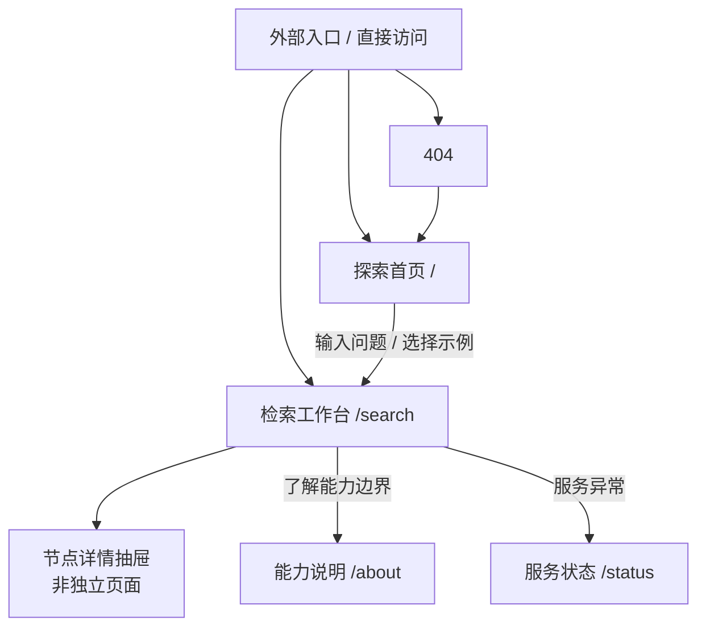
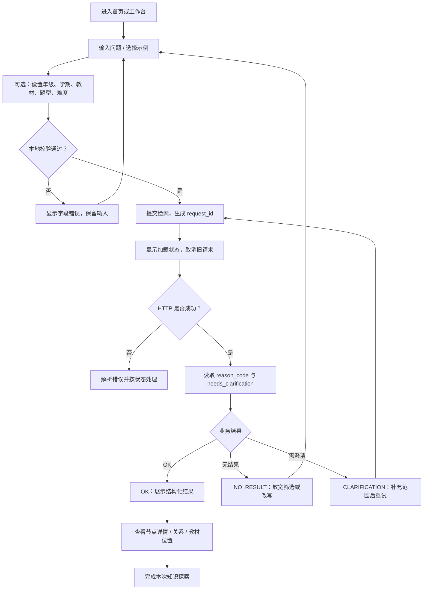

# 小学数学知识图谱检索 Web 系统产品需求文档

> 文档简称：E2E PRD<br>
> 文档版本：1.1<br>
> 更新时间：2026-08-02<br>
> 文档状态：Draft，已同步后端与前端 1.1 基线，可进入产品评审与研发拆解<br>
> 产品阶段：学生端 Web 原型 / MVP<br>
> 后端基线：[E2E-backend.md](./E2E-backend.md)<br>
> 前端设计基线：[E2E-frontend.md](./E2E-frontend.md)<br>
> 适用角色：产品、设计、前端、后端、测试、教研与项目负责人

## 0. 文档控制

### 0.1 文档目的

本文定义小学数学知识图谱检索 Web 系统的产品目标、用户范围、业务流程、
页面与模块、功能需求、交互规则、视觉规范和验收标准。

本文是产品需求的统一基线：

- 产品与教研使用本文确认用户价值和范围；
- 设计使用本文产出线框图、视觉稿和交互稿；
- 前后端使用本文拆解研发任务和联调接口；
- 测试使用本文设计功能、异常、响应式和可访问性用例；
- 项目负责人使用本文判断 MVP 是否满足上线条件。

本文不替代 API 参考文档。字段、类型、状态码和服务地址以
`docs/E2E-backend.md` 为准；前端技术实现细节以
`docs/E2E-frontend.md` 为准。

### 0.2 名词与优先级

| 名词 | 含义 |
| --- | --- |
| MVP | 当前必须完成的学生端最小完整闭环 |
| P0 | 缺失会导致核心流程不可用或产生安全/契约错误 |
| P1 | 明显提升完整性与可理解性，应在原型验收前完成 |
| P2 | 可在后续迭代完成，不阻塞 MVP |
| 图谱证据 | 后端返回的实体、证据节点、关系路径和教材位置 |
| 主实体 | `entities` 中作为主要答案对象的节点 |
| 证据节点 | `evidence_nodes` 中用于解释结果的节点 |
| 业务结果码 | 响应中的 `reason_code`，不能只依赖 HTTP 状态 |
| 澄清 | 系统无法确定问题含义时，要求用户补充知识点或范围 |
| 本地最近搜索 | 仅保存在当前浏览器会话中的检索记录 |

### 0.3 需求解释顺序

发生冲突时按以下顺序处理：

1. 安全、权限和字段允许列表；
2. 后端 V1 API 实际契约；
3. 本 PRD 的用户体验与业务规则；
4. 前端 E2E 设计中的实现建议；
5. 视觉稿中的表现细节。

任何产品设计不得绕过后端身份和权限策略。

## 1. 项目背景

### 1.1 背景

小学数学知识并不是孤立条目。一个知识点通常与前置知识、后续知识、技能、
练习和教材章节存在结构化关系。传统站内搜索和通用问答工具通常只能返回
关键词命中或生成一段文字，学生难以判断：

- 学习一个知识点前应该先掌握什么；
- 学完后可以继续学习什么；
- 哪些练习真正考察该知识点；
- 知识点位于哪个年级、哪册教材、哪一章或哪一节；
- 当前结果来自什么关系或教材范围。

项目后端已基于 Neo4j 建成小学数学知识图谱检索能力，并通过 V1 API 返回
结构化实体、关系路径、教材位置和业务状态。当前需要一个面向学生的 Web
界面，把这些技术能力转化为容易理解、可以探索、发生异常时能够恢复的产品。

### 1.2 当前后端能力基线

截至后端文档 1.1：

| 项目 | 已验证状态 |
| --- | --- |
| 图数据 | 1,182 个节点、2,303 条关系 |
| 代表性练习 | 280 道 |
| 检索向量 | 1,062 个，统一为 512 维 |
| 公开检索接口 | `POST /v1/retrieval/search` |
| 健康检查 | `GET /health` |
| 自动化测试 | 181 项通过 |
| 严格 HTTP E2E | 每轮 350 条，串行与并发 8 连续三轮通过 |
| 检索相关性工程基线 | Recall@5 1.0000，MRR 0.9139，nDCG@10 0.9343 |
| 本地性能工程基线 | 串行全链路 P95 54.0 ms，并发 8 全链路 P95 192.8 ms |
| 图数据库不可变性 | 节点、关系、属性、Embedding、索引和约束指纹变化为 0 |
| 支持意图 | 概念、前置、后续、练习、相似题、教材位置、语义检索；教师分析仅为后端受控能力，当前学生端不可访问 |
| 当前身份 | 开发模式固定学生身份 |

上述工程测试证明当前快照下的接口、安全、相关性和性能门槛可用。240 条相关性
查询来自图谱自动派生，110 条契约、安全和边界查询属于工程测试；两者都不能
替代教研人工验收，也不能推导生产 SLA。

### 1.3 业务痛点

| 编号 | 痛点 | 当前表现 | 产品应解决的问题 |
| --- | --- | --- | --- |
| P-01 | 学习顺序不清楚 | 学生知道一个名词，但不知道先学什么 | 展示前置和后续关系 |
| P-02 | 搜索结果缺少课程范围 | 搜到内容后无法判断适用年级和教材 | 展示年级、学期、版本、章/节 |
| P-03 | 知识与练习脱节 | 学完概念后难以找到对应练习 | 展示后端返回的代表性练习 |
| P-04 | 结果缺少可追溯证据 | 一段自然语言答案难以验证来源 | 优先呈现实体、关系和教材位置 |
| P-05 | 小学生不会写复杂检索语句 | 空白输入框造成启动困难 | 提供示例问题和渐进式筛选 |
| P-06 | 无结果或歧义时没有下一步 | 用户误以为系统坏了 | 提供澄清、放宽范围和改写入口 |
| P-07 | 技术错误信息不适合学生 | warnings、路由名、数据库异常不可理解 | 转换为友好且可操作的中文状态 |
| P-08 | 学生安全边界要求高 | 答案、解析或内部检索信息可能被误展示 | 前后端双重限制敏感字段 |

### 1.4 产品机会

本产品不与通用聊天机器人竞争“生成更多文字”，而是提供课程结构化的检索体验：

- 从“答案是什么”转向“知识在课程中的位置是什么”；
- 从不可验证的一段文字转向可查看的实体、关系和教材范围；
- 从一次性搜索转向沿着知识关系继续探索；
- 从技术状态转向适合小学生理解的反馈和下一步。

## 2. 产品定位与核心目标

### 2.1 一句话定位与场景矩阵

一个面向小学生及辅助成人的课程结构化检索 Web 工具：围绕知识点、前后关系、
代表性练习和教材位置，展示可追溯的图谱证据，不生成答案或超出证据的教学结论。

#### 推荐业务场景矩阵 (P0 / P1 / P2)

| 优先级 | 当前业务场景 | 核心用户 | 产品交付 |
| :--- | :--- | :--- | :--- |
| **P0** | **知识点理解与课程定位** | 学生 / 家长 | 展示定义、公开属性、教材版本、年级、册次和章/节位置 |
| **P0** | **前置与后续知识探索** | 学生 / 家长 | 展示最多 3 跳的局部证据关系，不生成完整个性化学习计划 |
| **P0** | **对应练习与相似练习检索** | 学生 / 家长 | 展示代表性练习、题型和难度，不展示答案或解析 |
| **P0** | **无结果、歧义与服务异常恢复** | 所有当前用户 | 提供澄清、放宽筛选、改写和有限重试入口 |
| **P1** | **局部关系图与节点详情探索** | 学生 / 辅助成人 | 使用本次响应数据提供图/列表双视图和临时详情抽屉 |
| **P1** | **课堂投屏辅助** | 教师作为学生端辅助者 | 使用同一学生权限界面展示结构化证据，不开放教师统计 |
| **P2** | **会话内最近搜索** | 学生 / 家长 | 可关闭、可清除的本地会话记录，不上传问题正文 |

个性化诊断、自动学习路径、伴学对话、教师备课、组卷和图谱治理均需要当前
后端尚未提供的状态、生成、导出或管理接口，不进入本 MVP。

### 2.2 核心价值主张

系统把 Neo4j 返回的实体、关系路径、代表性练习和教材位置转换为学生可理解、
可追溯、失败可恢复的课程探索体验。

### 2.3 核心目标

| 编号 | 目标 | 衡量方式 |
| --- | --- | --- |
| G-01 | 用户在 30 秒内发起一次有效检索 | 可用性测试、首搜耗时 |
| G-02 | 学生能区分知识点、前后关系、练习和教材位置 | 任务完成率、理解度访谈 |
| G-03 | 无结果、歧义和服务异常时，用户知道下一步怎么做 | 恢复任务完成率 |
| G-04 | 前端严格遵循权限白名单和 V1 API 契约 | 契约测试、安全测试 |
| G-05 | 核心流程在桌面端、移动端和课堂投屏视口可用 | 多视口及投屏 E2E |

### 2.4 产品原则

1. **证据优先**：只呈现后端返回的结构化证据与关系图谱。
2. **任务分层**：主实体优先，前后关系、练习、教材位置和补充证据按意图展开。
3. **失败可恢复**：每个失败状态都提供下一步，不留下死路。
4. **适龄但不低幼**：语言简单、视觉温和，不使用幼儿化卡通。
5. **安全默认开启**：学生端没有角色切换或查看答案的入口。
6. **不扩大承诺**：不把代表性练习称为完整题库，不把工程指标称为教学准确率。
7. **多端一致**：不同设备改变布局，不改变核心信息和能力。

## 3. 用户群体与使用场景

### 3.1 核心用户

#### U1：小学中高年级学生

- 年龄与阶段：小学 3～6 年级为优先验证群体；
- 主要任务：预习、复习、找前置知识、找练习、定位教材；
- 能力特点：能独立输入简短中文问题，但不熟悉专业检索语法；
- 主要障碍：不知道如何描述问题，容易把系统当成答案生成器；
- 成功结果：能找到知识点并理解其课程关系。

#### U2：小学低年级学生

- 年龄与阶段：小学 1～2 年级；
- 主要任务：在家长或教师辅助下查看知识和练习；
- 能力特点：阅读和键盘输入能力有限；
- 主要障碍：复杂筛选、长文案和密集关系图；
- 成功结果：借助示例、图标和成人辅助完成检索。

### 3.2 辅助用户

#### U3：家长

- 使用方式：帮助孩子组织问题、选择年级和教材范围；
- 关注点：内容是否对应课程、是否存在答案泄露；
- 当前权限：与学生端相同，不提供独立角色。

#### U4：教师

- 使用方式：课堂演示或帮助学生定位知识；
- 当前限制：开发认证不能获得教师 HTTP 身份；
- 当前产品结论：教师可以作为学生端辅助者使用，不提供教师专属页面；
- 后续机会：正式 JWT/JWKS 身份接入后再设计教师分析。

### 3.3 不服务的角色

- 数据管理员和知识图谱编辑人员；
- 需要批量导出或统计分析的教研管理员；
- 需要答案、解析和学习画像的教学管理系统；
- 初中、高中或非数学学科用户。

### 3.4 核心待办任务

| 用户表达 | 用户真正要完成的任务 | 产品响应 |
| --- | --- | --- |
| “分数是什么？” | 理解概念 | 展示概念定义、示例和教材范围 |
| “学习分数前要会什么？” | 补齐前置知识 | 展示前置关系和关联节点 |
| “分数之后学什么？” | 规划后续学习 | 展示后续关系 |
| “哪些题考察分数？” | 找练习 | 展示代表性练习，不展示答案 |
| “找一道类似的分数题” | 找相似题 | 展示混合检索命中的练习 |
| “分数在哪一章？” | 定位教材 | 展示书、章、节可用层级 |
| “分数怎么理解？” | 查找相关知识 | 展示语义相关实体和证据 |
| “分数……” | 问题不完整 | 引导补充知识点、年级或教材 |

### 3.5 核心使用场景

#### S1：课前预习

学生知道下一课要学“分数”，先查它的前置知识和教材位置，判断是否需要复习。

#### S2：课后复习

学生输入刚学过的概念，查看定义、后续知识和对应练习，形成课程结构认识。

#### S3：错题后的知识回溯

学生或家长根据题目涉及的知识点查找相关概念与前置技能。系统仅提供相关练习，
不提供当前题目的答案或解题过程。

#### S4：课堂投屏辅助

教师使用学生端界面展示知识关系和教材位置。该场景需要较大字号和清晰的单列
信息，但当前不提供教师统计。

#### S5：问题表达不清

学生只输入“分数”或包含多个模糊对象。系统要求补充范围，而不是猜测。

## 4. 产品范围与版本规划

### 4.1 MVP 范围

| 模块 | MVP 范围 | 优先级 |
| --- | --- | --- |
| 探索首页 | 产品介绍、问题输入、示例问题、基础导航 | P0 |
| 检索工作台 | 问题、筛选、提交、请求状态和结果展示 | P0 |
| 结构化结果 | 主实体、证据节点、关系、教材位置、练习 | P0 |
| 双意图 | 支持最多两个意图的顺序展示与导航 | P0 |
| 反馈状态 | 加载、成功、无结果、澄清、权限、校验、服务错误 | P0 |
| 节点详情 | 使用本次响应数据的抽屉/全屏详情 | P1 |
| 局部关系探索 | 图视图和等价列表视图 | P1 |
| 能力说明 | 产品能做什么、不能做什么、隐私边界 | P1 |
| 服务状态 | 读取 `/health` 的简单状态页 | P1 |
| 本地最近搜索 | 会话内最多 5 条，可清除 | P2，可配置 |

### 4.2 后续范围

- 正式身份认证和会话管理；
- 教师角色、教师统计和答案权限；
- 节点按 ID 查询和永久详情页；
- 服务端搜索历史、收藏和分享；
- 教材/题型/版本字典接口；
- 人工教研相关性验收与反馈闭环；
- 更多学科和学段；
- 内容纠错与图谱治理。

### 4.3 关键依赖

| 依赖 | 负责人 | 对产品的影响 |
| --- | --- | --- |
| V1 检索 API 稳定 | 后端 | 核心搜索闭环 |
| Neo4j 数据和索引可用 | 后端/数据 | 结果数量与关系完整度 |
| CORS 或同源网关 | 运维/后端 | 浏览器能否调用 API |
| 公开字段允许列表 | 后端 | 学生内容安全 |
| 教材/题型字典 | 后续后端 | 筛选选项完整性 |
| 正式身份源 | 后续平台 | 登录与教师角色 |
| 教研人工评测 | 教研 | 是否能对外承诺相关性质量 |

## 5. 产品信息架构



### 5.1 全局导航

导航项按顺序为：

1. 品牌 Logo / 产品名，点击返回首页；
2. 探索，进入 `/search`；
3. 能力说明，进入 `/about`；
4. 服务状态，进入 `/status`；
5. 移动端菜单。

当前不显示登录、教师入口、题库、知识点大全、收藏或个人中心。

### 5.2 内容层级

检索工作台的信息优先级：

1. 当前问题与生效筛选；
2. 业务状态和识别出的用户任务；
3. 主实体；
4. 与意图直接相关的关系、练习或教材位置；
5. 补充证据；
6. request_id 等诊断信息。

内部 `route`、精确向量信息、Cypher 和原始 `warnings` 不进入学生主界面。

## 6. 端到端产品流程

### 6.1 主流程总览



### 6.2 流程 A：从首页完成第一次检索

| 步骤 | 用户动作 | 系统行为 | 成功条件 |
| ---: | --- | --- | --- |
| 1 | 打开首页 | 展示产品说明、问题输入、示例问题 | 首屏无需登录 |
| 2 | 阅读示例或直接输入 | 输入框实时显示字数，保留换行 | 输入可编辑 |
| 3 | 点击示例问题 | 示例填入输入框，不立即提交 | 用户仍可修改 |
| 4 | 可选选择年级等范围 | 筛选以 Chip 显示 | 筛选可移除 |
| 5 | 点击“开始探索”或按 Enter | 先执行本地校验 | 非法输入不发请求 |
| 6 | 校验通过 | 导航到 `/search` 并提交 V1 请求 | 问题与筛选被保留 |
| 7 | 等待响应 | 100 ms 内出现明确加载反馈 | 不重复提交 |
| 8 | 收到成功结果 | 读取 HTTP、`reason_code` 和澄清标记 | 状态判断正确 |
| 9 | 展示结果 | 主实体优先，其次关系、练习、教材位置 | 内容层级清楚 |
| 10 | 查看详情或继续搜索 | 打开抽屉或修改原问题再次提交 | 不中断上下文 |

### 6.3 流程 B：单意图成功结果

1. 后端返回一个 `intent` 和 `reason_code="OK"`；
2. 页面将 intent 转换为学生可理解的标题；
3. 使用 `entities` 生成主结果卡片；
4. 根据 intent 选择主要结果模块：
   - 概念：定义、公式、示例；
   - 前置/后续：关系列表或关系图；
   - 练习/相似题：练习卡片；
   - 教材位置：教材面包屑；
   - 语义检索：主实体和证据；
5. 使用 `evidence_nodes`、`relation_paths`、`textbook_locations` 补充解释；
6. 用户可打开节点详情，但详情只使用当前响应数据；
7. 用户完成查看，或修改问题继续检索。

### 6.4 流程 C：双意图成功结果

1. 后端按问题中出现顺序返回两个 intents；
2. 页面显示“找到 2 类相关信息”；
3. 桌面和平板显示两个锚点式 Tab，手机显示可滚动 Tab；
4. 页面共享主实体摘要，再按意图顺序展示结果区块；
5. 若后端没有给每个节点标注意图，前端不得擅自强制拆分；
6. 用户选择 Tab 时滚动或聚焦到对应区块；
7. 任何一个区块无独立内容时保留共享实体，不制造“第二次无结果”。

示例：

```text
问题：学习分数前要会什么，并给两道练习题？
区块 1：学习前先了解
区块 2：对应练习
```

### 6.5 流程 D：需要澄清

触发条件：

- `needs_clarification === true`；
- 或 `reason_code === "CLARIFICATION_REQUIRED"`。

执行步骤：

1. 保留原问题和全部筛选；
2. 展示标题“这个问题还可以更具体一点”；
3. 不显示后端原始 `warnings`；
4. 引导用户选择一种补充方式：
   - 补充明确知识点；
   - 选择年级；
   - 选择学期或教材范围；
5. 将补充内容写回原表单；
6. 用户确认后发起新请求；
7. 新请求拥有新的前端交互记录，界面不把它当成同一聊天消息。

### 6.6 流程 E：无结果

触发条件：HTTP 200 且 `reason_code === "NO_RESULT"`。

执行步骤：

1. 展示“图库中暂时没有找到匹配内容”；
2. 展示当前生效筛选，帮助用户判断是否范围过窄；
3. 提供“清除筛选后重试”；
4. 提供“换一种说法”，并让输入框获得焦点；
5. 可展示同类型示例问题，但不能保证示例一定有结果；
6. 不展示红色系统错误，不自动重复请求。

### 6.7 流程 F：HTTP 和网络异常

| 条件 | 系统行为 | 是否自动重试 |
| --- | --- | --- |
| 浏览器离线 | 立即显示离线提示，保留输入 | 否 |
| 网络超时 | 显示网络较慢，可手动重试 | 可纳入有限重试 |
| HTTP 401 | 清理未来认证状态，提示重新登录 | 否 |
| HTTP 403 + `FORBIDDEN_TOOL` | 显示无权限，返回学生探索 | 否 |
| HTTP 403 + `UNSAFE_QUERY_REJECTED` | 提示修改问题，不自动改写 | 否 |
| HTTP 422 | 映射字段错误，记录前端契约异常 | 否 |
| HTTP 503 | 显示服务暂不可用 | 最多 2 次 |
| 未知 HTTP | 显示通用错误和诊断 ID | 否 |

503 建议退避为约 500 ms、1500 ms并加入轻微抖动。自动重试期间需展示状态，
不能让用户误以为按钮无响应。

### 6.8 流程 G：快速连续检索

1. 用户提交问题 A；
2. A 尚未返回时，用户修改并提交问题 B；
3. 前端取消 A 或标记 A 已失效；
4. 页面只允许 B 的响应更新当前结果；
5. A 即使晚于 B 返回，也不得覆盖 B；
6. 诊断日志分别保留两个请求 ID。

### 6.9 流程 H：查看服务状态

1. 用户从导航或错误状态进入 `/status`；
2. 页面调用 `GET /health`；
3. 200 显示“服务运行正常”；
4. 503 显示“知识图谱服务暂时不可用”；
5. 显示最后检查时间和手动刷新按钮；
6. API 启动预热期间可显示“服务正在启动或暂不可用”；
7. 不展示 Neo4j、FastEmbed 的地址、凭据、版本或 Prometheus 指标。

## 7. 页面与模块清单

### 7.1 P01 探索首页

**路由**：`/`<br>
**目标**：让第一次访问的用户理解产品并发起检索。<br>
**数据来源**：静态内容；提交后使用检索 API。

#### 页面模块

| 模块 | 说明 | 优先级 |
| --- | --- | --- |
| 全局导航 | Logo、探索、能力说明、服务状态 | P0 |
| Hero 标题 | 说明可以探索知识、关系、练习和教材位置 | P0 |
| 问题输入 | 1～500 字，自适应高度 | P0 |
| 示例问题 | 4～6 个核心意图示例 | P0 |
| 快速筛选 | 年级、学期；其他筛选按需展开 | P1 |
| 能力提示 | 明确不提供答案和解析 | P1 |
| 页脚 | 产品边界、隐私和文档入口 | P2 |

#### 页面设计要求

- 页面视觉焦点只有一个：问题输入与“开始探索”；
- 首屏不得用大面积关系图抢占输入任务；
- 示例问题应来自真实支持的意图；
- 不使用“万能 AI”“什么都能问”等误导文案；
- 用户提交后进入工作台，输入和筛选不得丢失。

### 7.2 P02 检索工作台

**路由**：`/search`<br>
**目标**：完成筛选、检索、结果理解和继续探索。<br>
**数据来源**：`POST /v1/retrieval/search`。

#### 页面模块

| 模块 | 说明 | 优先级 |
| --- | --- | --- |
| 紧凑搜索区 | 问题输入、提交、字数和快捷操作 | P0 |
| 筛选区 | 年级、学期、版本、题型、难度、数量、高级 ID | P0 |
| 生效筛选 Chip | 可单独移除，可全部重置 | P0 |
| 结果状态区 | 加载、结果摘要、空、澄清、错误 | P0 |
| 意图导航 | 1 个显示标题，2 个显示 Tab/锚点 | P0 |
| 主实体区 | 展示 `entities` | P0 |
| 关系探索区 | 图/列表双视图 | P1 |
| 练习区 | 题干、题型、难度、教材范围 | P0 |
| 教材位置区 | 书、章、节可缺省面包屑 | P0 |
| 证据区 | `evidence_nodes` 的补充信息 | P1 |
| 诊断区 | 折叠显示并可复制 request_id | P1 |
| 节点详情抽屉 | 展示本次响应内的节点详情 | P1 |
| 最近搜索 | 会话内、最多 5 条、可关闭 | P2 |

#### 页面设计要求

- 结果内容采用单列主阅读流；
- 桌面筛选栏与主内容分栏，但不做多列数据仪表盘；
- 修改筛选不会立即自动请求，用户点击“应用/开始探索”后提交；
- 新搜索时旧结果可保持低对比直至新结果到达，或使用结果骨架替换，需全站统一；
- 结果摘要不展示内部 route；
- 精确 score 默认不展示，除非后续证明阈值可解释。

### 7.3 P03 能力说明

**路由**：`/about`<br>
**目标**：建立正确预期，说明数据与安全边界。<br>
**数据来源**：静态内容。

#### 页面模块

- 产品可以完成的任务；
- 产品当前不能完成的任务；
- 图谱证据和普通生成式回答的区别；
- 练习题为代表性数据，不是完整题库；
- 教材位置可能只到章，没有完整页码；
- 工程 E2E 不等于教研相关性验收；
- 学生端不返回答案、解析、推理过程或内部检索数据；
- 隐私与本地最近搜索说明。

### 7.4 P04 服务状态

**路由**：`/status`<br>
**目标**：让用户判断是否为系统服务异常。<br>
**数据来源**：`GET /health`。

#### 页面模块

- 当前状态图标和文案；
- 最后检查时间；
- 手动刷新；
- 返回探索；
- 服务异常时的用户建议。

不得显示 `/metrics` 内容或内部服务拓扑。

### 7.5 P05 404

**路由**：任意未匹配路由<br>
**目标**：让用户返回有效入口。

要求：

- 标题明确说明页面不存在；
- 提供“返回探索首页”和“开始搜索”；
- 不自动跳转，避免用户迷失；
- 保持全局导航和品牌样式。

### 7.6 M01 节点详情抽屉

**形态**：桌面右侧抽屉、平板宽抽屉、手机全屏 Dialog。<br>
**目标**：查看节点完整公开属性和当前响应内的关系。

内容顺序：

1. 节点类型和名称；
2. 定义、公式、描述、示例、题干等核心属性；
3. 年级、学期、教材版本；
4. 教材位置；
5. 当前响应中的相关关系；
6. 诊断或来源说明。

限制：

- 不生成永久 URL；
- 刷新页面后不承诺恢复详情；
- 只有 ID、没有节点数据时不生成可点击详情；
- 不展示答案、解析、向量、Cypher 和内部检索文本。

## 8. 功能需求

### 8.1 搜索输入

| ID | 需求 | 优先级 | 验收标准 |
| --- | --- | --- | --- |
| FR-001 | 用户可以输入中文自然语言问题 | P0 | trim 后 1～500 字可提交 |
| FR-002 | 输入框显示字数或在接近上限时提示 | P1 | 超过 500 字明确报错 |
| FR-003 | Enter 提交，Shift+Enter 换行 | P0 | 键盘行为一致 |
| FR-004 | 示例问题点击后只填入，不立即请求 | P0 | 用户可修改后提交 |
| FR-005 | 提交中按钮进入禁用和忙碌状态 | P0 | 不产生重复请求 |
| FR-006 | 空白和纯空格输入不得发请求 | P0 | 显示字段级提示 |

### 8.2 筛选

| ID | 需求 | 优先级 | 验收标准 |
| --- | --- | --- | --- |
| FR-010 | 支持年级 1～6 | P0 | API 发送字符串 `"1"`～`"6"` |
| FR-011 | 支持上册、下册 | P0 | 仅发送允许枚举 |
| FR-012 | 支持教材版本 | P1 | 1～30 字；无完整字典时允许手动输入 |
| FR-013 | 支持题型 | P1 | 1～30 字 |
| FR-014 | 支持难度 1～5 | P1 | 发送整数并提供文字提示 |
| FR-015 | 支持返回数量 1～20，默认 5 | P1 | 超界值在前端拦截 |
| FR-016 | 支持 book_id 和 section_id 高级筛选 | P2 | 仅允许字母、数字、`_`、`-` |
| FR-017 | 生效筛选显示为可移除 Chip | P0 | 移除后表单同步更新 |
| FR-018 | 支持一次清除全部筛选 | P0 | 问题文本保留 |
| FR-019 | 不发送空字符串和未知字段 | P0 | 请求由白名单构造 |

### 8.3 请求与生命周期

| ID | 需求 | 优先级 | 验收标准 |
| --- | --- | --- | --- |
| FR-020 | 只调用 V1 检索端点 | P0 | 不调用两个旧接口 |
| FR-021 | 每次 HTTP 请求携带有效 X-Request-ID | P0 | UUID 可用于诊断 |
| FR-022 | 支持未来 Authorization Bearer Token | P2 | 当前开发模式不要求 |
| FR-023 | 新搜索使旧请求失效 | P0 | 旧响应不能覆盖新响应 |
| FR-024 | 默认超时建议 10 秒 | P1 | 超时进入可恢复错误 |
| FR-025 | 503 最多自动重试 2 次 | P0 | 403、422 不重试 |
| FR-026 | 请求失败后保留问题和筛选 | P0 | 用户可直接修改或重试 |

前端请求体不得包含：

```text
user_type
include_answers
route
subject
stage
```

### 8.4 结果解析

| ID | 需求 | 优先级 | 验收标准 |
| --- | --- | --- | --- |
| FR-030 | 同时判断 HTTP 状态和 reason_code | P0 | HTTP 200 无结果不显示系统错误 |
| FR-031 | 支持 1～2 个 intents | P0 | 双意图顺序与响应一致 |
| FR-032 | 主结果优先使用 entities | P0 | 主实体与证据层级明确 |
| FR-033 | 使用 evidence_nodes 补充证据 | P1 | 空数组不渲染空模块 |
| FR-034 | 展示 relation_paths | P1 | 路径最多 3 个关系也可显示 |
| FR-035 | 展示 textbook_locations | P0 | null 层级不导致错误 |
| FR-036 | properties 字段顺序不影响页面 | P0 | 使用前端映射排序 |
| FR-037 | 未知公开简单字段安全降级 | P1 | 页面不崩溃 |
| FR-038 | 学生端忽略 analysis_results | P0 | 不出现教师分析 UI |
| FR-039 | warnings 不直接展示给学生 | P0 | 使用产品文案映射 |

### 8.5 主实体和属性

支持节点类型：

- Concept；
- Skill；
- Exercise；
- Book；
- Chapter；
- Section。

已知属性展示顺序：

```text
definition → formula → description → examples → stem →
type/exercise_type → difficulty → grade → semester → edition
```

前端纵深防御拒绝字段至少包括：

```text
answer, answers, analysis, solution, reasoning, process,
embedding, vector, search_text, teacher_search_text,
cjk_search_text, cypher, query
```

未知对象或数组不得直接以 JSON 字符串展示给学生。

### 8.6 练习

| ID | 需求 | 优先级 | 验收标准 |
| --- | --- | --- | --- |
| FR-040 | 展示题目名称或题干 | P0 | 无题干时使用安全降级标题 |
| FR-041 | 展示题型、难度和教材范围 | P1 | 缺失字段不留空占位 |
| FR-042 | 不展示答案、解析和解题过程 | P0 | UI 无入口，字段不会渲染 |
| FR-043 | 明确练习为代表性数据 | P1 | 能力说明页有说明 |
| FR-044 | 相似题可显示“相关练习” | P1 | 不宣称完全相同 |

### 8.7 教材位置

目标格式：

```text
人教版 · 三年级上册 / 分数的初步认识 / 具体小节
```

业务规则：

- 缺少节时显示到章；
- 缺少章时显示教材、年级和学期；
- 全部位置字段缺失时不渲染空卡片；
- 不推断页码；
- 不用“未知小节”填充空值。

### 8.8 关系探索

| ID | 需求 | 优先级 | 验收标准 |
| --- | --- | --- | --- |
| FR-050 | 提供关系列表视图 | P0 | 所有设备和辅助技术可用 |
| FR-051 | 提供局部关系图视图 | P1 | 只绘制当前响应节点 |
| FR-052 | 图视图支持缩放、平移和重置 | P1 | 操作不阻塞页面滚动 |
| FR-053 | 图节点可打开详情 | P1 | 仅限本次响应中有详情的节点 |
| FR-054 | 不完整路径安全降级为文字 | P0 | 不出现空白画布或断裂链接 |
| FR-055 | 未知关系显示“关联” | P1 | 不凭空生成语义 |

关系文案映射：

| 关系 | 学生端表达 |
| --- | --- |
| `prerequisites_for` | 是学习……的前置知识 |
| `leads_to` | 学会后可以继续到 |
| `tests_concept` | 练习考察 |
| `tests_skill` | 练习训练 |
| `appears_in` | 出现在 |
| `is_part_of` | 属于 |
| `relates_to` | 与……相关 |
| `is_a` | 是一种 |

### 8.9 反馈状态

| ID | 需求 | 优先级 | 验收标准 |
| --- | --- | --- | --- |
| FR-060 | 加载态使用骨架屏或轻量动画 | P0 | 提交后 100 ms 内出现 |
| FR-061 | NO_RESULT 显示空状态和恢复动作 | P0 | 不显示红色错误 |
| FR-062 | 澄清状态可补充问题或筛选 | P0 | 原问题不丢失 |
| FR-063 | 401、403、422、503 分别处理 | P0 | 行动与状态匹配 |
| FR-064 | 离线状态明确提示 | P1 | 恢复在线后可手动重试 |
| FR-065 | 未知异常提供 request_id | P1 | 用户可复制 |
| FR-066 | 所有错误不直接输出技术堆栈 | P0 | 学生界面无内部细节 |
| FR-067 | 危险查询结构被拒绝时要求用户修改问题 | P0 | 不自动改写或重试原请求 |
| FR-068 | 后端执行故障统一进入不可用状态 | P0 | 503 不显示为普通无结果或能力状态 |

### 8.10 服务状态

| ID | 需求 | 优先级 | 验收标准 |
| --- | --- | --- | --- |
| FR-070 | 状态页调用 `/health` | P1 | 不调用 `/metrics` |
| FR-071 | 区分健康与不可用 | P1 | 200/503 文案正确 |
| FR-072 | 显示最后检查时间 | P1 | 时间为本地可读格式 |
| FR-073 | 支持手动刷新 | P1 | 有忙碌和错误状态 |
| FR-074 | 不泄露内部服务信息 | P0 | 无主机、凭据、内部版本 |

## 9. 核心交互逻辑

### 9.1 表单提交

- Enter 提交，Shift+Enter 换行；
- 中文输入法组合输入期间不得误提交；
- 提交前统一 trim；
- 输入非法时焦点移动到第一个错误字段；
- 错误信息说明“如何修正”，不只说明“格式错误”；
- 提交中按钮保留原尺寸，显示“正在探索…”；
- 同一请求不得因按钮连点重复发送。

### 9.2 示例问题

建议示例：

- “分数是什么？”
- “学习分数前要会什么？”
- “分数之后可以学什么？”
- “哪些题考察分数？”
- “找一道类似的分数题”
- “分数在三年级上册哪一章？”

示例需覆盖不同意图，点击只填入，不立即提交。

### 9.3 筛选

- 基础筛选：年级、学期；
- 扩展筛选：教材版本、题型、难度、返回数量；
- 高级筛选：book_id、section_id；
- 桌面筛选在左侧栏；
- 平板筛选在侧边 Sheet；
- 手机筛选在底部 Sheet；
- Sheet 必须有“应用”和“重置”；
- 关闭未应用的 Sheet 时不修改当前生效筛选；
- Chip 移除属于明确修改，但不自动发请求，除非产品后续统一改为自动检索。

### 9.4 意图导航

| API intent | 页面标题 |
| --- | --- |
| `concept_detail` | 知识点 |
| `prerequisites` | 学习前先了解 |
| `successors` | 接下来可以学习 |
| `exercises_for` | 对应练习 |
| `similar_exercises` | 相似练习 |
| `location` | 教材中的位置 |
| `semantic_search` | 相关知识 |
| `teacher_analysis` | 当前不可用 |

双意图时：

- Tab 顺序与后端一致；
- Tab 选中后滚动到对应内容；
- 键盘支持方向键切换；
- 手机允许横向滚动，但不能隐藏当前选中项；
- 不把意图编码名称直接展示给学生。

### 9.5 节点详情

- 点击卡片或图节点打开详情；
- Esc、关闭按钮和点击遮罩可关闭，涉及未保存输入时除外；
- 打开后焦点进入抽屉标题或首个可交互元素；
- 关闭后焦点返回触发元素；
- 抽屉内切换节点时更新标题并通知屏幕阅读器；
- 当前响应中不存在详情的节点不显示虚假链接。

### 9.6 加载与结果更新

- 新请求发起后页面显示明确忙碌状态；
- 禁止用人为最短时长拖慢响应；
- 响应很快时避免加载元素造成严重布局抖动；
- 新结果到达后结果标题获得程序化焦点或被 live region 宣告；
- 不自动将用户滚动到页面最底部；
- Reduced Motion 开启时取消自动布局动画。

### 9.7 错误映射

| reason_code | 用户文案 | 主操作 |
| --- | --- | --- |
| `OK` | 已找到相关知识 | 查看结果 |
| `NO_RESULT` | 图库中暂时没有找到匹配内容 | 清除筛选/改写 |
| `CLARIFICATION_REQUIRED` | 这个问题还可以更具体一点 | 补充范围 |
| `ROUTER_INVALID_OUTPUT` | 暂时没能理解这个问法 | 改写问题 |
| `AUTHENTICATION_REQUIRED` | 登录状态已失效 | 重新登录，未来 |
| `FORBIDDEN_TOOL` | 当前账号不能使用这项能力 | 返回探索 |
| `UNSAFE_QUERY_REJECTED` | 问题中包含不允许的查询结构 | 修改问题，不重试 |
| `GRAPH_BACKEND_UNAVAILABLE` | 知识图谱服务暂时不可用 | 重试/查看状态 |
| `TEACHER_ANALYSIS_DISABLED` | 教师分析功能暂未开放 | 返回学生检索 |
| `TEACHER_ANALYSIS_PLAN_INVALID` | 这项分析暂时无法执行 | 修改问题 |
| 未知码 | 暂时无法完成检索 | 复制诊断 ID |

教师分析静态计划形成后若 Neo4j 执行失败，后端返回 HTTP 503 和
`GRAPH_BACKEND_UNAVAILABLE`。产品不得把后端不可用包装成普通能力状态。

## 10. UI 与视觉设计要求

### 10.1 视觉定位

视觉关键词：

```text
清晰 / 可信 / 温和 / 有探索感 / 课程结构化
```

整体体验应像一本现代数学探索笔记：

- 内容比装饰更重要；
- 使用关系线和几何元素表达图谱概念；
- 保留适度趣味，但不做幼儿卡通；
- 不采用企业 BI 的密集表格和仪表盘视觉；
- 不使用高饱和大面积渐变、拟物按钮或复杂玻璃效果。

### 10.2 全局布局

#### 桌面端，≥ 1200 px

- 顶部导航高度约 64 px并可固定；
- 页面最大宽度约 1280 px；
- 左侧筛选栏约 248 px；
- 主内容最大宽度约 960 px；
- 详情抽屉宽 480～560 px；
- 结果使用单列阅读流；
- 筛选栏可在滚动时保持可见。

#### 平板端，768～1199 px

- 顶部导航精简；
- 固定筛选栏改为侧边 Sheet；
- Sheet 建议宽约 400 px；
- 结果保持单列；
- 详情抽屉占屏宽约 70%～80%。

#### 手机端，360～767 px

- 页面安全边距 16 px；
- 搜索按钮使用满宽；
- 筛选使用底部 Sheet；
- 详情使用全屏 Dialog；
- 关系默认展示列表，图视图按需加载；
- 所有卡片单列；
- 不允许非预期横向滚动。

### 10.3 颜色

| Token | 建议值 | 用途 |
| --- | --- | --- |
| `brand-600` | `#3155C6` | 主按钮、链接、选中和焦点关联 |
| `brand-50` | `#EEF3FF` | 选中背景和轻提示 |
| `accent-500` | `#E88B2B` | 少量探索强调 |
| `success-600` | `#27835A` | 成功和服务健康 |
| `warning-600` | `#A96314` | 澄清和回退 |
| `danger-600` | `#C43D4B` | 错误和不可用 |
| `text` | `#172033` | 主文字 |
| `text-muted` | `#5C667A` | 辅助文字 |
| `border` | `#DDE3EE` | 边框和分隔 |
| `surface` | `#FFFFFF` | 卡片和弹层 |
| `canvas` | `#F7F9FC` | 页面背景 |

要求：

- 正文对比度至少 4.5:1；
- 大字号文字至少 3:1；
- 焦点标识与相邻颜色至少 3:1；
- 不只依赖颜色表达节点类型或状态；
- 错误状态同时使用图标、标题和文字。

### 10.4 节点视觉

| 类型 | 主色倾向 | 图标建议 | 表现 |
| --- | --- | --- | --- |
| Concept | 蓝 | CircleDot | 标准圆角卡片 |
| Skill | 青绿 | Sparkles | 卡片 + 左侧标记 |
| Exercise | 橙 | FileQuestion | 练习卡片 |
| Book | 紫 | BookOpen | 标签或位置卡 |
| Chapter | 靛 | Library | 标签 |
| Section | 灰蓝 | Bookmark | 标签 |

节点类型必须同时有文字标签，不允许只靠颜色和图标。

### 10.5 字体与排版

- 中文字体栈：`Noto Sans SC`、`PingFang SC`、`Microsoft YaHei`、系统无衬线；
- 页面标题：桌面 32/40，手机 26/34，字重 700；
- 区块标题：20/28，字重约 650；
- 卡片标题：16/24，字重约 650；
- 正文：16/26；
- 辅助文字：14/22；
- 学生主流程正文不得小于 16 px；
- 公式首版使用可读文本；未来引入公式组件时提供可访问文本。

### 10.6 间距、圆角和阴影

- 采用 4 px 基础网格；
- 常用间距：8、12、16、24、32、48 px；
- 桌面输入和按钮高度至少 44 px；
- 触控主要操作高度至少 48 px；
- 卡片圆角 16 px；
- 输入圆角 12 px；
- Chip 使用胶囊圆角；
- 普通卡片优先使用 1 px 边框，不叠加重阴影；
- 弹层使用低对比阴影，避免多层悬浮。

### 10.7 组件样式

#### Button

- Primary：品牌蓝背景、白字；
- Secondary：白底、品牌色边框；
- Tertiary：无底色，用于次级文本操作；
- Danger：仅用于清除本地数据等明确操作；
- Disabled：降低对比但保持可读，禁止只改变鼠标样式；
- Loading：保留原宽度并显示忙碌文案。

#### Input / Textarea

- 持久可见 Label；
- Placeholder 只作为示例；
- Focus 使用 2 px 清晰焦点环；
- Error 同时显示边框、图标和具体错误；
- 字数提示靠近输入区右下方；
- 文本区允许 2～6 行自适应。

#### Card

- 白色 Surface、1 px Border、16 px Radius；
- 标题、类型标签、核心内容和次级元数据层级清楚；
- 可点击卡片有 Hover、Focus 和 Pressed 状态；
- 不可点击卡片不得使用手型光标。

#### Chip

- 用于筛选和类型；
- 最小触控区域 44 px；
- 移除按钮有可访问名称；
- 选中态使用浅品牌背景和深色文字。

#### Tabs

- 选中态同时使用文字权重和下划线/背景；
- 支持键盘方向键；
- 手机端可滚动；
- 不把 Tabs 用于隐藏错误和全局状态。

#### Dialog / Sheet

- 有标题、关闭按钮、焦点圈定和 Esc 关闭；
- 手机底部 Sheet 的操作栏考虑安全区；
- 关闭后恢复焦点；
- 遮罩透明度保持内容层级清楚。

#### Skeleton

- 形状应接近将出现的真实内容；
- 不显示高速闪烁；
- Reduced Motion 下停止流动动画；
- 不用 Skeleton 掩盖确定的错误状态。

### 10.8 动效

- 普通过渡：120～180 ms；
- 抽屉与 Sheet：约 220 ms；
- 不使用大型持续旋转 Loader；
- 不使用强制弹跳、闪烁或长距离位移动画；
- `prefers-reduced-motion` 下取消非必要动画；
- 关系图初次布局避免剧烈跳动。

## 11. 响应式与多端要求

### 11.1 断点

| 断点 | 宽度 | 主要布局 |
| --- | ---: | --- |
| Mobile | 360～639 px | 单列、底部 Sheet、全屏详情 |
| Small | 640～767 px | 单列、内容间距增大 |
| Tablet | 768～1023 px | 侧边 Sheet、宽抽屉 |
| Desktop | 1024～1199 px | 主内容扩展、筛选仍可折叠 |
| Large | ≥ 1200 px | 固定筛选栏 + 主内容 |

### 11.2 组件适配

| 组件 | 手机 | 平板 | 桌面 |
| --- | --- | --- | --- |
| 导航 | Logo + 状态 + 菜单 | 精简横向 | 完整横向 |
| 搜索按钮 | 满宽 | 内容宽 | 内容宽 |
| 筛选 | Bottom Sheet | Side Sheet | 固定侧栏 |
| 结果卡片 | 单列 | 单列 | 单列 |
| 节点详情 | 全屏 | 70%～80% 抽屉 | 480～560 px |
| Intent Tabs | 横向滚动 | 横向 | 横向 |
| 关系展示 | 默认列表 | 可切换 | 图/列表均可 |
| 教材位置 | 自动换行 | 单行优先 | 单行 |

### 11.3 触控

- 所有触控目标不小于 44 × 44 px；
- 主要按钮高度不小于 48 px；
- 支持 `safe-area-inset-bottom`；
- Hover 信息必须有点击或文字等价入口；
- 图谱平移不得阻止页面正常滚动；
- Bottom Sheet 操作栏固定在安全区上方。

## 12. 可访问性要求

目标：满足 WCAG 2.2 AA 的核心要求。

### 12.1 语义与键盘

- 使用 `header`、`nav`、`main`、`section`、`form`；
- 输入有可见 Label；
- 所有核心流程不使用鼠标也可完成；
- 焦点顺序与视觉顺序一致；
- Dialog、Sheet、Tabs 遵循标准键盘模式；
- 跳转到结果后提供“跳到主要内容”或合理焦点管理；
- 关闭抽屉后焦点回到触发卡片。

### 12.2 状态通知

- 搜索状态使用 `aria-live="polite"`；
- 阻断错误使用 `role="alert"`；
- 提交按钮使用 `aria-busy`；
- 不以 Toast 作为唯一错误载体；
- 图谱必须有文本列表等价视图。

### 12.3 感知

- 页面 `lang="zh-CN"`；
- 不只依赖颜色；
- 文字支持浏览器缩放到 200%；
- 360 px 和 400% 缩放下不丢失核心功能；
- 遵循 Reduced Motion；
- 不使用自动播放音频或闪烁内容。

## 13. 内容与文案规范

### 13.1 语气

- 直接、温和、鼓励；
- 使用小学生能理解的短句；
- 不过度拟人化系统；
- 不宣称系统“懂了”“思考了”或“保证正确”；
- 用“探索”“找到”“相关证据”，不用“万能回答”。

### 13.2 术语

| 技术术语 | 学生端建议表达 |
| --- | --- |
| entity | 知识点 / 技能 / 练习 |
| intent | 相关信息类型 |
| route | 不展示 |
| evidence | 检索依据 / 相关证据 |
| relation path | 知识关系 |
| NO_RESULT | 暂时没有找到匹配内容 |
| clarification | 还可以更具体一点 |
| request_id | 问题诊断编号 |

### 13.3 禁止文案

- “这是唯一正确答案”；
- “系统已经理解你的全部问题”；
- “所有教材练习”；
- “准确率 100%”；
- “实时生产 SLA”；
- 后端原始英文 warnings；
- 数据库、向量、Cypher 等面向学生的技术细节。

## 14. 数据、分析与隐私

### 14.1 事件原则

分析用于判断产品流程是否可用，不用于收集学生问题内容。

允许记录：

- 页面类型；
- 事件时间；
- intent 类型；
- 是否使用筛选以及筛选维度，不记录自由文本值；
- 结果数量；
- HTTP 状态和 reason_code；
- 请求耗时；
- 是否重试；
- 设备视口类别；
- request_id 或脱敏后的交互 ID。

默认不记录：

- 完整问题正文；
- Authorization；
- 完整 API 响应；
- 学生姓名、学校、班级或其他个人信息；
- 本地最近搜索内容；
- 后端内部 warnings 原文。

### 14.2 核心事件

| 事件名 | 触发时机 | 关键属性 |
| --- | --- | --- |
| `home_viewed` | 首页可见 | viewport |
| `example_selected` | 点击示例 | example_type |
| `search_submitted` | 请求发出 | filters_used、question_length |
| `search_completed` | 得到业务结果 | intents、reason_code、result_count、latency |
| `search_failed` | HTTP/网络失败 | status、reason_code、retry_count |
| `clarification_shown` | 显示澄清 | missing_scope_hint |
| `clarification_resubmitted` | 澄清后提交 | filters_added |
| `entity_opened` | 打开节点详情 | label |
| `relation_view_changed` | 图/列表切换 | view |
| `filter_applied` | 应用筛选 | filter_types |
| `request_id_copied` | 复制诊断 ID | error_context |

### 14.3 本地存储

- 当前表单状态存放在内存；
- 最近搜索如启用，只写 sessionStorage；
- 最多保存 5 条；
- 提供“一键清除”；
- 不持久化完整响应；
- 正式 Token 不写 localStorage；
- 未来认证优先使用 HttpOnly、Secure、SameSite Cookie。

## 15. 安全与权限

### 15.1 学生权限

- 当前开发模式固定学生身份；
- 客户端不提供角色选择；
- 客户端不能请求答案权限；
- 客户端不能强制路由；
- 学生端不展示 `analysis_results`；
- 教师入口在身份系统接入前完全隐藏。

### 15.2 内容安全

- 所有后端文本按普通文本渲染；
- 不使用 `dangerouslySetInnerHTML` 渲染属性；
- 外部链接需要显式允许；
- 前端执行敏感字段二次拒绝；
- 不能把隐藏按钮当作权限控制；
- 发生后端字段泄露时，前端拒绝渲染并记录安全事件。

### 15.3 网络与部署

- 开发环境允许配置的 localhost Origin；
- 生产 CORS 禁止 `*`；
- 生产优先同源网关；
- API Base URL 来自环境变量；
- 生产构建不得回退到 localhost；
- 配置 Content Security Policy 和常规安全响应头。

## 16. 非功能要求

### 16.1 性能

| 项目 | 目标 |
| --- | ---: |
| 提交后视觉反馈 | ≤ 100 ms |
| 良好网络 LCP | ≤ 2.5 s |
| INP | ≤ 200 ms |
| CLS | ≤ 0.1 |
| 首次 JS gzip | ≤ 220 KB，不含按需图谱包 |
| 请求超时 | 建议 10 s |
| 图谱包 | 存在关系并进入图视图时按需加载 |

后端已测平均和 P95 仅为隔离 E2E 结果，不作为生产体验承诺。
当前研究环境参考值为串行全链路 P95 54.0 ms、并发 8 全链路 P95 192.8 ms，
仅用于发现明显工程回归。API 在报告启动完成前会预热 READ 连接池和本地
FastEmbed 模型，前端仍须处理启动期间的连接失败或 503。

### 16.2 兼容性

- 最近两个主要版本的 Chrome、Edge、Safari、Firefox；
- iOS Safari 和 Android Chrome 的主流程；
- 最小设计宽度 360 px；
- 中文简体；
- 触控、键盘和屏幕阅读器基础支持。

### 16.3 稳定性

- 未知 `properties` 不导致页面崩溃；
- 空数组和 null 位置字段不导致空白页；
- 旧请求不能覆盖新请求；
- 503 重试有上限；
- 403、422 不自动重试；
- 错误边界提供返回探索入口；
- 未知 reason_code 安全降级。

## 17. 产品指标

### 17.1 北极星指标

**有效知识探索完成率**：

用户提交检索后获得 `OK` 结果，并完成至少一个有效行为：

- 展开主实体；
- 查看关系；
- 查看教材位置；
- 查看练习；
- 发起与当前知识相关的下一次检索。

### 17.2 核心指标

| 指标 | 原型目标 |
| --- | ---: |
| 首次检索完成率 | ≥ 90% |
| 有结果检索的主结果展开率 | ≥ 40% |
| 澄清后的再次提交率 | ≥ 60% |
| 前端导致的 HTTP 422 | < 1% |
| 关键 E2E 通过率 | 100% |
| 键盘核心流程完成率 | 100% |
| 手机核心流程完成率 | 100% |

### 17.3 守护指标

- 学生界面敏感字段展示次数必须为 0；
- 原始 warnings 展示次数必须为 0；
- 旧接口调用次数必须为 0；
- 误把 NO_RESULT 当系统错误的次数必须为 0；
- 未经教研评审不得对外宣传检索准确率。

## 18. 验收标准

### 18.1 业务验收

- [ ] 用户可以从首页进入工作台并完成检索；
- [ ] 单意图和双意图正确展示；
- [ ] 概念、关系、练习和教材位置有清晰层级；
- [ ] 澄清、无结果和异常状态均提供下一步；
- [ ] 不展示答案、解析和内部检索信息；
- [ ] 页面能力与“能力说明”一致。

### 18.2 API 契约验收

- [ ] 只使用 `/v1/retrieval/search`；
- [ ] `grade` 发送字符串；
- [ ] 不发送 `user_type`、`include_answers`、`route`；
- [ ] 只发送白名单字段；
- [ ] 同时处理 HTTP 和 `reason_code`；
- [ ] 支持 1～2 个 intents；
- [ ] 教材位置 null 安全；
- [ ] properties 顺序和扩展安全；
- [ ] request_id 可关联日志；
- [ ] 503 有限重试，403/422 不重试；
- [ ] `UNSAFE_QUERY_REJECTED` 不自动改写或重试；
- [ ] 教师分析兼容契约中，执行后端故障按 503 处理，不识别旧的执行失败原因码；
- [ ] 当前不依赖尚未实现的 HTTP 429 限流契约。

### 18.3 UI 与响应式验收

- [ ] 360、768、1440 px 核心流程通过；
- [ ] 手机无非预期横向滚动；
- [ ] 桌面筛选栏、平板 Side Sheet、手机 Bottom Sheet 行为正确；
- [ ] 详情在手机为全屏、桌面为抽屉；
- [ ] 触控目标满足最小尺寸；
- [ ] 颜色和字号符合 Token 规范；
- [ ] 加载、空、错误、成功、禁用状态完整。

### 18.4 可访问性验收

- [ ] 键盘完成搜索、筛选、查看详情和关闭抽屉；
- [ ] 焦点顺序正确且可见；
- [ ] Dialog/Sheet 焦点圈定与恢复；
- [ ] 状态被辅助技术正确宣告；
- [ ] 图谱有列表等价视图；
- [ ] 对比度达到目标；
- [ ] Reduced Motion 生效；
- [ ] 200% 缩放核心功能可用。

### 18.5 E2E 场景

| 编号 | 场景 | 期望结果 |
| --- | --- | --- |
| E2E-01 | 示例问题检索成功 | 主实体可见，只调用 V1 |
| E2E-02 | 双意图 | 顺序与后端一致 |
| E2E-03 | 年级/学期/难度筛选 | 请求类型正确 |
| E2E-04 | NO_RESULT | 显示空状态，不显示错误 |
| E2E-05 | CLARIFICATION | 可补充并重新提交 |
| E2E-06 | HTTP 422 | 字段提示，不自动重试 |
| E2E-07 | HTTP 503 后成功 | 有限重试后展示结果 |
| E2E-08 | HTTP 403 + `FORBIDDEN_TOOL` | 无权限，无自动重试 |
| E2E-09 | 连续搜索 A/B | A 不覆盖 B |
| E2E-10 | 节点详情 | 打开、关闭、焦点恢复 |
| E2E-11 | 位置缺少 section | 正常显示到章 |
| E2E-12 | 未知公开属性 | 页面不崩溃 |
| E2E-13 | 敏感属性注入 | 学生端不渲染 |
| E2E-14 | 360 px | 核心流程可用 |
| E2E-15 | 键盘操作 | 不用鼠标完成主流程 |
| E2E-16 | 健康检查 200/503 | 状态文案正确 |
| E2E-17 | 危险查询结构 | 403 + `UNSAFE_QUERY_REJECTED`，不重试、不自动改写 |
| E2E-18 | 教师分析执行后端故障（契约 Mock） | 503 + `GRAPH_BACKEND_UNAVAILABLE` |

## 19. 里程碑与交付物

### M0：产品与设计评审

交付：

- 本 PRD；
- 前端 E2E 设计；
- 关键页面低保真线框；
- 开放问题决议。

退出条件：

- MVP 范围得到产品、设计、研发和教研确认；
- 无阻断性的身份、数据或 API 歧义。

### M1：核心检索闭环

交付：

- 首页和工作台；
- 搜索和基础筛选；
- 主实体、练习和教材位置；
- 加载、成功、无结果、澄清和 HTTP 错误；
- API Mock 与真实联调。

退出条件：

- 从输入到真实 API 结果的闭环通过；
- P0 业务和契约用例通过。

### M2：证据探索与多端质量

交付：

- 双意图；
- 节点详情；
- 关系图/列表；
- 三档响应式；
- 可访问性和自动化 E2E。

退出条件：

- E2E-01～18 通过；
- P0/P1 验收项完成。

### M3：生产化准备

交付：

- 同源网关或生产 CORS；
- 安全头；
- 遥测和错误观测；
- OpenAPI 契约差异检查；
- 部署和回滚说明。

退出条件：

- 生产构建无 localhost；
- 安全、性能和兼容性检查完成；
- 仍未完成的教研相关性工作被明确披露。

## 20. 风险与应对

| 风险 | 影响 | 概率 | 应对 |
| --- | --- | --- | --- |
| 用户期待自然语言答案 | 认为产品“不够智能” | 高 | 首屏说明“检索依据”，强化结构价值 |
| 相关性未人工验收 | 无法承诺教学准确性 | 高 | 展示来源和范围，组织教研评测 |
| 练习仅 280 道 | 用户误以为题库不完整 | 高 | 明确“代表性练习”，不称完整题库 |
| 教材位置多到章 | 用户想找页码但无法满足 | 高 | 不推断页码，能力说明明确限制 |
| 只有搜索端点 | 无法深链节点和全库浏览 | 中 | 当前用抽屉，后续新增节点 API |
| 关系节点信息不完整 | 图视图出现断裂 | 中 | 列表安全降级，只绘制可解析节点 |
| properties 扩展 | 未知字段破坏 UI | 中 | 映射排序和未知字段降级 |
| 生产身份未定 | 登录方案无法冻结 | 高 | MVP 保持学生开发身份，后续 ADR |
| 移动端关系图复杂 | 操作困难 | 中 | 手机默认列表，图按需加载 |
| 过度采集学生问题 | 隐私风险 | 中 | 遥测不记录问题正文 |

## 21. 待决策问题

### 阻塞生产化，但不阻塞 MVP 原型

- [ ] 主要使用场景是学生独立使用还是课堂投屏？
- [ ] 生产认证采用同源 HttpOnly Cookie、浏览器 Bearer Token 还是 BFF？
- [ ] 教材版本、题型是否需要后端字典 API？
- [ ] 是否允许启用 sessionStorage 最近搜索，默认是否开启？
- [ ] 是否提供教研诊断模式查看原始 JSON？

### 需要后端确认

- [ ] relation path 的 start/end 是否保证存在于实体或节点集合？
- [ ] score 是否有稳定且适合用户解释的区间？
- [ ] 生产环境 X-Request-ID 重试策略是每次尝试新建，还是同一交互复用？
- [ ] 是否规划节点按 ID 查询接口？
- [ ] 是否规划搜索历史、收藏和反馈接口？

### 需要教研确认

- [ ] 首批示例问题和知识点是否符合小学课程表达；
- [ ] 难度 1～5 的学生端文案；
- [ ] 代表性练习的对外说明；
- [ ] 相关性验收集、评价指标和通过阈值；
- [ ] 是否允许教师课堂投屏使用学生端。

## 22. 上线前决策门槛

满足以下条件才可以将原型定义为“可上线学生试用”：

1. P0 功能、契约、安全和响应式要求全部通过；
2. 学生端敏感字段渲染测试为 0 泄露；
3. 真实 V1 API Smoke 测试通过；
4. CORS 或同源网关配置完成；
5. 生产环境隐私说明和遥测范围经过确认；
6. 明确披露练习数量、教材位置和相关性限制；
7. 至少完成一轮目标学生或辅助成人可用性测试；
8. 产品、研发、测试与教研共同签署已知风险。

若尚未完成教研相关性验收，产品只能标记为“工程原型/试用”，不得宣传为正式
教学准确性产品。

## 23. 附录：API 与 UI 快速对应

### 23.1 请求字段

| API 字段 | 产品控件 | 约束 |
| --- | --- | --- |
| `question` | 问题输入 | 1～500 字 |
| `grade` | 年级选择 | `"1"`～`"6"` |
| `semester` | 学期分段选择 | 上册/下册 |
| `edition` | 教材版本 | 1～30 字 |
| `book_id` | 高级教材 ID | 1～64，受限字符 |
| `section_id` | 高级章节 ID | 1～64，受限字符 |
| `exercise_type` | 题型 | 1～30 字 |
| `difficulty` | 难度 | 1～5 |
| `top_k` | 结果数量 | 1～20，默认 5 |

### 23.2 响应字段

| API 字段 | 产品用途 |
| --- | --- |
| `request_id` | 诊断编号 |
| `intents` | 结果类型标题和导航 |
| `route` | 内部诊断，学生端不展示 |
| `entities` | 主结果 |
| `evidence_nodes` | 补充证据 |
| `relation_paths` | 知识关系 |
| `textbook_locations` | 教材位置 |
| `analysis_results` | 当前学生端忽略 |
| `scores` | 默认不展示精确值 |
| `warnings` | 内部处理，不直接展示 |
| `reason_code` | 业务状态和文案映射 |
| `needs_clarification` | 触发澄清流程 |

## 24. 关联文档

- [前端 E2E 设计与实现规划](./E2E-frontend.md)
- [后端系统架构与 API 对接文档](./E2E-backend.md)
- [仓库级设计约束](../DESIGN.md)
