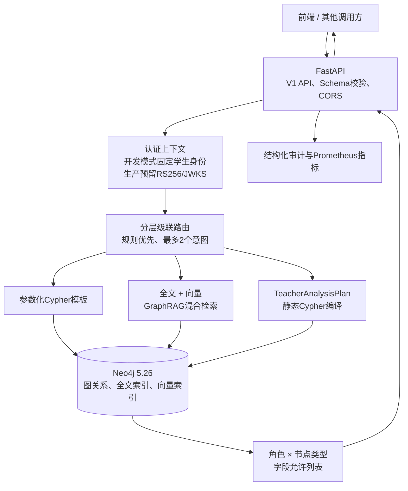
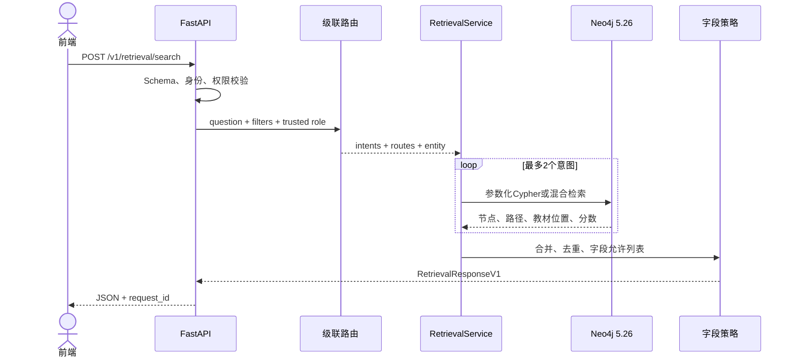

# 小学数学知识图谱检索后端：系统架构与 API 对接文档

> 文档身份：K12-KGraph 仓库内正式接口文档；OpenAPI 与 `src/retrieval/models.py` 是机器可验证契约。<br>
> 文档版本：1.1<br>
> 更新时间：2026-08-02<br>
> 对接基线：K12-KGraph Neo4j 5.26 检索后端<br>
> 规范接口：`POST /v1/retrieval/search`

## 1. 当前可用状态

后端已经完成模块实现和隔离环境端到端验证：

| 验证项 | 结果 |
| --- | --- |
| Neo4j | Community 5.26.26，健康 |
| 图数据 | 1,182 个节点、2,303 条关系 |
| 练习题 | 280 个 `Exercise` |
| 检索向量 | 1,062 个，维度均为 512 |
| 索引 | 全文、向量、范围、唯一约束全部 `ONLINE` |
| 后端镜像 | 构建成功 |
| API 与 Neo4j 容器 | 健康 |
| 自动化测试 | 181 项全部通过 |
| 严格 HTTP E2E | 每轮 350 条，串行和并发 8 连续三轮通过 |
| 最终相关性 | Recall@5 1.0000，MRR 0.9139，nDCG@10 0.9343 |
| 最终串行全链路 P95 | 54.0 ms |
| 最终并发 8 全链路 P95 | 192.8 ms |
| 数据库完整指纹变化 | 0 |

严格 E2E 每次包含 240 条图谱派生相关性查询和 110 条工程契约、安全、
边界、无结果及澄清查询；Neo4j 不可用语义由单独的 isolated API 运行验证。
这些样本是 `graph_derived_not_sme_reviewed` 或工程合成测试集，不是教研人员
人工标注的检索相关性验收集。本次验证复用图库已有的
1,062 个 512 维 BGE 向量，没有生成、替换或修改任何 Embedding；本地指标
不能据此推导生产 SLA。完整证据见
[`strict-graph-retrieval-e2e.md`](strict-graph-retrieval-e2e.md)。

## 2. 系统架构

系统采用模块化单体。FastAPI、路由、检索编排和安全策略运行在同一个 API
进程中，Neo4j 是独立的数据服务。



### 2.1 检索路由

| 问题类型 | 示例 | 路线 |
| --- | --- | --- |
| 前置知识 | “学习分数前要会什么” | 参数化 Cypher |
| 后续知识 | “分数之后学什么” | 参数化 Cypher |
| 对应练习 | “哪些题考察分数” | 参数化 Cypher |
| 教材位置 | “分数在哪一章” | 参数化 Cypher |
| 相似题 | “找一道类似的分数题” | 全文 + 向量 + GraphRAG |
| 模糊解释 | “怎么理解平均数” | 全文 + 向量 + GraphRAG |
| 教师统计 | “统计四年级知识点数量” | 结构化分析计划，仅可信教师 |

一个问题最多返回两个意图。多意图按它们在问题中的出现顺序返回，例如：

```text
学习分数前要会什么，并给两道练习题？
```

返回：

```json
{
  "intents": ["prerequisites", "exercises_for"],
  "route": "cypher_template"
}
```

### 2.2 请求时序



## 3. 服务地址与端点

隔离 E2E 默认使用非标准宿主机端口，避免和已有 Neo4j、Neo4j Browser 或
API 服务冲突：

| 服务 | E2E 地址 |
| --- | --- |
| API | `http://127.0.0.1:18000` |
| Swagger UI | `http://127.0.0.1:18000/docs` |
| OpenAPI | `http://127.0.0.1:18000/openapi.json` |
| Neo4j Browser | `http://127.0.0.1:17474` |
| Neo4j Bolt | `bolt://127.0.0.1:17687` |

对外端点：

| 方法 | 路径 | 用途 |
| --- | --- | --- |
| `POST` | `/v1/retrieval/search` | 规范检索接口 |
| `GET` | `/health` | API 和 Neo4j 健康检查 |
| `GET` | `/metrics` | Prometheus 指标 |
| `POST` | `/retrieve` | 旧接口，已弃用 |
| `POST` | `/retrieval/search` | 旧接口，已弃用 |

前端新代码只应使用 `/v1/retrieval/search`。旧接口会返回 `Deprecation`、
`Sunset` 和 `Link` 响应头。

## 4. 身份和请求头

### 4.1 通用请求头

| 请求头 | 必填 | 类型 | 说明 |
| --- | --- | --- | --- |
| `Content-Type` | 是 | `application/json` | 请求体格式 |
| `X-Request-ID` | 否 | UUID 字符串 | 前端链路 ID；无效或缺失时由后端生成 |
| `Authorization` | 生产是 | `Bearer <JWT>` | 生产 RS256/JWKS 模式使用 |

### 4.2 当前开发认证

当前 E2E 使用 `K12_AUTH_MODE=development`：

- 后端忽略客户端自报角色；
- 身份固定为学生；
- 只具有 `retrieval:read` 权限；
- 即使请求体传入 `user_type=teacher`、`include_answers=true` 或
  `route=text2cypher`，V1 也会返回 HTTP 422；
- 教师 HTTP 身份要等外部 JWT/JWKS 身份源接入后开放。

前端不得在请求体中传角色、答案开关或强制路由。

## 5. 检索请求

### 5.1 TypeScript 类型

```ts
export interface RetrievalRequestV1 {
  question: string;
  grade?: string | null;
  semester?: "上册" | "下册" | null;
  edition?: string | null;
  book_id?: string | null;
  section_id?: string | null;
  exercise_type?: string | null;
  difficulty?: 1 | 2 | 3 | 4 | 5 | null;
  top_k?: number;
}
```

### 5.2 参数规范

| 参数 | 必填 | JSON 类型 | 默认值 | 约束与含义 |
| --- | --- | --- | --- | --- |
| `question` | 是 | `string` | 无 | 去除首尾空格后 1～500 字符 |
| `grade` | 否 | `string \| null` | `null` | 年级；当前图数据使用 `"1"`～`"6"` |
| `semester` | 否 | `string \| null` | `null` | 只能是 `"上册"` 或 `"下册"` |
| `edition` | 否 | `string \| null` | `null` | 教材版本，如 `"人教版"`；1～30 字符 |
| `book_id` | 否 | `string \| null` | `null` | 教材 ID；仅允许字母、数字、`_`、`-`，1～64 字符 |
| `section_id` | 否 | `string \| null` | `null` | 章节 ID；格式同 `book_id` |
| `exercise_type` | 否 | `string \| null` | `null` | 题型，如 `"选择题"`、`"填空题"`、`"应用题"` |
| `difficulty` | 否 | `integer \| null` | `null` | 难度 1～5 |
| `top_k` | 否 | `integer` | `5` | 每条检索路线的返回上限，1～20 |

所有未知字段均被拒绝。特别禁止：

```json
{
  "user_type": "teacher",
  "include_answers": true,
  "route": "text2cypher"
}
```

### 5.3 请求示例

单意图：

```http
POST /v1/retrieval/search HTTP/1.1
Content-Type: application/json
X-Request-ID: 11111111-1111-4111-8111-111111111111

{
  "question": "分数的前置知识是什么？",
  "grade": "3",
  "semester": "上册",
  "edition": "人教版",
  "top_k": 5
}
```

多意图：

```json
{
  "question": "学习分数前要会什么，并给两道练习题？",
  "top_k": 5
}
```

## 6. 检索响应

### 6.1 TypeScript 类型

```ts
export type RetrievalIntent =
  | "concept_detail"
  | "prerequisites"
  | "successors"
  | "exercises_for"
  | "similar_exercises"
  | "location"
  | "semantic_search"
  | "teacher_analysis";

export type RetrievalRoute =
  | "cypher_template"
  | "hybrid"
  | "teacher_analysis"
  | "none";

export type EvidenceLabel =
  | "Concept"
  | "Skill"
  | "Exercise"
  | "Book"
  | "Chapter"
  | "Section";

export interface EvidenceNodeV1 {
  id: string;
  label: EvidenceLabel;
  name: string;
  score: number;
  properties: Record<string, unknown>;
}

export interface RelationPathV1 {
  start_id: string;
  end_id: string;
  relationships: string[];
  nodes: EvidenceNodeV1[];
}

export interface TextbookLocationV1 {
  node_id?: string | null;
  book_id?: string | null;
  book_name?: string | null;
  chapter_id?: string | null;
  chapter_name?: string | null;
  section_id?: string | null;
  section_name?: string | null;
  grade?: string | null;
  semester?: string | null;
  edition?: string | null;
}

export interface RetrievalResponseV1 {
  request_id: string;
  intents: RetrievalIntent[];
  route: RetrievalRoute;
  entities: EvidenceNodeV1[];
  evidence_nodes: EvidenceNodeV1[];
  relation_paths: RelationPathV1[];
  textbook_locations: TextbookLocationV1[];
  analysis_results: Array<Record<string, unknown>>;
  scores: Array<Record<string, unknown>>;
  warnings: string[];
  reason_code: string;
  needs_clarification: boolean;
}
```

### 6.2 字段说明

| 字段 | JSON 类型 | 说明 |
| --- | --- | --- |
| `request_id` | `string` | 链路 ID；用于问题定位和日志关联 |
| `intents` | `string[]` | 识别到的意图，1～2 项 |
| `route` | `string` | 实际检索路线 |
| `entities` | `EvidenceNodeV1[]` | 主要命中实体 |
| `evidence_nodes` | `EvidenceNodeV1[]` | 实体、前置节点、练习题等证据集合 |
| `relation_paths` | `RelationPathV1[]` | 图关系路径；`relationships` 最多 3 项 |
| `textbook_locations` | `object[]` | 教材、章、节位置；缺失层级可能为 `null` |
| `analysis_results` | `object[]` | 教师统计结果；学生端通常为空数组 |
| `scores` | `object[]` | 节点最终检索分数；不包含原始向量 |
| `warnings` | `string[]` | 回退、无结果或能力状态提示 |
| `reason_code` | `string` | 业务结果码 |
| `needs_clarification` | `boolean` | 是否需要前端要求用户补充问题 |

`entities` 表示主要答案对象；`evidence_nodes` 是用于解释结果的完整证据。
前端展示主结果优先使用 `entities`，展示“为什么得到这个结果”时再使用
`relation_paths` 和 `textbook_locations`。

### 6.3 节点属性

`properties` 按节点类型和身份使用允许列表：

- `Concept`：定义、公式、别名、示例、教材范围等；
- `Skill`：描述、示例、教材范围等；
- `Exercise`：题干、题型、难度、教材范围等；
- 学生端永远不返回答案、解析、解题过程、Embedding、内部检索文本或
  Cypher；
- 将来可信教师只有同时具有答案权限时才可获得答案和解析。

前端必须允许 `properties` 后续增加公开字段，不应依赖字段顺序。

### 6.4 成功响应示例

```json
{
  "request_id": "11111111-1111-4111-8111-111111111111",
  "intents": ["prerequisites", "exercises_for"],
  "route": "cypher_template",
  "entities": [
    {
      "id": "math_3a_rjb_cpt26",
      "label": "Concept",
      "name": "分数",
      "score": 1.0,
      "properties": {
        "definition": "表示把一个整体平均分成若干份后，其中若干份所占的部分的数。",
        "grade": "3",
        "semester": "上册",
        "edition": "人教版",
        "book_id": "math_3a_rjb"
      }
    }
  ],
  "evidence_nodes": [],
  "relation_paths": [
    {
      "start_id": "math_3a_rjb_cpt26",
      "end_id": "math_3a_rjb_skl16",
      "relationships": ["prerequisites_for"],
      "nodes": []
    }
  ],
  "textbook_locations": [
    {
      "book_id": "math_3a_rjb",
      "book_name": "三年级上册",
      "chapter_id": "math_3a_rjb_ch8",
      "chapter_name": "分数的初步认识",
      "section_id": null,
      "section_name": null,
      "grade": "3",
      "semester": "上册",
      "edition": "人教版"
    }
  ],
  "analysis_results": [],
  "scores": [
    {"node_id": "math_3a_rjb_cpt26", "final": 1.0}
  ],
  "warnings": [],
  "reason_code": "OK",
  "needs_clarification": false
}
```

### 6.5 无结果

无结果仍返回 HTTP 200：

```json
{
  "request_id": "generated-request-id",
  "intents": ["semantic_search"],
  "route": "hybrid",
  "entities": [],
  "evidence_nodes": [],
  "relation_paths": [],
  "textbook_locations": [],
  "analysis_results": [],
  "scores": [],
  "warnings": ["No matching knowledge graph evidence found."],
  "reason_code": "NO_RESULT",
  "needs_clarification": false
}
```

前端不能仅用 HTTP 状态判断是否命中，应同时读取 `reason_code`。

## 7. HTTP 状态和原因码

### 7.1 HTTP 状态

| HTTP | 含义 | 前端建议 |
| ---: | --- | --- |
| 200 | 成功、无结果、需要澄清或受控能力状态 | 读取 `reason_code` |
| 401 | 缺少或无效的生产 JWT | 清理会话并重新登录 |
| 403 | 权限不足或问题包含被拒绝的危险查询结构 | 读取原因码，不自动重试 |
| 422 | 请求字段、类型、枚举或范围非法 | 修正前端参数 |
| 503 | Neo4j 或上游后端不可用 | 可有限重试并显示服务暂不可用 |

当前版本尚未实现 429 限流响应，不能依赖 429 作为现有契约。

### 7.2 常见 `reason_code`

| 原因码 | 含义 |
| --- | --- |
| `OK` | 检索成功并返回证据 |
| `NO_RESULT` | 请求合法，但没有符合范围的证据 |
| `CLARIFICATION_REQUIRED` | 问题含义不清，需要用户补充 |
| `ROUTER_INVALID_OUTPUT` | 结构化路由输出非法，系统拒绝猜测 |
| `AUTHENTICATION_REQUIRED` | 需要有效认证 |
| `FORBIDDEN_TOOL` | 当前身份无权使用所选能力 |
| `UNSAFE_QUERY_REJECTED` | 问题包含写操作、外部加载、未知过程或注入结构，已在检索前拒绝 |
| `GRAPH_BACKEND_UNAVAILABLE` | 图数据库或检索后端不可用 |
| `TEACHER_ANALYSIS_DISABLED` | 教师统计能力没有配置 |
| `TEACHER_ANALYSIS_PLAN_INVALID` | 教师分析计划未通过严格 Schema 或安全校验 |

HTTP 异常的原因码位于：

```json
{
  "detail": {
    "reason_code": "GRAPH_BACKEND_UNAVAILABLE"
  }
}
```

Pydantic 请求校验失败的 HTTP 422 使用 FastAPI 标准 `detail[]` 格式。

GraphRAG 官方适配器失败、但受控本地全文/向量融合成功时，HTTP 仍为 200，
同时 `warnings` 包含 `GRAPHRAG_FALLBACK_LOCAL`。如果本地回退也失败，则返回
HTTP 503 和 `GRAPH_BACKEND_UNAVAILABLE`，不得当成普通无结果。

教师分析能力未配置或结构化计划非法时，分别返回受控的
`TEACHER_ANALYSIS_DISABLED` 或 `TEACHER_ANALYSIS_PLAN_INVALID`。静态计划已经
形成但 Neo4j 执行失败时属于后端不可用，必须返回 HTTP 503 和
`GRAPH_BACKEND_UNAVAILABLE`，不能包装成普通 HTTP 200。

## 8. 前端调用建议

### 8.1 基础调用

```ts
export async function searchKnowledgeGraph(
  payload: RetrievalRequestV1,
  token?: string,
): Promise<RetrievalResponseV1> {
  const response = await fetch(
    "http://127.0.0.1:18000/v1/retrieval/search",
    {
      method: "POST",
      headers: {
        "Content-Type": "application/json",
        "X-Request-ID": crypto.randomUUID(),
        ...(token ? { Authorization: `Bearer ${token}` } : {}),
      },
      body: JSON.stringify(payload),
    },
  );

  const body = await response.json();
  if (!response.ok) {
    const reason = body?.detail?.reason_code ?? `HTTP_${response.status}`;
    throw new Error(reason);
  }
  return body as RetrievalResponseV1;
}
```

### 8.2 UI 状态建议

| 条件 | UI |
| --- | --- |
| `reason_code === "OK"` | 展示实体、路径和教材出处 |
| `reason_code === "NO_RESULT"` | 展示“图库中暂未找到相关内容” |
| `needs_clarification === true` | 要求用户补充知识点、年级或教材范围 |
| HTTP 401 | 进入重新认证流程 |
| HTTP 403 + `FORBIDDEN_TOOL` | 展示无权限 |
| HTTP 403 + `UNSAFE_QUERY_REJECTED` | 提示问题包含不允许的查询结构，不自动改写重试 |
| HTTP 422 | 提示参数错误并记录前端日志 |
| HTTP 503 | 展示服务暂不可用，可做指数退避重试 |

不要把 `warnings` 直接作为面向小学生的文案。建议前端维护原因码到友好中文
文案的映射。

### 8.3 CORS

开发示例允许：

```text
http://localhost:3000
http://localhost:5173
```

通过 `K12_CORS_ORIGINS` 配置，多个 Origin 使用逗号分隔。生产环境禁止
通配符 `*`，应填写真实前端域名；也可以由网关提供同源访问。

## 9. 部署和 E2E 复现

代码目录：

```text
/Users/xiexiaodong/mykg0728/K12-KGraph
```

核心文件：

- `src/retrieval/api.py`：HTTP 入口；
- `src/retrieval/models.py`：V1 请求和响应模型；
- `src/retrieval/router.py`：级联路由；
- `src/retrieval/service.py`：检索编排；
- `src/retrieval/policy.py`：字段与权限策略；
- `src/retrieval/teacher_analysis.py`：教师分析计划和静态编译；
- `docker/docker-compose.neo4j-retrieval.yml`：隔离容器；
- `eval/retrieval/run_strict_graph_e2e.py`：严格 HTTP E2E 执行器；
- `eval/retrieval/graph_fingerprint.py`：只读数据与 Schema 指纹；
- `eval/retrieval/run_failure_semantics_e2e.py`：独立故障语义验证。

配置：

```bash
cd /Users/xiexiaodong/mykg0728/K12-KGraph
cp config/retrieval.env.example config/retrieval.env
```

必须把示例 Neo4j 密码替换为本地测试密码。API 密钥只写入未跟踪的
`config/retrieval.env`，不得提交到仓库。

`K12_NEO4J_POOL_WARMUP_CONCURRENCY` 默认是 `8`。API 启动时会并发执行固定的
只读 `RETURN 1 AS value`，预热 Bolt 连接池，避免第一批并发请求承担连接创建
成本。READ 连接成功后，本地 `fastembed` 模型也会在应用报告启动完成前完成
加载和一次固定文本推理，避免首个 Hybrid 请求承担模型初始化成本。这两个
动作都不修改图节点、关系、属性、Embedding 或 Schema。

首次部署需要按“数据库 → Schema → 数据 → API”顺序执行：

```bash
docker compose \
  --env-file config/retrieval.env \
  -f docker/docker-compose.neo4j-retrieval.yml \
  up -d neo4j

./docker/scripts/init_retrieval_schema.sh config/retrieval.env

docker compose \
  --env-file config/retrieval.env \
  -f docker/docker-compose.neo4j-retrieval.yml \
  build retrieval-api

docker compose \
  --env-file config/retrieval.env \
  -f docker/docker-compose.neo4j-retrieval.yml \
  run --rm --no-deps retrieval-api \
  python docker/scripts/import_kg_json.py \
  --kg-json data/retrieval/primary_math_graph.json \
  --no-drop-embeddings

docker compose \
  --env-file config/retrieval.env \
  -f docker/docker-compose.neo4j-retrieval.yml \
  up -d --build retrieval-api
```

宿主机没有 `cypher-shell` 时，可以把 Schema 文件通过标准输入交给 Neo4j
容器内的 `cypher-shell`。不得对已有生产数据库执行清库命令。

执行严格 E2E：

```bash
uv run python eval/retrieval/run_strict_graph_e2e.py \
  --url http://127.0.0.1:18000/v1/retrieval/search \
  --output-dir eval/retrieval/results/strict-e2e/<run-id> \
  --warmup 20 \
  --concurrency 8
```

API 镜像使用 `pyproject.toml` 和 `uv.lock` 执行 `uv sync --frozen --no-dev`。
`.dockerignore` 排除本地 `.env`、Git、虚拟环境、OMX 状态和历史评测结果，
真实凭据不得进入镜像构建上下文。

## 10. Embedding 和 LLM 配置边界

系统支持三类 Embedding：

| Provider | 用途 |
| --- | --- |
| `fastembed` | 本地 512 维 BGE，默认无外部密钥 |
| `openai` | DashScope OpenAI-compatible `text-embedding-v4` |
| `hash` | 仅用于离线契约和容器 E2E，不代表语义相关性 |

同一向量索引中的向量必须来自同一个模型空间。切换到 DashScope 时必须：

1. 在未跟踪的本地配置中设置新的 API Key；
2. 设置 Provider、Base URL、模型和 512 维参数；
3. 对 Concept、Skill、Exercise 的全部向量执行 `--replace` 重建；
4. 检查三个向量索引和全部向量维度；
5. 重新运行相关性评测和 E2E。

本次严格 E2E 使用与图库现有向量一致的本地 `fastembed` Provider、
`BAAI/bge-small-zh-v1.5` 模型和 512 维配置。全过程没有重建向量。
`hash` 只用于部分离线单元与契约测试，不用于证明语义质量。DashScope
Adapter 另有自动化测试；真实上游调用仍需要轮换后的私有密钥，并且切换
模型后必须在独立维护流程中重建全部向量，不能混用向量空间。

DeepSeek 只用于低置信结构化路由和教师结构化分析计划。没有 DeepSeek Key
时，高置信规则路由和多意图规则仍可工作；自由生成 Cypher 已从 V1 API
运行时移除。

## 11. 已知限制

- 当前开发认证固定学生身份，教师 HTTP 对接等待外部 JWT/JWKS；
- 280 道练习题是代表性题目，不是教材全部练习；
- 大部分教材证据只能定位到章，少量能定位到节，没有完整页码；
- 110 条契约/安全/边界用例是工程合成集，不是教研相关性验收；
- 240 条检索相关性查询由图数据自动生成，同样不能代替教研人工验收；
- 当前未实现生产限流、正式 SLA、Canary 和长期观测基线；
- 自然语言答案生成不在当前后端范围，前端应直接消费结构化证据。

## 12. 前端联调验收清单

- 使用 `/v1/retrieval/search`，不使用旧接口；
- `grade` 发送字符串，不发送数字；
- 不发送 `user_type`、`include_answers`、`route`；
- 同时处理 HTTP 状态和 `reason_code`；
- 支持 1～2 个 `intents`；
- 允许教材位置字段为 `null`；
- 不假定 `properties` 的字段顺序；
- 使用 `request_id` 关联前后端日志；
- 对 HTTP 503 做有限重试，不对 403、422 自动重试；
- 不在学生界面展示内部 `warnings` 原文；
- 联调域名已加入 `K12_CORS_ORIGINS`。
