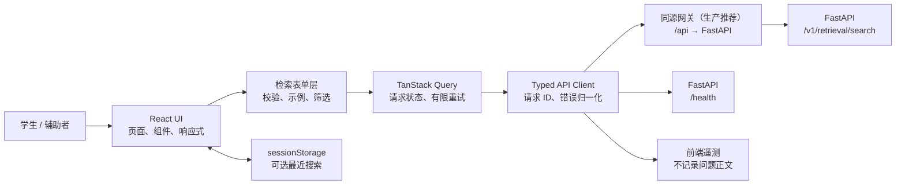
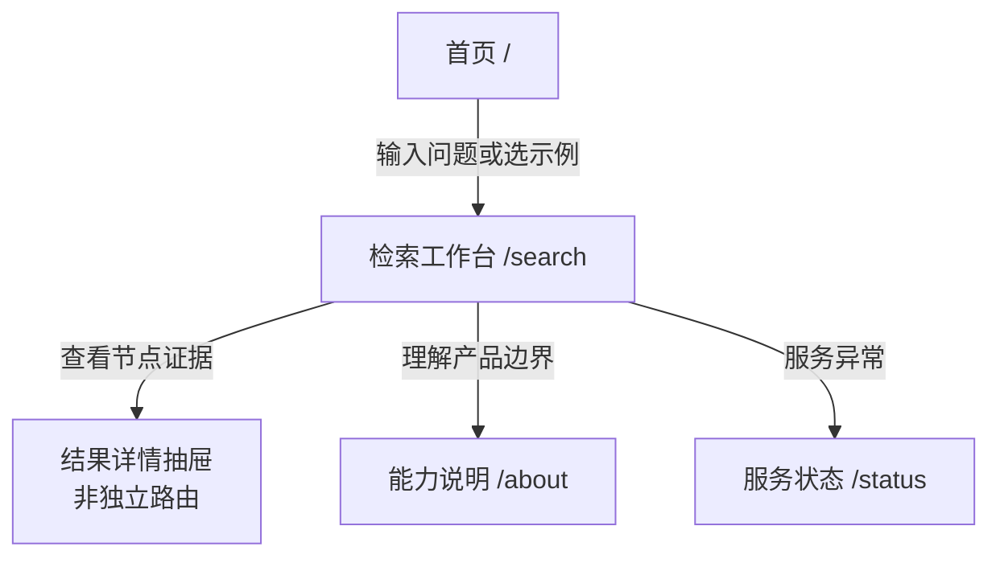
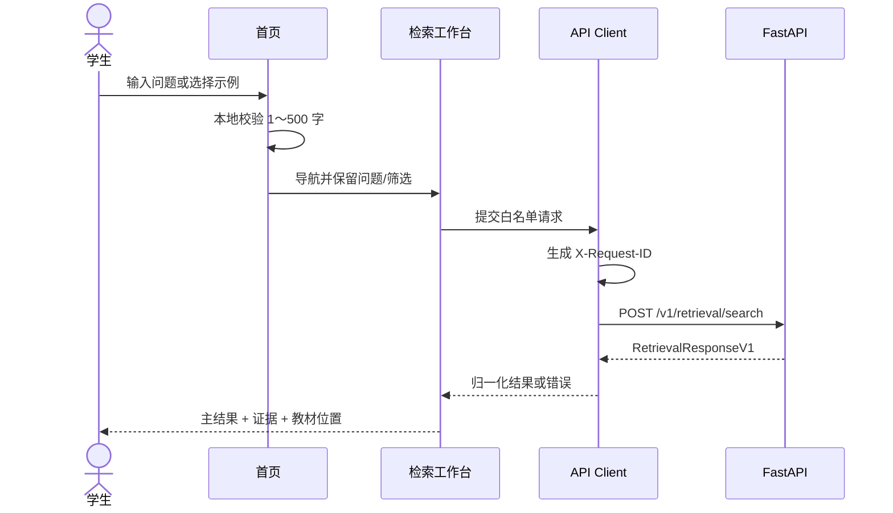
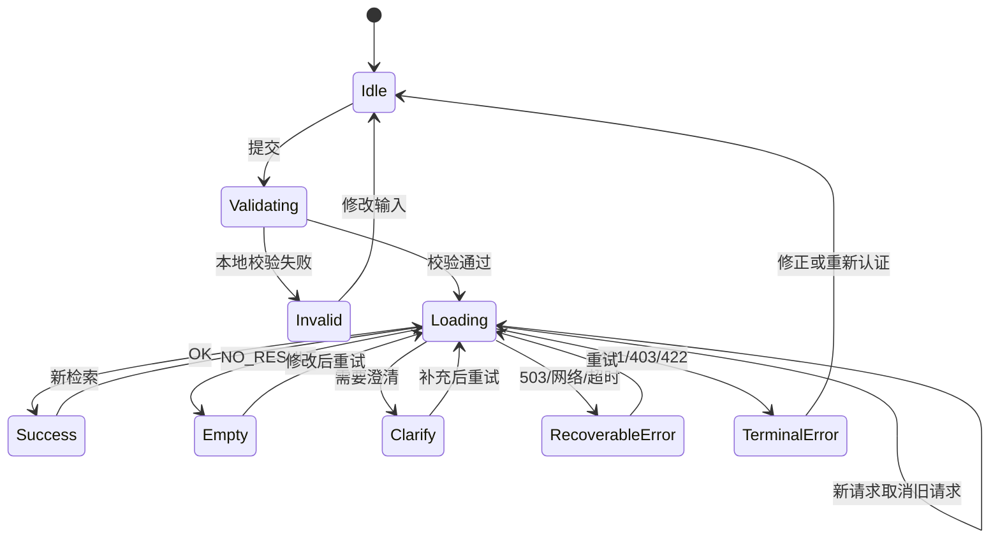

# 小学数学知识图谱检索 Web 原型：前端 E2E 设计与实现规划

> 文档版本：1.1<br>
> 更新时间：2026-08-02<br>
> 状态：Draft，已同步后端 1.1 契约，可进入原型实现<br>
> 产品需求基线：[E2E-PRD.md](./E2E-PRD.md)<br>
> 后端基线：[E2E-backend.md](./E2E-backend.md)<br>
> 当前范围：学生身份、小学数学、结构化检索结果展示<br>
> 推荐实现：React + TypeScript + Vite

## 1. 文档目标

本文把当前后端已经验证的检索能力转换为一个**可运行、可联调、可测试**
的学生端 Web 系统原型方案，作为产品、设计、前端开发和 E2E 验收的共同基线。

本文覆盖：

- 前端技术架构与目录结构；
- 信息架构、页面清单和导航；
- 桌面、平板、手机端布局；
- 视觉风格、设计 Token 和组件规范；
- 搜索、筛选、结果探索和异常恢复的交互逻辑；
- 后端字段到 UI 的映射；
- API Client、状态管理、缓存、错误和安全策略；
- 实施阶段、测试矩阵和验收标准。

本文不承诺后端尚未提供的能力。所有“未来”功能均明确标注，不进入当前 MVP。

## 2. 设计依据与事实边界

### 2.1 已审阅证据

- `docs/E2E-backend.md`：前端对接的主要契约；
- `src/retrieval/models.py`：V1 请求、响应和字段约束；
- `src/retrieval/api.py`：规范端点和健康检查；
- `src/retrieval/router.py`：意图及检索路线；
- `src/retrieval/service.py`：检索编排与结果聚合；
- `tests/retrieval/`：安全、路由、契约和 E2E 行为；
- `README_zh.md`：产品背景与知识图谱语义。

仓库当前没有 `package.json`、前端源码、路由、组件库、样式系统或可直接复用
的产品 UI。本文因此定义一个新的前端基线。

### 2.2 后端当前真实能力

| 能力 | 当前状态 | 前端设计结论 |
| --- | --- | --- |
| 后端工程基线 | 181 项测试通过；严格 E2E 每轮 350 条，串行/并发 8 连续三轮通过 | 作为联调基线，不外推为生产 SLA |
| 图数据不可变性 | 最终数据库指纹变化为 0 | 前端不得触发导入、Schema 或向量维护操作 |
| 自然语言检索 | 可用 | 作为产品主入口 |
| 年级、学期、教材、题型、难度筛选 | 可用 | 放入渐进式筛选区 |
| 概念、前置、后续、练习、相似题、教材位置 | 可用 | 按意图呈现结果模块 |
| 一次识别 1～2 个意图 | 可用 | 结果区支持分组与切换 |
| 关系路径 | 可用，但数据量有限 | 只画响应内的局部证据图 |
| 教材位置 | 可用，章/节可能为空 | 使用可缺省的面包屑 |
| 自然语言答案生成 | 不可用 | 不生成“AI 总结”，直接展示证据 |
| 学生答案、解析、解题过程 | 不可用且禁止返回 | UI 不出现“查看答案”入口 |
| 教师分析 | HTTP 身份尚未开放 | 当前导航和页面不展示 |
| 按节点 ID 查询详情 | 不可用 | 详情只来自本次响应，采用抽屉 |
| 全库分页浏览 | 不可用 | 不设计“知识点大全”或题库列表 |
| 检索历史服务端保存 | 不可用 | 仅可做本地、可关闭的最近搜索 |
| 生产限流、正式 SLA | 不可用 | 不展示虚构的配额或 SLA |

### 2.3 当前产品假设

当前已有产品需求基线，但尚无正式品牌规范。前端在不扩大 PRD 范围的前提下
采用以下显式设计假设：

- 核心用户为小学 1～6 年级学生，家长或教师可能在旁辅助；
- 核心任务是“快速理解知识点在课程中的位置和关系”，不是替代教学答疑；
- 第一版只做中文简体、数学学科、学生只读；
- 首屏必须让不会写复杂提示词的学生也能成功发起检索；
- 界面应友好、有探索感，但避免低幼卡通化和过度游戏化；
- 目标浏览器为最近两个主要版本的 Chrome、Edge、Safari 和 Firefox；
- 可访问性目标为 WCAG 2.2 AA 的核心要求。

这些假设不会改变 API，也可在用户研究后独立调整。

## 3. 产品目标、非目标与成功标准

### 3.1 产品目标

1. 学生能在 30 秒内完成一次有效检索并理解主结果。
2. 学生能区分“知识点本身”“前后关系”“练习”和“教材位置”。
3. 后端无结果、需澄清或不可用时，界面给出明确且可执行的下一步。
4. 所有 UI 状态严格服从 V1 API 契约，不泄露内部检索或安全字段。
5. 同一核心流程在 360 px 手机、768 px 平板和 1440 px 桌面上可用。

### 3.2 非目标

- 不提供聊天机器人式多轮对话；
- 不生成超出结构化证据的解释、答案或教学建议；
- 不实现教师后台、运营后台、班级管理或账号体系；
- 不实现完整知识图谱编辑器；
- 不实现题目作答、判分、答案和解析；
- 不直接暴露 Neo4j、Cypher、原始向量、内部 `warnings` 或检索路由细节；
- 不将 `/metrics` 暴露给普通学生界面。

### 3.3 原型成功信号

| 指标 | 原型目标 | 采集方式 |
| --- | ---: | --- |
| 首次检索完成率 | ≥ 90% | 前端匿名事件 |
| 有结果检索的主结果展开率 | ≥ 40% | 前端匿名事件 |
| 澄清后的再次提交率 | ≥ 60% | 前端匿名事件 |
| 前端导致的 HTTP 422 | < 1% | 错误事件 |
| 关键流程 E2E 通过率 | 100% | Playwright |
| 键盘关键流程可完成 | 100% | 自动化 + 人工检查 |

分析事件只记录意图、筛选项是否存在、结果数量和耗时，不记录完整问题文本。

## 4. 技术方案比较与选择

### 4.1 方案 A：React + Vite 单页应用

前端浏览器直接调用 FastAPI，开发环境使用 CORS，生产环境优先由网关将
`/api` 反向代理到后端。

优点：

- 新仓库启动快，概念少，适合当前单一检索工作台；
- 静态资源可部署到 CDN 或 Nginx；
- 与现有 `localhost:5173` CORS 配置直接匹配；
- 后端没有 SEO 或服务端渲染要求；
- 易于使用 Mock Service Worker 和 Playwright 做契约/E2E。

限制：

- 未来生产 JWT 的刷新和 HttpOnly Cookie 需要网关或 BFF 配合；
- 首屏 HTML 不含业务内容，但当前工具型产品不依赖 SEO；
- 跨域生产部署需要正确配置 CORS。

### 4.2 方案 B：Next.js + BFF

浏览器调用 Next.js Route Handler，由 BFF 转发到 FastAPI 并管理认证 Cookie。

优点：

- 生产认证、同源 Cookie、安全头和服务端代理更集中；
- 可在服务端隐藏后端地址；
- 未来加入公开内容页时具备 SSR/SEO 能力。

限制：

- 对当前单端点原型增加 Node 服务、部署和缓存复杂度；
- 需要维护前端服务与 FastAPI 两个服务运行时；
- BFF 容易复制后端 Schema 或造成错误语义不一致；
- 当前尚无正式身份源，暂时无法发挥主要价值。

### 4.3 推荐结论

当前选择**方案 A：React + Vite SPA**。

选择依据是：当前产品本质是一个检索工作台，后端只开放一个核心业务端点，
无 SEO 诉求，开发 CORS 已支持 Vite。生产环境推荐使用同源网关代理，而不是
在浏览器里硬编码后端域名。正式 JWT/JWKS 接入后，再评估是否增加轻量 BFF。

## 5. 整体前端架构



### 5.1 分层职责

| 层 | 职责 | 禁止事项 |
| --- | --- | --- |
| 页面层 | 编排页面、URL、布局和焦点 | 直接拼装 HTTP 请求 |
| 功能层 | 搜索表单、结果、图谱、筛选 | 读取未知后端私有字段 |
| 领域层 | 类型、标签映射、展示模型转换 | 发起网络请求 |
| API 层 | Headers、序列化、错误归一化 | 将内部错误原文直接交给学生 |
| 基础 UI | Button、Card、Dialog、Toast | 绑定业务意图 |
| 配置层 | API Base URL、超时、功能开关 | 在代码中硬编码环境地址 |

### 5.2 推荐依赖

| 类别 | 选择 | 用途 |
| --- | --- | --- |
| 框架 | React + TypeScript | UI 与类型安全 |
| 构建 | Vite | 本地开发和静态构建 |
| 路由 | React Router | 页面与 URL 状态 |
| 服务端状态 | TanStack Query | 请求生命周期、缓存、重试 |
| 表单 | React Hook Form + Zod | 输入校验和请求白名单 |
| 样式 | Tailwind CSS + CSS Variables | Token、响应式和组件样式 |
| 无障碍组件 | Radix UI primitives | Dialog、Popover、Tabs 等交互基础 |
| 图谱 | React Flow | 仅展示当前响应中的局部证据路径，按需加载 |
| 图标 | Lucide React | 统一线性教研图标 |
| Mock | MSW | 接口场景模拟 |
| 单元/组件测试 | Vitest + Testing Library | 逻辑与交互测试 |
| E2E | Playwright | 多视口联调验收 |

依赖版本在实施时锁定，不为简单展示引入额外全局状态库。若 React Router
Data APIs 足以承载页面状态，也不再增加 Zustand 或 Redux。

### 5.3 建议目录

```text
frontend/
├── public/
├── src/
│   ├── app/
│   │   ├── App.tsx
│   │   ├── router.tsx
│   │   ├── providers.tsx
│   │   └── routes.ts
│   ├── pages/
│   │   ├── HomePage.tsx
│   │   ├── SearchPage.tsx
│   │   ├── AboutPage.tsx
│   │   └── StatusPage.tsx
│   ├── features/
│   │   └── retrieval/
│   │       ├── api/
│   │       ├── components/
│   │       ├── hooks/
│   │       ├── model/
│   │       └── utils/
│   ├── components/
│   │   ├── ui/
│   │   └── layout/
│   ├── styles/
│   │   ├── globals.css
│   │   └── tokens.css
│   ├── lib/
│   │   ├── env.ts
│   │   ├── http.ts
│   │   └── telemetry.ts
│   ├── mocks/
│   └── test/
├── e2e/
├── .env.example
├── index.html
├── package.json
├── tsconfig.json
└── vite.config.ts
```

### 5.4 环境变量与运行命令

```dotenv
# 开发：直接请求 FastAPI
VITE_API_BASE_URL=http://127.0.0.1:18000

# 生产推荐：由网关同源转发
# VITE_API_BASE_URL=/api
```

```bash
pnpm install
pnpm dev
pnpm test
pnpm test:e2e
pnpm build
pnpm preview
```

`env.ts` 在应用启动时校验配置。生产构建不得回退到 localhost。

## 6. 信息架构与页面清单

### 6.1 信息架构



### 6.2 页面清单

| 页面 | 路由 | 主要任务 | 数据来源 | MVP |
| --- | --- | --- | --- | --- |
| 探索首页 | `/` | 了解产品、输入问题、使用示例 | 静态内容 | 是 |
| 检索工作台 | `/search` | 筛选、发起检索、探索结果 | `POST /v1/retrieval/search` | 是 |
| 能力说明 | `/about` | 解释能做什么、不能做什么、隐私原则 | 静态内容 | 是 |
| 服务状态 | `/status` | 查看 API/图数据库是否可用 | `GET /health` | 是 |
| 404 | `*` | 返回有效入口 | 静态内容 | 是 |
| 登录 | `/login` | 正式身份认证 | 未来身份源 | 否 |
| 教师分析 | `/teacher` | 教师统计 | 未来 JWT/权限 | 否 |
| 节点永久详情 | `/nodes/:id` | 按 ID 重取详情 | 后端无端点 | 否 |

节点详情采用工作台内抽屉，因为当前后端不能通过节点 ID 重新获取数据。抽屉
不生成可分享的永久 URL，避免刷新后出现无数据页面。

## 7. 全局布局

### 7.1 桌面端（≥ 1200 px）

```text
┌──────────────────────────────────────────────────────────────────────┐
│ Logo / 数学图谱     探索   能力说明                服务状态  帮助     │ 64
├──────────────────────────────────────────────────────────────────────┤
│                                                                      │
│  ┌────────── 248 ──────────┐  ┌──────── 主内容，max 960 ──────────┐ │
│  │ 搜索范围                 │  │ 问题输入 + 搜索按钮               │ │
│  │ 年级 / 学期 / 教材       │  │ 已选筛选 chips                    │ │
│  │ 题型 / 难度 / 数量       │  ├──────────────────────────────────┤ │
│  │                          │  │ 意图摘要 / 结果状态               │ │
│  │ 最近搜索（本地，可关闭） │  │ 主结果卡片                        │ │
│  │                          │  │ 关系 / 教材位置 / 练习分区        │ │
│  └──────────────────────────┘  └──────────────────────────────────┘ │
│                                                                      │
└──────────────────────────────────────────────────────────────────────┘
```

- 顶部导航固定，主体最大宽度 1280 px；
- 左侧筛选栏在滚动时保持可见，顶部偏移 88 px；
- 主内容为一列，不做密集三栏仪表盘；
- 详情从右侧以 480～560 px 抽屉打开；
- 结果图谱最大高度 460 px，始终提供等价的列表视图。

### 7.2 平板端（768～1199 px）

- 顶部保留 Logo、探索、能力说明；
- 筛选栏收起为搜索框下方的“筛选”按钮；
- 筛选使用右侧 Sheet，占屏宽约 400 px；
- 结果卡片保持单列；
- 详情抽屉占 70%～80% 宽度。

### 7.3 手机端（360～767 px）

```text
┌──────────────────────────────┐
│ Logo                 状态  ☰ │ 56
├──────────────────────────────┤
│ 你想了解什么数学知识？       │
│ ┌──────────────────────────┐ │
│ │ 输入问题，最多 500 字…   │ │
│ └──────────────────────────┘ │
│ [筛选 2]          [开始探索] │
│ [三年级] [上册]              │
├──────────────────────────────┤
│ 找到：分数                   │
│ [前置知识] [对应练习]        │
│ ┌──────────────────────────┐ │
│ │ 结果卡片                 │ │
│ └──────────────────────────┘ │
│ ┌──────────────────────────┐ │
│ │ 教材位置                 │ │
│ └──────────────────────────┘ │
└──────────────────────────────┘
```

- 页面左右安全边距 16 px；
- 搜索按钮在输入区下方占满宽度，不使用仅图标按钮；
- 筛选为底部 Sheet，支持拖拽关闭和明确“应用/重置”；
- 详情使用全屏 Dialog，关闭后焦点回到触发卡片；
- 图谱默认显示“关系列表”，用户主动切换后再加载画布；
- 任何横向滚动内容都必须有边缘提示或改为换行。

## 8. 视觉风格与设计系统

### 8.1 风格定位

关键词：**清晰、可信、温和、探索感、课程结构化**。

设计应像一本现代化的“数学探索笔记”，不是企业 BI 仪表盘，也不是低幼游戏。
使用少量几何图形和关系连线表达知识图谱语义，让内容而非装饰成为主角。

### 8.2 色彩 Token

| Token | 建议值 | 用途 |
| --- | --- | --- |
| `--color-brand-600` | `#3155C6` | 主按钮、链接、焦点关联 |
| `--color-brand-50` | `#EEF3FF` | 选中背景、轻提示 |
| `--color-accent-500` | `#E88B2B` | 数学探索强调，不承载大段文字 |
| `--color-success-600` | `#27835A` | 成功、服务健康 |
| `--color-warning-600` | `#A96314` | 澄清、回退状态 |
| `--color-danger-600` | `#C43D4B` | 错误、不可用 |
| `--color-text` | `#172033` | 主要文字 |
| `--color-text-muted` | `#5C667A` | 辅助文字 |
| `--color-border` | `#DDE3EE` | 边框和分隔 |
| `--color-surface` | `#FFFFFF` | 卡片 |
| `--color-canvas` | `#F7F9FC` | 页面背景 |

不得只依赖颜色区分节点或状态；节点类型同时使用文字标签、图标和形状。

### 8.3 节点类型视觉

| 类型 | 颜色倾向 | 图标 | 形状语义 |
| --- | --- | --- | --- |
| Concept | 蓝 | CircleDot | 圆角矩形 |
| Skill | 青绿 | Sparkles | 圆角矩形 + 左侧标记 |
| Exercise | 橙 | FileQuestion | 卡片 |
| Book | 紫 | BookOpen | 标签 |
| Chapter | 靛 | Library | 标签 |
| Section | 灰蓝 | Bookmark | 标签 |

颜色只用于快速扫视，不改变文本对比度要求。

### 8.4 字体与排版

- 中文字体：`"Noto Sans SC", "PingFang SC", "Microsoft YaHei", sans-serif`；
- 数学/数字：继承正文；公式较多时再评估 KaTeX，不在原型先引入；
- 页面标题：32/40，700；
- 区块标题：20/28，650；
- 卡片标题：16/24，650；
- 正文：16/26，400；
- 辅助文字：14/22，400；
- 手机页面标题降为 26/34；
- 学生主流程正文不小于 16 px。

### 8.5 空间、圆角和阴影

- 4 px 基础网格；常用间距为 8、12、16、24、32、48；
- 输入和按钮高度：桌面 44 px，触屏最小 48 px；
- 卡片圆角 16 px，输入 12 px，Chip 999 px；
- 默认卡片只使用 1 px 边框；
- 悬浮层使用低对比阴影，避免层层浮起；
- 页面每屏只允许一个视觉主行动按钮。

### 8.6 动效

- 普通状态过渡 120～180 ms；
- 抽屉 220 ms；
- 搜索中使用骨架屏和轻微关系点动效，不使用无限旋转的大型 Loader；
- `prefers-reduced-motion: reduce` 时取消位移和图谱自动布局动画；
- 结果出现时不自动滚动越过搜索摘要，移动端仅将焦点移到结果状态标题。

## 9. 核心组件清单

### 9.1 输入与筛选

| 组件 | 关键状态 |
| --- | --- |
| `QuestionComposer` | empty、typing、invalid、submitting、disabled |
| `ExamplePromptList` | 默认示例、按年级变化、键盘选择 |
| `FilterPanel` | desktop sidebar、tablet sheet、mobile bottom sheet |
| `FilterChip` | active、removable、disabled |
| `GradeSelect` | `"1"`～`"6"`，发送字符串 |
| `SemesterSegment` | 未选择、上册、下册 |
| `DifficultySelect` | 未选择、1～5，附文字含义 |
| `TopKSelect` | 3、5、10、20，默认 5 |

`edition` 原型可提供“人教版”和手动输入兼容；在没有字典 API 前，不把它做成
声称完整的教材版本列表。`book_id`、`section_id` 属于高级精确筛选，默认折叠，
只对了解 ID 的测试或教研用户开放。

### 9.2 结果组件

| 组件 | 数据来源 | 说明 |
| --- | --- | --- |
| `ResultSummary` | intents、route、entities | 面向用户只翻译意图，不显示内部 route |
| `IntentTabs` | intents | 两个意图时切换/锚点导航 |
| `EntityCard` | entities | 主结果，优先展示 |
| `EvidenceCard` | evidence_nodes | 解释证据，默认次级 |
| `RelationExplorer` | relation_paths + nodes | 图/列表双视图 |
| `TextbookBreadcrumb` | textbook_locations | 书 → 章 → 节，容忍 null |
| `ExerciseCard` | Exercise properties | 题干、题型、难度，无答案按钮 |
| `PropertyList` | properties | 基于允许映射展示，未知公开字段降级 |
| `ScoreIndicator` | score | 默认隐藏精确小数，用“相关/较相关”表达 |
| `NodeDetailDrawer` | 本次响应中的节点 | 不支持永久链接 |
| `RequestSupportInfo` | request_id | 仅在“问题诊断”折叠区复制 |

### 9.3 反馈状态

| 组件 | 用途 |
| --- | --- |
| `SearchSkeleton` | 首次和新检索加载 |
| `EmptyResult` | 合法但无命中 |
| `ClarificationPanel` | 需要补充问题 |
| `ErrorPanel` | HTTP/业务错误 |
| `InlineFieldError` | 前端校验或 422 字段错误 |
| `RetryBanner` | 503 有限重试 |
| `OfflineBanner` | 浏览器离线 |
| `Toast` | 复制 request_id、保存设置等低风险反馈 |

## 10. 后端字段到 UI 的映射

### 10.1 请求映射

| UI 字段 | API 字段 | 发送规则 |
| --- | --- | --- |
| 问题 | `question` | trim 后 1～500 字 |
| 年级 | `grade` | `"1"`～`"6"` 字符串 |
| 学期 | `semester` | `"上册"`、`"下册"` 或省略 |
| 教材版本 | `edition` | 1～30 字或省略 |
| 教材 ID | `book_id` | 仅 `[A-Za-z0-9_-]`，1～64 |
| 章节 ID | `section_id` | 同上 |
| 题型 | `exercise_type` | 1～30 字或省略 |
| 难度 | `difficulty` | 1～5 整数或省略 |
| 结果数量 | `top_k` | 1～20，默认 5 |

请求对象必须由白名单序列化器生成，禁止扩展运算符把整个表单状态直接发送。
不得发送 `user_type`、`include_answers`、`route`、`subject` 或 `stage`。

### 10.2 意图文案映射

| API intent | 学生端标题 | 建议结果模块 |
| --- | --- | --- |
| `concept_detail` | 知识点 | 实体定义、公式、示例、教材位置 |
| `prerequisites` | 学习前先了解 | 关系路径、前置节点 |
| `successors` | 接下来可以学习 | 关系路径、后续节点 |
| `exercises_for` | 对应练习 | Exercise 卡片 |
| `similar_exercises` | 相似练习 | Exercise 卡片、相关度 |
| `location` | 教材中的位置 | 教材面包屑 |
| `semantic_search` | 相关知识 | 主实体、证据、关系 |
| `teacher_analysis` | 教师分析 | 当前学生端不渲染，转为能力不可用提示 |

### 10.3 节点属性展示策略

`properties` 是可扩展对象，前端采用“已知字段优先 + 安全降级”：

1. 已知字段按产品顺序和友好标签展示；
2. 内部/敏感字段即使意外出现也在前端二次拒绝；
3. 未知字段只在值为简单字符串、数字或布尔值时进入“更多信息”；
4. 对象、数组默认不直接 `JSON.stringify` 给学生；
5. 不依赖服务端字段顺序。

前端防御性拒绝名单至少包括：

```text
answer, answers, analysis, solution, reasoning, process,
embedding, vector, search_text, teacher_search_text,
cjk_search_text, cypher, query
```

常用字段顺序建议：

```text
definition → formula → description → examples → stem →
type/exercise_type → difficulty → grade → semester → edition
```

注意：前端拒绝名单只是纵深防御，不能替代后端字段策略。

### 10.4 教材位置

展示格式：

```text
人教版 · 三年级上册 / 分数的初步认识 / 具体小节
```

- 缺少节：显示到章，不使用“未知小节”制造噪音；
- 缺少章：显示教材名和年级学期；
- 全部缺失：不渲染空卡片；
- 不推断页码。

### 10.5 关系展示

关系文案映射：

| 关系 | 文案 |
| --- | --- |
| `prerequisites_for` | 是学习……的前置知识 |
| `leads_to` | 学会后可以继续到 |
| `tests_concept` | 练习考察 |
| `tests_skill` | 练习训练 |
| `appears_in` | 出现在 |
| `is_part_of` | 属于 |
| `relates_to` | 与……相关 |
| `is_a` | 是一种 |

未知关系使用安全格式化后的原名并标记“关联”，不得凭空生成语义。

## 11. 核心交互流程

### 11.1 首次检索



行为规则：

1. 示例问题点击后填入输入框，不立即发送，避免误触；
2. Enter 提交，Shift+Enter 换行；
3. 空输入、超长输入和非法 ID 在前端拦截；
4. 提交后保留输入和筛选，禁用重复提交按钮；
5. 新搜索取消旧请求，旧响应不得覆盖新响应；
6. 成功后 URL 只保存非敏感筛选，不强制保存完整问题；
7. 页面显示“检索依据”，而不是“AI 回答”。

### 11.2 多意图结果

当 `intents.length === 2`：

- 桌面端显示两个锚点式 Tab，并在同一页面按 API 顺序排列；
- 手机端使用横向可滚动 Tab，选中项自动对齐；
- 每个区块只消费与该意图相关的结果形态；
- 后端未对节点逐一标注意图时，不做不可靠的强制拆分；可以共享实体摘要，
  再分别呈现关系或练习模块；
- 页面标题使用“我们找到了 2 类相关信息”，不暴露路由器概念。

### 11.3 节点详情

1. 点击 Entity/Evidence 卡片打开详情抽屉；
2. 抽屉标题显示节点类型和名称；
3. 内容顺序为核心属性、教材位置、相关关系、来源说明；
4. 点击相关节点时，如该节点存在于本次响应则在抽屉内切换；
5. 若只有 ID 没有节点详情，则只展示关系文本，不生成不可用链接；
6. 关闭后焦点回到原卡片。

### 11.4 澄清流程

当 `needs_clarification === true` 或
`reason_code === "CLARIFICATION_REQUIRED"`：

- 保留原问题；
- 标题：“这个问题还可以更具体一点”；
- 提供三个可操作方向：补充知识点、选择年级、选择教材范围；
- 根据缺失的当前筛选显示快捷控件；
- 用户修改后再次提交新请求；
- 不展示后端内部 `warnings` 原文。

### 11.5 无结果流程

当 `reason_code === "NO_RESULT"`：

- 标题：“图库中暂时没有找到匹配内容”；
- 展示当前生效筛选，帮助识别范围过窄；
- 提供“清除筛选后重试”和“换一种说法”；
- 给出 2～3 个同类示例，但不声称一定有结果；
- 不把无结果渲染成系统错误。

### 11.6 网络异常与重试

- HTTP 503：最多自动重试 2 次，建议退避 500 ms、1500 ms，并加入抖动；
- GET `/health`：状态页可手动刷新，不在每次搜索前阻塞检查；
- HTTP 401：清理本地认证状态并进入未来登录流程；当前开发模式显示配置提示；
- HTTP 403、422：不自动重试；403 需区分权限不足和危险查询结构被拒绝；
- 当前后端未实现 429 限流契约，前端不得依赖 Retry-After 或虚构倒计时；
- 浏览器离线：立即提示，恢复在线后允许手动重试；
- 请求默认超时建议 10 秒；超时视为可重试网络错误，不虚构后端状态；
- 保留失败请求对应的 `request_id` 供诊断。

## 12. 状态机与错误文案

### 12.1 检索状态机



### 12.2 原因码映射

| 条件 | 学生端文案 | 行动 |
| --- | --- | --- |
| `OK` | 已找到相关知识 | 展示结果 |
| `NO_RESULT` | 图库中暂时没有找到匹配内容 | 放宽筛选/改写 |
| `CLARIFICATION_REQUIRED` | 这个问题还可以更具体一点 | 补充范围 |
| `ROUTER_INVALID_OUTPUT` | 暂时没能理解这个问法 | 改写问题 |
| `AUTHENTICATION_REQUIRED` | 登录状态已失效 | 重新登录（未来） |
| `FORBIDDEN_TOOL` | 当前账号不能使用这项能力 | 返回探索 |
| `UNSAFE_QUERY_REJECTED` | 问题中包含不允许的查询结构 | 修改问题，不自动重试 |
| `GRAPH_BACKEND_UNAVAILABLE` | 知识图谱服务暂时不可用 | 有限重试 |
| `TEACHER_ANALYSIS_DISABLED` | 教师分析功能暂未开放 | 返回学生检索 |
| `TEACHER_ANALYSIS_PLAN_INVALID` | 这项分析暂时无法执行 | 修改问题 |
| 未知码 | 暂时无法完成检索 | 记录并提供 request_id |

后端 `warnings` 进入前端日志的脱敏上下文，不直接作为学生文案。
教师分析静态计划形成后若 Neo4j 执行失败，后端使用 HTTP 503 和
`GRAPH_BACKEND_UNAVAILABLE`，前端不得把它降级为普通能力状态。

### 12.3 FastAPI 422

前端解析 `detail[]`：

- 可映射到表单字段时显示字段级错误；
- 无法映射时显示通用参数错误；
- 记录 `loc`、`type` 和 request_id，不记录完整输入；
- 422 被视为前端契约缺陷，应纳入监控。

## 13. 响应式细则

### 13.1 断点

```css
/* mobile first */
--breakpoint-sm: 40rem;  /* 640px */
--breakpoint-md: 48rem;  /* 768px */
--breakpoint-lg: 64rem;  /* 1024px */
--breakpoint-xl: 75rem;  /* 1200px */
```

布局变化以内容是否拥挤为准，不以设备品牌为准。

### 13.2 组件适配矩阵

| 组件 | 手机 | 平板 | 桌面 |
| --- | --- | --- | --- |
| 导航 | Logo + 菜单 | 精简横向 | 完整横向 |
| 筛选 | Bottom Sheet | Side Sheet | 固定侧栏 |
| 结果卡片 | 单列 | 单列 | 单列 |
| 详情 | 全屏 Dialog | 70～80% 抽屉 | 480～560 px 抽屉 |
| Intent Tabs | 横向滚动 | 横向 | 横向 |
| 关系图 | 默认列表 | 可切图 | 默认图 + 列表切换 |
| 教材位置 | 换行面包屑 | 单行优先 | 单行 |
| 操作按钮 | 满宽/双列 | 内容宽 | 内容宽 |

### 13.3 触控与安全区

- 点击目标不小于 44 × 44 px，主要操作不小于 48 px 高；
- 支持 `env(safe-area-inset-bottom)`；
- Bottom Sheet 操作区固定在安全区上方；
- Hover 只提供增强信息，所有功能必须可通过点击和键盘完成。

## 14. 可访问性

- 使用语义化 `header`、`nav`、`main`、`section`、`form`；
- 每个输入都有持久可见 Label，Placeholder 不替代 Label；
- 搜索结果状态使用 `aria-live="polite"`，错误使用 `role="alert"`；
- 加载中按钮使用 `aria-busy`，不只改变图标；
- Dialog/Sheet 有焦点圈定、Esc 关闭和焦点恢复；
- Tab 遵循 WAI-ARIA 键盘模式；
- 图谱提供完整列表等价视图，不要求屏幕阅读器解析画布；
- 正文和背景对比度至少 4.5:1，大号文字至少 3:1；
- 焦点环至少 2 px，并与背景有 3:1 对比；
- 不使用闪烁、快速缩放或强制自动播放；
- 语言属性设置为 `zh-CN`；
- 数学公式首版以可读文本呈现；引入公式渲染后必须提供可访问文本。

## 15. 状态管理与 URL 策略

### 15.1 状态归属

| 状态 | 存放位置 |
| --- | --- |
| 当前问题草稿 | React Hook Form |
| 当前筛选 | 表单 + 可选 URL Search Params |
| 请求/响应/重试 | TanStack Query mutation |
| 当前选中节点 | 页面局部状态 |
| Drawer/Sheet 开关 | 页面局部状态 |
| 最近搜索 | sessionStorage，默认最多 5 条 |
| 主题/无障碍偏好 | localStorage |
| 认证 Token | 当前不实现；未来优先 HttpOnly Cookie |

### 15.2 URL 原则

- `/search` 是稳定入口；
- 可将 `grade`、`semester`、`edition` 等非敏感筛选放入 URL；
- 默认不把完整学生问题放入 URL，避免浏览历史、日志和分享泄露；
- 刷新后若没有响应，恢复筛选并回到可提交状态；
- 不把整个响应写入 URL 或 localStorage。

### 15.3 缓存原则

检索请求按“规范化问题 + 筛选”形成 Query Key，但：

- 原型仅在当前会话短时缓存，建议 `gcTime` 10 分钟；
- 不在磁盘持久化响应；
- 相同请求在短时间返回缓存时明确提供“重新检索”；
- 不缓存 401、403、422 和 503；
- 新检索用 `AbortController` 取消旧请求。

## 16. API Client 规范

### 16.1 类型

前端复制后端公开 V1 契约为稳定类型，或在 CI 中从 OpenAPI 生成并审查。
第一版推荐手写公开类型，避免自动生成器引入大量无关代码；上线前增加
OpenAPI 差异检查。

### 16.2 白名单请求构造

```ts
function toRetrievalRequest(
  values: RetrievalFormValues,
): RetrievalRequestV1 {
  return {
    question: values.question.trim(),
    ...(values.grade ? { grade: values.grade } : {}),
    ...(values.semester ? { semester: values.semester } : {}),
    ...(values.edition?.trim()
      ? { edition: values.edition.trim() }
      : {}),
    ...(values.bookId ? { book_id: values.bookId } : {}),
    ...(values.sectionId ? { section_id: values.sectionId } : {}),
    ...(values.exerciseType
      ? { exercise_type: values.exerciseType }
      : {}),
    ...(values.difficulty
      ? { difficulty: values.difficulty }
      : {}),
    top_k: values.topK ?? 5,
  };
}
```

### 16.3 请求规范

```ts
POST {VITE_API_BASE_URL}/v1/retrieval/search
Content-Type: application/json
X-Request-ID: <crypto.randomUUID()>
Authorization: Bearer <token> // 仅生产认证接入后
```

- `X-Request-ID` 在一次用户操作的重试中保持相同还是更新，需与后端观测约定；
  原型建议每次 HTTP 尝试使用新 ID，并用客户端 `interaction_id` 关联同一操作；
- API Client 解析 JSON 前检查 Content-Type，避免代理 HTML 错误页导致二次异常；
- 错误归一为 `ApiError { status, reasonCode, requestId, fieldErrors }`；
- 不在组件中判断原始 FastAPI 错误形状。

### 16.4 健康检查

`/status` 页面调用 `GET /health`：

- 200：显示“服务运行正常”；
- 503：显示“知识图谱服务暂时不可用”；
- 显示最后检查时间；
- 不展示 Neo4j 凭据、内部主机、版本或 Prometheus 数据；
- 不将健康检查失败等同于用户网络一定正常；
- API 会先预热 Neo4j READ 连接池和本地 FastEmbed 模型，再报告启动完成。
  启动期间按“服务正在启动或暂不可用”处理，不暴露模型与内部初始化细节。

## 17. 安全、隐私和内容边界

- 生产优先同源部署，并设置明确 `K12_CORS_ORIGINS`；
- 不使用 `dangerouslySetInnerHTML` 渲染节点属性；
- 所有后端文本按普通文本渲染，链接需显式允许；
- 不把 Token 写入 localStorage；正式认证优先 HttpOnly、Secure、SameSite Cookie；
- CSP 至少限制 `default-src 'self'`，按图标/字体资源再最小放开；
- 前端日志不记录 Authorization、完整问题、完整响应或学生个人信息；
- request_id 可以展示和复制，但不作为身份凭证；
- 不提供切换“学生/教师”角色的客户端控件；
- 不通过隐藏按钮假装保护答案，答案权限必须由后端强制执行；
- 内部 route、scores 精确值和 warnings 默认不进入学生主界面；
- 本地最近搜索默认使用 sessionStorage，并提供“一键清除”。

## 18. 性能与体验预算

后端预热 E2E P95 不能直接作为生产 SLA。当前研究环境的参考值为串行全链路
P95 54.0 ms、并发 8 全链路 P95 192.8 ms，只用于发现明显回归。前端仍需为
网络超时、503 和慢请求提供完整恢复路径，并独立设置体验预算：

| 项目 | 目标 |
| --- | ---: |
| 首次 JS（gzip） | ≤ 220 KB，不含按需图谱包 |
| 首屏 LCP | 本地/良好网络 ≤ 2.5 s |
| INP | ≤ 200 ms |
| CLS | ≤ 0.1 |
| 图谱模块 | 动态导入 |
| 搜索反馈出现 | 提交后 ≤ 100 ms |
| 骨架屏最短显示 | 不强制延迟；避免人为变慢 |

优化措施：

- 首页与工作台按路由拆包；
- React Flow 仅在存在关系且用户进入图视图时加载；
- 图节点多时先裁剪为本次响应涉及节点，不请求全图；
- 卡片列表超过 20 项才评估虚拟化，当前 `top_k ≤ 20` 不需要；
- 字体优先系统字体，避免阻塞下载；
- 不预检索示例问题。

## 19. 原型数据与 Mock 场景

MSW 至少提供以下固定场景：

1. 单意图概念详情；
2. 前置知识 + 对应练习双意图；
3. 相似练习（Hybrid）；
4. 教材位置缺少 section；
5. `NO_RESULT`；
6. `CLARIFICATION_REQUIRED`；
7. HTTP 401、403、422；
8. HTTP 403 + `UNSAFE_QUERY_REJECTED`；
9. HTTP 503 后重试成功；
10. HTTP 503 持续失败；
11. 未知公开 `properties` 字段；
12. 防御性敏感字段过滤；
13. 慢请求和请求取消；
14. GraphRAG 本地回退成功但内部 `warnings` 不直接展示。

Mock 响应以 `docs/E2E-backend.md` 示例为基础，并单独标明哪些是人为构造的
边界场景，不能把 Mock 当成后端真实相关性证明。

## 20. 测试策略

### 20.1 单元测试

- 请求白名单和字段 trim；
- grade 保持字符串；
- 非法 ID、难度、top_k 和问题长度；
- reason_code 到文案映射；
- 属性排序、未知字段降级和敏感字段过滤；
- 教材位置 null 处理；
- 关系名称映射；
- 分数到相关度标签的边界。

### 20.2 组件测试

- QuestionComposer 键盘提交与 Shift+Enter；
- FilterPanel 应用、重置、焦点；
- 双意图 Tabs；
- NodeDetailDrawer 焦点圈定与恢复；
- ClarificationPanel 保留原问题；
- ErrorPanel 不显示内部 warning；
- 图谱列表等价视图。

### 20.3 Playwright E2E

| 编号 | 场景 | 核心断言 |
| --- | --- | --- |
| FE-E2E-01 | 示例问题 → 成功结果 | 只调用 V1，主实体可见 |
| FE-E2E-02 | 双意图 | 顺序正确，两个区块可访问 |
| FE-E2E-03 | 高级筛选 | 请求字段和类型正确 |
| FE-E2E-04 | 无结果 | HTTP 200 显示 Empty，不显示 Error |
| FE-E2E-05 | 需澄清 | 可补充范围并再次提交 |
| FE-E2E-06 | 422 | 字段提示，无自动重试 |
| FE-E2E-07 | 503 → 成功 | 有限重试后显示结果 |
| FE-E2E-08 | 403 + `FORBIDDEN_TOOL` | 无权限文案，无重试 |
| FE-E2E-09 | 快速连续搜索 | 旧响应不会覆盖新响应 |
| FE-E2E-10 | 节点详情 | 抽屉显示、关闭、焦点恢复 |
| FE-E2E-11 | 360 px | 无页面横向溢出，核心流程可用 |
| FE-E2E-12 | 768 px | 筛选 Sheet 和结果可用 |
| FE-E2E-13 | 键盘 | 不使用鼠标完成搜索与查看详情 |
| FE-E2E-14 | 敏感字段 | 即使 Mock 返回也不渲染 |
| FE-E2E-15 | 服务状态 | `/health` 200/503 正确映射 |
| FE-E2E-16 | 危险查询结构 | 403 + `UNSAFE_QUERY_REJECTED`，不重试、不自动改写 |
| FE-E2E-17 | 教师分析执行后端故障（契约 Mock） | 503 + `GRAPH_BACKEND_UNAVAILABLE`，不显示普通能力状态 |

### 20.4 契约测试

- 使用真实 FastAPI OpenAPI 或固定 Schema 检查请求/响应类型；
- CI 检测 V1 公共 Schema 的 breaking change；
- 与真实 E2E 环境跑一组 smoke：成功、无结果、422、503；
- 不使用旧 `/retrieve` 或 `/retrieval/search`。

## 21. 实施阶段

### Phase 0：契约与脚手架（0.5～1 天）

- 建立 `frontend/`、Vite、TypeScript、Lint、Test；
- 配置环境变量和开发代理/CORS；
- 建立 V1 类型、API Client、错误模型；
- 引入 MSW 基础场景。

退出标准：命令可运行，成功和错误响应均可在测试中解析。

### Phase 1：核心检索闭环（2～3 天）

- 首页、工作台、问题输入和基础筛选；
- Loading、OK、NO_RESULT、Clarification、HTTP 错误；
- Entity、Exercise、教材位置卡片；
- 桌面/手机基础响应式。

退出标准：从输入到结果的真实 API E2E 可通过。

### Phase 2：证据探索与质量（2～3 天）

- 双意图呈现；
- 节点详情抽屉；
- 关系图/列表；
- 高级筛选；
- 无障碍和三档视口完善。

退出标准：本文件 FE-E2E-01～17 全部通过。

### Phase 3：生产化准备（1～2 天）

- 同源网关、CSP、安全头；
- 遥测、错误观测、性能预算；
- OpenAPI 差异检查；
- 部署说明和联调验收。

退出标准：构建产物可部署，生产配置不含 localhost，安全/性能检查达标。

### 未来阶段（不计入当前原型）

- 正式 JWT/JWKS 与登录；
- 教师角色和 `analysis_results` 专用视图；
- 节点按 ID 查询及可分享详情页；
- 后端检索历史/收藏；
- 教研人工相关性验收后的推荐策略；
- 服务端字典 API，用于教材、题型等完整可选项。

## 22. 完成定义与验收清单

### 22.1 功能

- [ ] 只调用 `POST /v1/retrieval/search`；
- [ ] 支持全部公开请求字段和本地校验；
- [ ] 不发送角色、答案开关或强制路由；
- [ ] 支持 1～2 个 intents；
- [ ] 主结果优先使用 entities；
- [ ] 证据使用 evidence_nodes、relation_paths、textbook_locations；
- [ ] 同时处理 HTTP 状态、reason_code 和 needs_clarification；
- [ ] 教材层级 null 不导致空白或崩溃；
- [ ] 未知 properties 不导致崩溃；
- [ ] request_id 可用于问题诊断。

### 22.2 体验

- [ ] 360、768、1440 px 核心流程通过；
- [ ] 空、加载、成功、澄清、无结果、异常状态齐全；
- [ ] 手机端无非预期横向滚动；
- [ ] 图谱有列表等价视图；
- [ ] 关键流程只用键盘可完成；
- [ ] Reduced Motion 生效；
- [ ] 学生端不直接展示内部 warning、route、Cypher 或精确向量信息。

### 22.3 工程

- [ ] TypeScript strict 无错误；
- [ ] Lint、单测、组件测试、E2E 通过；
- [ ] Build 和 Preview Smoke 通过；
- [ ] 生产构建不回退 localhost；
- [ ] 503 只有限重试，403/422 不自动重试；
- [ ] `UNSAFE_QUERY_REJECTED` 不自动改写或重试；
- [ ] 教师分析兼容契约中，执行故障按 503 处理，不识别旧的执行失败原因码；
- [ ] 快速连续搜索能取消旧请求；
- [ ] 敏感属性有纵深防御测试；
- [ ] OpenAPI 契约差异可被 CI 发现。

## 23. 风险与缓解

| 风险 | 影响 | 缓解 |
| --- | --- | --- |
| 结构化证据不等于自然语言答案 | 用户可能期待聊天体验 | 明确“检索依据”，用模板化布局解释 |
| 相关性尚无教研人工验收 | 不能承诺教学准确率 | 显示来源与范围，不做强结论 |
| 只有单一搜索端点 | 页面深链和浏览能力有限 | 用工作台 + 抽屉，未来补 ID API |
| 教材位置缺失 | 面包屑不完整 | 层级可缺省，不推断页码 |
| properties 可扩展 | UI 可能遇到未知字段 | 已知映射 + 安全降级 |
| 图路径节点信息可能不全 | 图谱可能出现孤立 ID | 仅绘制可解析节点，其余用关系列表 |
| 开发认证固定学生 | 无法真实验收教师 UI | 当前彻底排除教师入口 |
| 生产认证未定 | Token 存储方案不能定案 | 优先同源 HttpOnly Cookie，后续 ADR |

## 24. 开放问题

以下问题不阻塞学生端原型，但在生产化前需要产品或后端负责人确认：

- [ ] 核心使用场景是学生独立探索，还是教师课堂投屏？
- [ ] 是否允许在 sessionStorage 保存最近搜索，默认是否开启？
- [ ] 教材版本是否始终只有人教版，还是需要字典 API？
- [ ] `score` 是否有稳定、可解释的阈值；若没有，是否完全隐藏相关度？
- [ ] relation path 的 start/end 节点是否保证出现在 entities/evidence_nodes/nodes 中？
- [ ] 生产认证采用网关 Cookie、浏览器 Bearer Token，还是独立 BFF？
- [ ] 是否需要面向教研人员的“复制 request_id + 原始 JSON”诊断模式？
- [ ] 未来节点详情、收藏和历史是否需要新增后端端点？
- [ ] 是否需要同步提供 Figma 视觉稿或直接实现 HTML 可点击原型？

## 25. 推荐的下一步

按 Phase 0 → Phase 1 实现第一个可运行版本，以真实
`POST /v1/retrieval/search` 完成最短闭环。首版不要先做大型全图可视化；先确保
学生能稳定输入问题、理解结构化结果并从失败状态恢复，再增加局部关系图。
