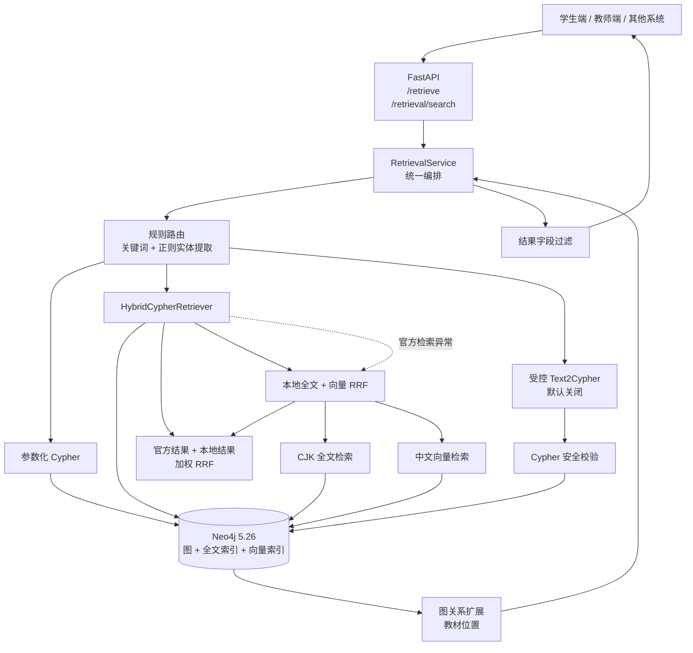
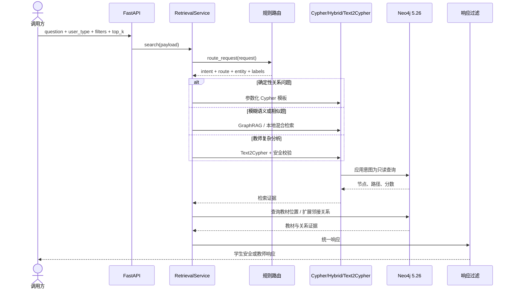
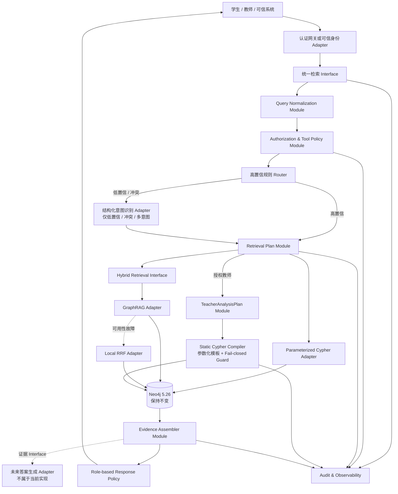
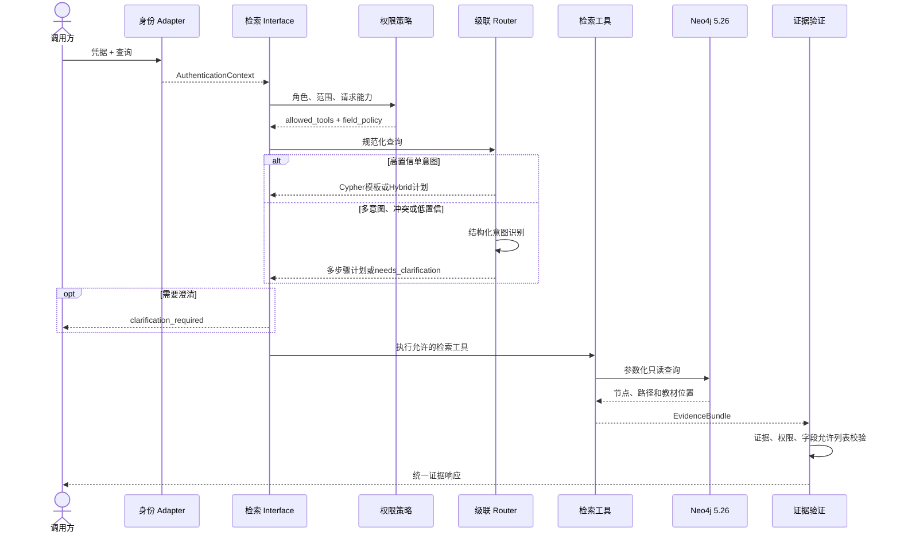

# Neo4j 小学数学检索后端系统架构评估

> 文档状态：架构评估与目标设计
>
> 评估日期：2026-07-29
>
> 适用项目：K12-KGraph 小学数学检索后端
>
> 硬约束：Neo4j 5.26、现有图模型、数据和索引保持不变
>
> 目标阶段：研究原型到受控试点；不代表当前已经达到互联网生产就绪

> 实施状态更新（2026-07-29）：本文第3～7节保留的是实施前事实基线和选型
> 依据；第8节以后描述的V1请求模型、可信认证上下文、级联多意图路由、
> 角色字段允许列表、TeacherAnalysisPlan静态编译、审计指标和隔离E2E已经
> 实现。当前实际接口和前端数据类型以
> `docs/E2E-backend.md`及OpenAPI为准。

## 1. 执行摘要

当前后端不是“只用向量搜索”，也不是“让大模型直接查询数据库”。它是一个
**模块化单体中的分层检索系统**：

1. FastAPI 接收统一检索请求。
2. 规则路由根据问题中的关键词和用户类型识别意图。
3. 前置知识、后续知识、教材位置、知识点对应练习等确定性问题走参数化
   Cypher。
4. 模糊描述、知识点解释和相似题走全文、向量、Neo4j GraphRAG 混合检索。
5. GraphRAG 正常运行时也会与本地全文/向量结果进行加权 RRF 融合；
   官方检索异常时则只使用本地结果。
6. 复杂教师统计分析可以走默认关闭的受控 Text2Cypher。
7. 返回知识节点、关系路径、教材位置和警告；学生响应会过滤答案、解析和
   内部检索字段。

这条技术路线适合小学数学知识图谱，因为不同问题的确定性差异很大：

- “分数除法的前置知识是什么”本质是图关系查询，Cypher 比向量检索更准确；
- “找一道意思和平均分苹果差不多的题”属于语义近似，全文和向量更合适；
- “统计四年级下册各章知识点数量”是开放的分析查询，模板难以完全覆盖，
  但自由生成 Cypher 的风险又较高，因此只能作为受控教师能力。

综合现状审计、系统架构、安全、测试评测和批判性复核，本报告推荐继续使用：

> **模块化单体 + 分层级联路由 + 参数化 Cypher + 全文/向量 GraphRAG
> 混合检索 + 教师端结构化分析计划/静态Cypher编译器**

但需要特别强调：

- 这是当前证据下风险和复杂度较均衡的推荐方案；
- 现有 240 条评测来自图谱自动生成，不是独立教研人工标注；
- 当前系统没有完成真正的路由方案对比，不能宣称它已经被证明为“绝对最佳
  实践”；
- API 信任客户端自报教师身份，以及 Text2Cypher 混合 `CALL` 校验绕过，
  都是当前实现的生产上线阻断项；目标设计分别用RS256/JWKS认证和“禁止执行
  模型自由Cypher”解决。

## 2. 评估范围与不变约束

### 2.1 本次覆盖

- 在线检索入口和请求模型；
- 意图识别、实体提取和检索路由；
- 参数化 Cypher；
- 全文、向量、本地 RRF 和 Neo4j GraphRAG；
- 图关系扩展和教材证据；
- 教师端 Text2Cypher；
- 学生/教师返回差异；
- 安全、评测、可观测性和部署演进；
- 后续自然语言答案生成所需的证据消费接口。

### 2.2 本次明确不改变

- Neo4j 5.26；
- 已有 Concept、Skill、Exercise、Book、Chapter、Section 等图模型；
- 已导入的小学数学节点和关系；
- 已有全文和向量索引；
- 当前 512 维中文数学向量；
- 当前教材版本、年级、册次等数据范围。

### 2.3 不在本次目标内

- 不将系统拆成多个在线微服务；
- 不改造成 LLM-only 或 Agent-only 检索；
- 不重新设计图谱本体；
- 不重新导入或清洗 Neo4j；
- 不实现最终自然语言回答生成；
- 不把当前自动评测包装成教研验收结果。

## 3. 当前实现的事实基线

### 3.1 状态分类

| 状态 | 能力 |
| --- | --- |
| 已实现 | FastAPI入口、规则路由、参数化Cypher、全文/向量/混合检索、GraphRAG Adapter、本地融合与回退、图扩展 |
| 已实现但存在生产阻断缺陷 | Text2Cypher安全检查、学生字段脱敏；前者存在混合`CALL`绕过，后者仍是字段黑名单 |
| 仅有配置入口、需要部署验证 | Neo4j 5.26 + retrieval-api Compose、只读凭据环境变量、官方GraphRAG真实运行、Text2Cypher外部模型调用；当前Compose不负责创建或授权只读账户 |
| 当前缺失 | API 认证、可信角色上下文、RBAC 策略、速率限制、结构化审计、全链路追踪、人工独立路由评测 |

代码依据：

- FastAPI 创建一个 `Neo4jStore(readonly=True)` 和一个
  `RetrievalService`，暴露 `/retrieve` 与 `/retrieval/search`：
  [api.py](../src/retrieval/api.py#L23)。
- `RetrievalService` 在同一进程内组装 Cypher、全文、向量、混合、GraphRAG
  和图扩展实现：[service.py](../src/retrieval/service.py#L33)。
- Docker 编排只有 Neo4j 与 retrieval-api 两个运行时：
  [docker-compose.neo4j-retrieval.yml](../docker/docker-compose.neo4j-retrieval.yml#L1)。

因此，当前在线架构属于**模块化单体**，不是检索微服务集群。

### 3.2 当前模块图



### 3.3 当前请求时序



> 当前“只读”主要依赖应用实现。生产只读必须同时由查询Guard和Neo4j只读
> 账户保证；当前只读凭据缺失时仍可能回退主账户。

## 4. 当前意图识别方案

### 4.1 它是什么

当前意图识别不是大模型分类器，也不是训练出来的分类模型，而是
**固定优先级的关键词规则 + 正则实体提取**。

`route_request()` 的实际判断顺序是：

| 优先级 | 条件 | 意图 | 检索路线 |
| ---: | --- | --- | --- |
| 1 | 请求显式指定 `route` | 保留自然意图 | 强制指定路线 |
| 2 | `user_type == teacher` 且含统计、分布、分析等 | `teacher_analysis` | Text2Cypher |
| 3 | 含前置、先修、之前、应先等 | `prerequisites` | Cypher |
| 4 | 含后续、之后、下一步等 | `successors` | Cypher |
| 5 | 含题目、练习、例题、考察、测试、题 | `exercises_for` | Cypher |
| 5a | 题目词同时包含相似、类似等 | `similar_exercises` | Hybrid |
| 6 | 含哪里、在哪、教材、章节、出处等 | `location` | Cypher |
| 7 | 含相似、什么意思、怎么理解、解释等 | `semantic_search` | Hybrid |
| 8 | 其他 | `concept_detail` | Hybrid |

代码依据：[router.py](../src/retrieval/router.py#L34)。

实体提取依次尝试：

- `【知识点】`；
- 中文或英文引号；
- “学习X前要会”；
- “哪些题考察X”；
- “解释一下X”；
- “教材中的X”；
- 最后删除常见疑问词形成候选实体。

代码依据：[router.py](../src/retrieval/router.py#L23)。

### 4.2 优点

- 延迟低，不需要调用外部模型；
- 结果可解释，容易知道为什么选择某条检索路线；
- 确定性问题不会被大模型随机路由；
- 安全工具白名单容易控制；
- 单元测试简单，适合当前固定问题族；
- 当用户给出明确的年级、册次和教材版本时，可以直接交给参数化查询。

### 4.3 局限与已知误路由

规则顺序意味着“先匹配者获胜”，当前没有：

- 路由置信度；
- 多意图输出；
- 冲突检测；
- 澄清问题；
- 独立的身份规范化；
- 基于候选实体存在性的消歧；
- learned router 或结构化 LLM fallback。

典型风险：

1. “乘法练习在哪一章？”同时包含“练习”和“在哪”，会先命中练习查询，
   可能忽略教材位置意图。
2. “学习分数除法前要会什么，并给两道练习题”包含两个意图，当前只处理
   第一个命中的意图。
3. `teacher`、`教师`、`admin` 在不同位置的判断并不完全统一：
   `RetrievalRequest.is_teacher()` 支持三种值，但路由和服务中的部分判断只接受
   英文 `teacher`。
4. 客户端可以显式强制 `route`，但当前没有权限策略限制哪些调用方可以强制
   哪些工具。

所以，当前规则路由可以作为**高精度第一层**，不能直接等同于完整的企业级
意图识别系统。

### 4.4 当前行为真值表

| 输入或状态 | 当前实际行为 | 目标行为 |
| --- | --- | --- |
| 未提供`route` | 按固定规则选择路线 | 高置信规则优先，低置信进入结构化识别 |
| 提供合法`route` | 直接覆盖自然路线 | 先经过服务端工具权限策略 |
| 提供未知`route` | 没有白名单报错，服务编排最终落入默认Hybrid分支 | 返回参数错误或受控默认路线并记录原因码 |
| `user_type=teacher` | 直接信任请求体 | 只信任服务端认证上下文 |
| 教师未设置`include_answers` | `retrieve()`仍按学生字段策略构造证据；外层`search()`只按`user_type`决定最终字典清洗 | 由统一角色字段策略决定 |
| 教师设置`include_answers=true` | 当前可能返回答案和解析 | 必须额外具有教师答案权限 |
| GraphRAG成功 | 官方结果与本地RRF结果加权融合 | 保持，但记录两路候选数和耗时 |
| GraphRAG异常 | 只返回本地RRF结果 | 允许可用性回退并记录原因码 |
| Text2Cypher安全拒绝 | 返回`None`后回退Hybrid | 安全拒绝失败关闭，不伪装为普通成功 |

## 5. 各检索路线的职责

### 5.1 参数化 Cypher

适用：

- 知识点详情；
- 教材章节位置；
- 1～3 跳前置与后续知识；
- 知识点或技能对应练习题；
- 年级、册次、版本、题型和难度过滤。

采用原因：

- 问题直接对应图结构；
- 返回关系和路径是确定性的；
- 参数化查询能避免把用户文本拼入 Cypher；
- 查询深度和返回数量容易约束；
- 教学证据可以明确落到节点和关系。

主要实现：[cypher.py](../src/retrieval/cypher.py) 和
[service.py](../src/retrieval/service.py#L98)。

### 5.2 CJK 全文检索

适用：

- 中文知识点名称；
- 别名和数学术语；
- 精确词语、公式文字和题干关键词。

它通过 `db.index.fulltext.queryNodes` 查询 Concept、Skill、Exercise 的独立
全文索引，并在查询后应用教材范围过滤：
[retrievers.py](../src/retrieval/retrievers.py#L24)。

### 5.3 向量检索

适用：

- 近义表达；
- 学生口语化描述；
- 语义相似题；
- 不包含标准知识点名称的查询。

当前模型和维度由设置控制，默认是
`BAAI/bge-small-zh-v1.5`、512维：
[settings.py](../src/retrieval/settings.py#L14)。

Neo4j 官方说明，全文索引适合词法匹配，向量索引适合语义近似，两者可以组成
混合检索；不同来源的原始分数不宜直接比较，应分别排序再融合。
[Neo4j Semantic indexes](https://neo4j.com/docs/cypher-manual/current/indexes/semantic-indexes/)

### 5.4 本地 RRF

本地 `HybridRetriever` 分别取得全文和向量排序，使用 Reciprocal Rank Fusion
按名次融合，而不是直接相加不具备相同量纲的原始分数：
[retrievers.py](../src/retrieval/retrievers.py#L100)。

它同时承担官方 GraphRAG 的可用性回退。

### 5.5 Neo4j GraphRAG

当前 GraphRAG Adapter 为 Concept、Skill、Exercise 分别建立
`HybridCypherRetriever`，复用现有向量和全文索引，并在召回后执行范围过滤
与教材位置扩展：[graphrag_adapter.py](../src/retrieval/graphrag_adapter.py#L41)。
正常路径还会调用本地全文/向量RRF，再将官方结果和本地结果按权重融合；只有
官方路径抛出异常时才退化为纯本地结果：
[retrievers.py](../src/retrieval/retrievers.py#L121)。

Neo4j GraphRAG 官方文档提供 Vector、VectorCypher、Hybrid、
HybridCypher、Text2Cypher 等 Retriever。本文据此作出的工程判断是：本项目
可以按问题性质组合不同Retriever；这不是Neo4j官方对本项目级联架构的背书。
[Neo4j GraphRAG RAG user guide](https://neo4j.com/docs/neo4j-graphrag-python/current/user_guide_rag.html)

### 5.6 Neo4j 5.26 的向量过滤限制

当前向量调用使用 `db.index.vector.queryNodes()`，先取得较大的候选集，再在
Cypher `WHERE` 中过滤年级、册次和版本，因此采用 `top_k * 5` 的过召回。
这是当前项目代码能够直接证明的事实：
[retrievers.py](../src/retrieval/retrievers.py#L64)。

Neo4j当前官方文档把携带额外属性的索引内过滤和`SEARCH ... WHERE`列为较新
版本能力，并把`db.index.vector.queryNodes()`描述为兼容早期版本但能力较弱
的途径。项目现有部署文档也记录了5.26下“过召回后过滤”的实测约束：
[neo4j-retrieval.md](neo4j-retrieval.md#L212)。因此本项目在5.26保持过召回后
过滤是合理兼容策略，但必须监控范围过滤后的空结果率和延迟。这里的5.26结论
来自项目代码与项目实测记录，`current`官方链接用于说明版本演进，不冒充
5.26固定版本页面。
[Neo4j Vector indexes](https://neo4j.com/docs/cypher-manual/current/indexes/semantic-indexes/vector-indexes/)

### 5.7 受控 Text2Cypher

自然路由只在`user_type == teacher`且命中统计/分析词时选择Text2Cypher；
但当前客户端也可以通过显式`route=text2cypher`强制路线，只要同时自报
`teacher`且生成器已启用，就可能进入该分支。这扩大了当前工具暴露面，也是
服务端身份和工具策略必须阻断的问题。Text2Cypher本身仍必须配置开关和模型
密钥，默认关闭。生成的候选Cypher在执行前检查：

- 写操作和模式修改；
- 外部数据加载；
- 部分过程调用；
- 无界路径；
- 超过3跳路径；
- 缺失或过大的 `LIMIT`。

失败时当前实现回退到混合检索：
[service.py](../src/retrieval/service.py#L126)、
[security.py](../src/retrieval/security.py#L27)。

Text2Cypher 的定位应该是“低频、授权、可审计的教师分析能力”，不是主路由，
也不是通用数据库代理。

## 6. 为什么保持模块化单体

按照深模块设计，在线检索应通过少量稳定 Interface 隐藏复杂实现：

- 调用方只需要理解统一检索请求和统一证据响应；
- 路由、融合、GraphRAG 回退、字段策略都保持在实现内部；
- GraphRAG 与本地 RRF 是同一个检索 Seam 上的两个 Adapter；
- 身份提供方可以在认证 Seam 上替换；
- 测试应通过统一 Interface 验证行为，而不是让调用方直接组合检索器。

当前没有证据表明需要把在线链路拆成微服务：

- 只有一个 Neo4j 数据平面；
- 各检索分支会共享请求上下文、过滤条件和安全策略；
- 拆分会增加网络跳数、重复鉴权和分布式追踪成本；
- 当前没有独立扩缩容、独立团队所有权或独立发布节奏的需求证据。

因此推荐：

- 近期保持模块化单体；
- 离线导入、向量生成和评测继续与在线进程隔离；
- 只有 Text2Cypher 出现明显独立扩缩容或安全隔离需要时，才考虑独立进程；
- 只有出现量化触发条件后，才重新评估微服务。

## 7. 替代方案对比

| 方案 | 准确性 | 延迟 | 成本 | 安全 | 可测试性 | 演进性 | 结论 |
| --- | --- | --- | --- | --- | --- | --- | --- |
| 规则路由 + 纯 Cypher | 已知关系问题高，模糊问法低 | 最低 | 最低 | 最强 | 最强 | 新意图需手写模板 | 保留为确定性底座，不能单独覆盖全部问题 |
| 统一 CJK 全文 | 标准术语好，近义表达较弱 | 低 | 低 | 强 | 强 | 简单 | 只适合作为召回源 |
| 统一向量检索 | 近义表达好，图关系准确性弱 | 中 | 中 | 强 | 中 | 易扩展语义 | 不能替代路径和教材关系查询 |
| Embedding 意图分类 | 可覆盖规则同义词 | 中 | 中 | 较强 | 中 | 需要训练和阈值 | 可作为候选实验，不应直接承担所有检索 |
| Structured LLM 路由 | 多意图和复杂表达较好 | 高且波动 | 高 | 需要严格工具策略 | 较难 | 灵活 | 适合作为低置信 fallback |
| LLM/Agent-only | 覆盖面理论上最大 | 最高 | 最高 | 风险最大 | 最难 | 灵活但不可预测 | 当前明确不采用 |
| 分层级联路由 | 确定性与语义兼顾 | 中 | 中 | 可控 | 较强 | 可逐层替换 | 推荐目标方案 |

### 7.1 模块化单体与微服务

| 维度 | 模块化单体 | 微服务 |
| --- | --- | --- |
| 请求延迟 | 同进程调用，较低 | 增加网络跳数 |
| 安全策略 | 集中实施 | 多处复制并保持一致 |
| 测试 | 一条 Interface 可做合同测试 | 需要跨进程合同和故障测试 |
| 部署 | 简单 | 需要服务发现、追踪、重试和熔断 |
| 扩缩容 | 整体扩容 | 可按模块独立扩容 |
| 当前适配度 | 高 | 低 |

重新评估微服务的触发条件：

- Text2Cypher 的负载和故障域需要独立隔离；
- 向量模型和 Cypher 查询出现明显不同的扩缩容曲线；
- p95 延迟无法通过单体内优化达标；
- 出现不同团队独立所有权和发布节奏；
- 对可用性有明确的多实例、跨可用区要求。

## 8. 推荐目标架构

> 本章及其后的Interface契约是**目标设计，不是当前已经实现的能力**。

### 8.1 目标原则

1. Neo4j 和图谱方案不变。
2. 保持一个统一在线检索 Interface。
3. 权限判断在意图识别之前完成。
4. 高置信确定性问题不调用大模型。
5. 低置信、冲突和多意图问题才进入结构化识别。
6. 检索工具由服务端策略决定，客户端不能自由提升权限。
7. 安全拒绝失败关闭；只有可用性故障允许降级。
8. 所有教学结论返回教材节点或图关系证据。
9. 不可靠时返回澄清或无结果，不编造知识点。

### 8.2 目标模块图



### 8.3 目标时序



### 8.4 决策完备的级联路由

目标Router不是“规则、Embedding和LLM任选其一”，而是以下固定级联。所有阈值
先作为试点基线写入配置，只有第12节的冻结测试集评测通过后才能调整：

| 顺序 | 判定条件 | 服务端置信度 | 执行结果 |
| --- | --- | ---: | --- |
| 1 | 空问题、规范化后超过500字或`top_k`不在1～20 | 不适用 | HTTP 422，不进入检索 |
| 2 | 恰好一个关系、教材位置或对应练习意图；实体非空；名称/别名精确解析为唯一节点；没有并列词、冲突过滤或第二意图 | 0.95 | 参数化Cypher |
| 3 | 恰好一个“相似、近义、描述性查找”意图；没有冲突或第二意图 | 0.90 | Hybrid |
| 4 | 普通知识点描述，未命中冲突，且只有一个可接受意图 | 0.85 | `concept_detail` + Hybrid |
| 5 | 多意图、规则冲突、歧义实体或上述条件均不满足 | 0.50 | 结构化意图识别 |

直接执行条件统一为：`confidence >= 0.85`、单意图、没有冲突且工具在
`allowed_tools`中。规则置信度是可解释的离散值，不伪装成统计概率。

结构化识别固定使用现有OpenAI兼容Client，模型由`K12_ROUTER_MODEL`配置，试点
默认`gpt-4.1-mini`；`temperature=0`、单次超时4秒，只对网络错误和HTTP 429重试
一次。模型必须输出Pydantic `IntentDecisionV1`：

```json
{
  "intents": ["prerequisites", "exercises_for"],
  "entities": [{"text": "分数除法", "type": "Concept"}],
  "filters": {"grade": "四年级", "semester": "下册", "edition": "人教版"},
  "needs_clarification": false
}
```

模型不得输出工具、权限或可信置信度。服务端仅在Schema有效、意图受支持、实体
解析成功且工具策略允许时赋值`confidence=0.80`并生成检索计划；否则返回
`CLARIFICATION_REQUIRED`。结构化模型不可用或输出非法Schema时返回
`ROUTER_BACKEND_UNAVAILABLE`，不猜测意图。

实体消歧固定执行：

1. 名称和别名精确匹配；
2. 未命中时Hybrid过召回Top5；
3. 只有一个候选，或Top1分数至少为Top2的1.2倍时接受；
4. 没有候选返回`NO_RESULT`，其余情况返回`CLARIFICATION_REQUIRED`。

最多执行两个兼容意图，按请求中的自然语言顺序串行执行，并共享8秒总截止时间；
结果按稳定节点ID和关系路径去重后合并。超过两个意图、过滤条件互斥或需要不同
权限的组合必须澄清。Cypher模板无结果时只允许重新做一次实体消歧，仍无结果即
返回`NO_RESULT`。

公开HTTP请求不接受`route`。固定路线只允许评测程序通过进程内
`EvaluationRetrievalRequest`调用，不能通过Web路由、Header或查询参数触发。

## 9. 推荐 Interface 契约

以下是目标架构契约，不代表当前代码已经全部实现。

### 9.1 可信身份上下文

```json
{
  "principal_id": "opaque-id",
  "role": "student",
  "permissions": [
    "retrieval:read"
  ],
  "tenant_id": null,
  "authenticated": true
}
```

生产认证实现固定为RS256 JWT + JWKS验证，使用
`PyJWT[crypto]>=2.10,<3`的`PyJWKClient`。不在同一个进程内同时支持Session、
可信Header或共享密钥JWT，避免多条认证路径产生策略偏差。
[PyJWT usage examples](https://pyjwt.readthedocs.io/en/stable/usage.html)

| 配置 | 生产要求 |
| --- | --- |
| `K12_ENV` | `production`；仅本地测试可为`development` |
| `K12_AUTH_MODE` | 生产必须为`jwks` |
| `K12_JWT_ALGORITHM` | 固定`RS256`，拒绝`none`、所有`HS*`及其他算法 |
| `K12_JWT_ISSUER` | 必填并精确校验`iss` |
| `K12_JWT_AUDIENCE` | 必填并精确校验`aud` |
| `K12_JWKS_URL` | 必填；JWKS缓存300秒 |
| 时钟偏差 | 最多30秒，同时校验`exp`和`nbf` |

JWT必需Claims为`sub`、`role`和`permissions`。`role`只能是`student`、
`teacher`或`admin`；`permissions`只能从已知权限集合解析：

- `retrieval:read`：调用检索；
- `retrieval:answers`：读取教师答案和解析；
- `retrieval:text2cypher`：调用受控教师分析。

角色只是字段策略的输入，不能代替权限；教师答案和教师分析均要求对应权限。
缺少、过期、签名错误或Claim不完整返回HTTP 401；身份有效但权限不足返回HTTP
403。认证发生在解析检索意图之前。

`K12_AUTH_MODE=development`仅允许在`K12_ENV=development`且HTTP绑定
`127.0.0.1`时启动，并固定生成只有`retrieval:read`的学生身份。教师测试使用
测试私钥签发的Fixture JWT；不存在`X-Role`、请求体角色或“关闭认证后变教师”
的旁路。生产缺少任一JWT配置时进程启动失败。

实现位置固定为新增`src/retrieval/auth.py`（验签和
`AuthenticationContext`）与`src/retrieval/policy.py`（权限及字段允许列表），
并修改`api.py`、`models.py`、`settings.py`和环境变量示例。

### 9.2 检索请求

```json
{
  "question": "学习分数除法前要会什么，并给两道练习题？",
  "grade": "四年级",
  "semester": "下册",
  "edition": "人教版",
  "book_id": "math_4b_rjb",
  "section_id": null,
  "exercise_type": null,
  "difficulty": null,
  "top_k": 5
}
```

`RetrievalRequestV1`字段约束：

| 字段 | 类型与约束 | 默认 |
| --- | --- | --- |
| `question` | `str`，去首尾空白后1～500个Unicode字符 | 必填 |
| `grade` | `str | null`，1～20字符 | `null` |
| `semester` | `Literal["上册","下册"] | null` | `null` |
| `edition` | `str | null`，1～30字符 | `null` |
| `book_id`、`section_id` | `str | null`，匹配`^[A-Za-z0-9_-]{1,64}$` | `null` |
| `exercise_type` | `str | null`，1～30字符 | `null` |
| `difficulty` | `int | null`，1～5 | `null` |
| `top_k` | `int`，1～20 | 5 |

`subject`固定为数学、`stage`固定为小学，不再作为公网可变字段。空字符串不会
静默转成`null`，而是返回422，避免调用方误以为范围过滤已经生效。

目标状态下不再让普通调用方通过请求体控制：

- 安全角色；
- 是否允许返回答案；
- 是否允许 Text2Cypher；
- 是否允许强制内部检索工具。

### 9.3 意图决策

```json
{
  "intents": [
    "prerequisites",
    "exercises_for"
  ],
  "entities": [
    {
      "text": "分数除法",
      "type": "Concept",
      "resolved_id": null
    }
  ],
  "filters": {
    "grade": "四年级",
    "semester": "下册",
    "edition": "人教版"
  },
  "allowed_tools": [
    "cypher_template"
  ],
  "confidence": 0.91,
  "needs_clarification": false,
  "reason_code": "CASCADE_RULE_MULTI_INTENT"
}
```

### 9.4 统一证据响应

```json
{
  "request_id": "opaque-request-id",
  "intents": [
    "prerequisites"
  ],
  "route": "cypher_template",
  "entities": [],
  "evidence_nodes": [],
  "relation_paths": [],
  "textbook_locations": [],
  "scores": [],
  "warnings": [],
  "reason_code": "OK",
  "needs_clarification": false
}
```

V1响应模型固定为：

- `request_id: UUID`；
- `intents: list[IntentName]`，1～2项；
- `route: Literal["cypher_template","hybrid","teacher_analysis","none"]`；
- `entities`和`evidence_nodes`：稳定ID、受控Label、名称、0～1归一化分数和按
  角色过滤后的属性；
- `relation_paths`：起止ID、最多3个关系及路径节点；
- `textbook_locations`：`book/chapter/section`的ID与名称，以及年级、册次和
  版本；
- `scores`：每个命中节点的`lexical/vector/rrf/final`可选分数，不包含向量；
- `warnings: list[WarningCode]`；
- `reason_code: ReasonCode`和`needs_clarification: bool`。

字段允许列表校验发生在Pydantic序列化之前；未知图属性默认丢弃。学生端永远
没有答案、解析、向量、`search_text`、模型提示词或内部Cypher字段。

必须区分的原因码：

- `OK`
- `NO_RESULT`
- `CLARIFICATION_REQUIRED`
- `AUTHENTICATION_REQUIRED`
- `FORBIDDEN_TOOL`
- `UNSAFE_QUERY_REJECTED`
- `GRAPH_BACKEND_UNAVAILABLE`
- `EMBEDDING_BACKEND_UNAVAILABLE`
- `TEACHER_ANALYSIS_DISABLED`
- `TEACHER_ANALYSIS_PLAN_INVALID`
- `TEACHER_ANALYSIS_EXECUTION_FAILED`
- `ROUTER_BACKEND_UNAVAILABLE`
- `ROUTER_INVALID_OUTPUT`

### 9.5 证据消费 Interface

未来答案生成只能消费已经完成权限过滤的 `EvidenceBundle`，不得直接获得
Neo4j 驱动或自由 Cypher 执行权。这样可以在不改变检索模块的情况下增加
“基于证据的自然语言回答” Adapter。

### 9.6 HTTP版本、校验和兼容迁移

规范入口固定为`POST /v1/retrieval/search`。`RetrievalRequestV1`使用Pydantic
`extra="forbid"`，请求体仅包含第9.2节字段；`user_type`、
`include_answers`和`route`均不是V1字段，未知字段返回HTTP 422。
`RetrievalResponseV1`固定使用`intents: list[str]`，并返回`request_id`、
证据、路径、教材位置、分数、警告和`reason_code`。

HTTP状态与业务语义：

| HTTP | 场景 |
| ---: | --- |
| 200 | 成功、`NO_RESULT`或`CLARIFICATION_REQUIRED`，由`reason_code`区分 |
| 401 | 缺少或无效认证 |
| 403 | 权限不足、禁用工具或`UNSAFE_QUERY_REJECTED` |
| 422 | 请求Schema、长度、枚举或范围非法 |
| 429 | 主体/IP限流 |
| 502 | 上游结构化模型返回非法输出且无法形成安全计划 |
| 503 | Neo4j、Embedding或结构化模型不可用 |

旧`/retrieve`和`/retrieval/search`从V1发布日期D起保留90天。生产环境仍强制
认证；旧请求中的`user_type`、`include_answers`和`route`被忽略并记录弃用
警告。响应增加`Deprecation: true`、`Sunset: D+90d`和指向V1的`Link` Header。
旧响应保留单值`intent`，取V1第一个意图；多意图证据合并，并在`warnings`中
标明兼容降级。第一个不早于D+90天的版本删除旧入口。

迁移由`K12_V1_ENABLED`、`K12_LEGACY_ENABLED`和
`K12_ROUTER_MODE=legacy|shadow|cascade`控制。部署时必须先启用V1和旧入口，
完成第14节Shadow/Canary后再关闭旧入口。

## 10. 安全架构评估

### 10.1 P0：客户端可以自报教师身份

当前 `/retrieve` 直接接收任意字典：
[api.py](../src/retrieval/api.py#L53)。

`user_type` 和 `include_answers` 来自请求体：
[models.py](../src/retrieval/models.py#L26)。

服务随后用这些字段决定是否返回教师内容以及是否允许 Text2Cypher：
[service.py](../src/retrieval/service.py#L75)。

这意味着未经认证的调用方可以尝试提交：

```json
{
  "user_type": "teacher",
  "include_answers": true
}
```

当前字段过滤能降低泄露范围，但这不是认证或授权。

**生产要求：**

- 未认证请求返回401；
- 角色来自可信身份上下文；
- 学生伪造请求字段仍按学生策略处理；
- Text2Cypher和教师答案分别检查权限；
- V1不接受客户端`route`；固定路线只允许进程内评测调用。

### 10.2 P0：Text2Cypher 混合 `CALL` 绕过与最终处置

当前校验逻辑是：

```python
if contains_CALL and not contains_allowed_CALL:
    reject()
```

即整条语句只要出现一次允许的
`CALL db.index.fulltext...` 或 `CALL db.index.vector...`，其他 `CALL` 可能没有
被逐个拒绝：[security.py](../src/retrieval/security.py#L27)。

同时 Compose 默认配置：

- `apoc.*,gds.*` unrestricted；
- `apoc.*,gds.*` allowlist；
- 默认安装 APOC 和 GDS。

依据：[docker-compose.neo4j-retrieval.yml](../docker/docker-compose.neo4j-retrieval.yml#L8)。

**锁定的生产方案：不执行模型自由生成的Cypher。**

授权教师的复杂分析由模型输出严格的Pydantic `TeacherAnalysisPlanV1`，再由应用
内静态编译器生成参数化Cypher。允许的Schema固定为：

- `operation`：`count | list | distribution`；
- `entity_type`：`Concept | Skill | Exercise`；
- `group_by`：`book | chapter | grade | semester | edition | none`；
- `filters`：只接受年级、册次、版本、教材、章节、题型和难度；
- `limit`：1～20。

静态编译映射如下，不允许出现映射表之外的片段：

| Plan字段 | 编译片段 |
| --- | --- |
| `entity_type=Concept|Skill|Exercise` | 分别选择`MATCH (n:Concept)`、`MATCH (n:Skill)`或`MATCH (n:Exercise)`固定模板 |
| `operation=count` | `RETURN count(DISTINCT n) AS value` |
| `operation=list` | 返回允许字段中的`id/name/grade/semester/edition/book_id/section_id`并强制`LIMIT $limit` |
| `operation=distribution` | `WITH <固定分组表达式> AS key, count(DISTINCT n) AS value RETURN key, value ORDER BY key LIMIT $limit` |
| `group_by=book|chapter` | 固定使用`appears_in`、`is_part_of`到`Section/Chapter/Book`的可选匹配 |
| `group_by=grade|semester|edition` | 分别使用`n.grade/n.semester/n.edition` |
| `filters` | 使用现有`RetrievalFilters`白名单并全部参数化 |

标签、属性名、聚合方式和分组字段全部来自服务端Enum，不接受模型生成的标识符；
过滤值全部作为参数传入。编译器只会生成`MATCH`、`OPTIONAL MATCH`、
`WHERE`、`WITH`、`RETURN`、`ORDER BY`和`LIMIT`，教师分析的`CALL`
允许列表为空。现有`OpenAIText2CypherGenerator`从运行时装配中移除，
`K12_TEXT2CYPHER_ENABLED`保持默认关闭；完成兼容迁移后删除自由Cypher路径。

新增`src/retrieval/teacher_analysis.py`承载Schema和编译器。现有
`validate_readonly_cypher()`保留为纵深防御，并固定执行：

1. Unicode NFKC规范化；
2. 拒绝行注释、块注释、分号和子查询；
3. 拒绝任意`CALL`，包括`db.*`、`apoc.*`、`gds.*`和自定义过程；
4. 拒绝写入、删除、模式、用户权限和外部数据加载关键字；
5. 拒绝无界路径、超过3跳路径及`LIMIT`不在1～20的查询；
6. 解析或校验出现任何未知状态时失败关闭。

安全拒绝返回HTTP 403与`UNSAFE_QUERY_REJECTED`，记录审计事件，且不得回退到
Hybrid并伪装为同一教师分析成功。结构化模型Schema非法返回
`ROUTER_INVALID_OUTPUT`，也不执行任何Cypher。

必须新增的回归用例包括：允许/禁止`CALL`两种排列、嵌套`CALL {}`、
`CALL apoc.*`、`gds.*`、`custom.*`、行/块注释、混合大小写、全角和Unicode
混淆字符、分号、所有写入动词、无界路径、超过3跳、`LIMIT`为0、负数或超过
20。Compose移除`apoc.*,gds.*`通配开放；检索部署不再默认安装GDS，APOC仅在
离线导入Profile中按具体过程启用。

### 10.3 P1：只读连接可能回退主账户

当前 `readonly=True` 但未配置只读凭据时，会回退到主账户：
[store.py](../src/retrieval/store.py#L27)。

代码层的 `run_write()` 保护不能约束直接经过 `run_read()` 发送的自由语句，也
不能替代数据库权限。

**生产要求：**

- Serving进程必须配置独立只读凭据；
- 缺少只读凭据时启动失败；
- 启动探针验证可读且不可 `CREATE`、`SET`、模式修改或执行高风险过程；
- Neo4j端口只对内部网络开放；
- 跨主机连接使用TLS Bolt。

Neo4j官方将最小权限作为RBAC原则，并提供`reader`等内置角色；相应能力取决于
Neo4j版本和发行版：
[Neo4j RBAC](https://neo4j.com/docs/operations-manual/current/authentication-authorization/manage-privileges/)、
[Built-in roles](https://neo4j.com/docs/operations-manual/current/authentication-authorization/built-in-roles/)。

Neo4j官方SSL框架支持Bolt和HTTPS：
[Neo4j SSL framework](https://neo4j.com/docs/operations-manual/current/security/ssl-framework/)。

### 10.4 P1：错误和回退缺少结构化语义

当前：

- Text2Cypher不可用、安全拒绝和执行失败最后都可能得到相似回退警告；
- GraphRAG捕获广泛异常后回退本地RRF；
- 整体后端异常只追加字符串警告。

**目标要求：**

- 安全拒绝：失败关闭并记录安全事件；
- GraphRAG可用性故障：允许回退本地RRF；
- 外部模型不可用：教师分析返回能力不可用或回到批准的模板，不得虚构；
- 无匹配：明确 `NO_RESULT`；
- 每个回退带 `request_id`、`reason_code` 和阶段耗时。

### 10.5 P1：脱敏应由黑名单改为允许列表

当前学生端删除答案、解析、向量、搜索文本和Cypher：
[text.py](../src/retrieval/text.py#L87)、
[service.py](../src/retrieval/service.py#L266)。

该控制已经有价值，但新增 `correct_answer`、`teacher_note`、`rubric` 等字段时，
黑名单可能漏删。

目标状态应按“角色 × 节点类型”定义允许字段：

| 节点类型 | 学生允许字段示例 | 教师额外允许字段示例 |
| --- | --- | --- |
| Concept | id、name、definition、formula、教材位置 | 教学备注、完整证据 |
| Skill | id、name、description、教材位置 | 教学建议 |
| Exercise | id、name、stem、type、difficulty | answer、analysis |

向量、搜索内部文本、数据库凭据和内部Cypher对任何普通角色都不返回。

### 10.6 其他生产要求

- 试点单实例使用进程内Token Bucket：学生每主体60次/分钟、教师120次/分钟；
  单IP额外限制180次/分钟；学生并发4、教师并发8，超限返回429；
- HTTP请求体上限32KiB；问题文本、`top_k`和路径深度分别采用第9.2和8.4节
  上限；
- JWKS连接/读取超时2秒、Embedding 2秒、Neo4j单查询5秒、结构化模型4秒，
  多意图共享8秒总截止时间；超时不能被重试突破；
- 审计记录主体、角色、意图、路由、拒绝和回退原因；
- 日志中不记录密码、API密钥、完整向量或不受控敏感原文；
- 健康检查和就绪检查分离；
- Neo4j、Embedding、GraphRAG和结构化教师分析分别暴露可用性指标。

扩为多实例前必须把Token Bucket迁移到可信网关或共享限流存储；不能把多个
实例各自的进程内计数相加后声称满足同一限流契约。

## 11. 评测可信度

### 11.1 当前240条数据能证明什么

现有 `primary_math_eval_240.jsonl` 是显式生成并检入的240条产物，覆盖12本
人教版小学数学教材和6种意图。生成脚本自身的命令行默认上限仍是200，二者
不要混淆。该数据适合：

- 自动回归；
- 检查图中的已知节点和关系是否还能召回；
- 比较同一技术集上的全文、向量和混合结果；
- 验证部署、索引和检索链路没有明显回归。

### 11.2 不能证明什么

问题和 `expected_ids` 都由同一图谱节点、关系生成：
[generate_eval_set.py](../eval/retrieval/generate_eval_set.py#L40)。

每一条都标记：

```text
synthetic_seed_not_sme_reviewed
```

依据：[generate_eval_set.py](../eval/retrieval/generate_eval_set.py#L181)。

因此它不能独立证明：

- 图谱内容教学上正确；
- 用户真实问法下的路由准确率；
- 多意图、歧义、错别字和无结果处理；
- 当前规则优于Embedding分类或结构化LLM；
- 当前方案已经达到教学验收或绝对最佳实践。

此外，`evaluate.py` 固定使用`top_k=10`；默认又强制指定
`cypher/fulltext/vector/hybrid`路线，只有显式加入`auto`才真正经过当前规则
路由：
[evaluate.py](../eval/retrieval/evaluate.py#L24)。

### 11.3 现有结果的正确解读

当前报告中的实体召回子集显示：

| 方法 | Recall@5 | MRR | nDCG@10 | 平均延迟 |
| --- | ---: | ---: | ---: | ---: |
| CJK全文 | 0.9833 | 0.9792 | 0.9803 | 5.56ms |
| 向量 | 0.9750 | 0.9408 | 0.9551 | 11.83ms |
| 混合 | 1.0000 | 1.0000 | 1.0000 | 19.96ms |

依据：[retrieval-final-report.md](retrieval-final-report.md#L131)。

正确结论是：在这份图谱自动生成的技术集上，混合检索以更高延迟换取了更高
召回。不能进一步推导为“真实学生查询中必然最好”。

## 12. 推荐评测体系

### 12.1 数据文件、Schema和冻结规则

| 数据集 | 最低规模 | 标注内容 | 主要用途 |
| --- | ---: | --- | --- |
| 人工路由集 | 500 | 意图、实体、过滤、多意图、歧义、角色 | 比较路由方案 |
| 教研检索集 | 600 | graded relevance、路径、教材位置 | 比较召回与证据 |
| 安全鲁棒集 | 150 | 越权、泄露、注入、错别字、无结果 | 安全与失败行为 |

目标文件固定为：

```text
eval/retrieval/schemas/router_query_v1.schema.json
eval/retrieval/schemas/relevance_v1.schema.json
eval/retrieval/schemas/security_case_v1.schema.json
eval/retrieval/router_train_v1.jsonl
eval/retrieval/router_dev_v1.jsonl
eval/retrieval/router_test_v1.jsonl
eval/retrieval/retrieval_sme_test_v1.jsonl
eval/retrieval/security_robustness_v1.jsonl
eval/retrieval/adjudication_v1.jsonl
eval/retrieval/router_eval.toml
eval/retrieval/baselines/cascade_v1.json
```

每条路由记录至少包含`query_id`、原始问题、角色、教材过滤、一个或多个意图、
实体Span和规范ID、是否需要澄清、标注者、数据来源和分组ID。检索记录还包含
0～3级相关性、期望路径和教材位置；安全记录包含攻击类别、期望HTTP状态、
期望原因码和禁止字段。

冻结规则：

- 至少两名标注者；
- 两人独立标注，冲突由第三名小学数学教研人员裁决；
- `adjudication_v1.jsonl`保留两份原标签、最终标签、裁决者和理由；
- 不直接从图关系模板生成后原样回测；
- 年级、册次、意图和难度分层采样；
- 保留真实学生和教师问法；
- 文本先做NFKC、拉丁字母小写、空白和标点规范化，再用SHA-256去精确重复；
- 字符3-gram Jaccard相似度大于等于0.85的近重复归入同一`group_id`；
- 同一`group_id`不能跨数据分片；
- 按意图、年级和教材分层，以60%/20%/20%划分Train/Dev/Test；
- 在调整规则或阈值前冻结Test及其SHA-256清单，开发者只查看Train/Dev结果。

### 12.2 公平比较的四种方案

固定同一Neo4j快照、索引、Embedding模型、过滤条件和TopK，仅替换路由决策：

1. `rule-only`：当前规则路由。
2. `embedding-only`：Embedding意图分类器，不使用关键词规则。
3. `structured-LLM`：模型只输出受Schema约束的意图决策，不直接拥有数据库。
4. `cascade`：高置信规则优先，低置信/冲突进入结构化识别。

### 12.3 指标

路由：

- Intent Accuracy；
- Intent Macro-F1；
- 多标签F1；
- 实体Exact Match和F1；
- 过滤条件F1；
- 澄清触发准确率；
- 不安全工具选择率。

检索：

- Recall@5和Recall@10；
- Precision@5；
- MRR；
- nDCG@10；
- 路径有效率；
- 教材证据覆盖率；
- 无结果Specificity。

性能和安全：

- p50、p95、p99延迟；
- 超时和失败率；
- 回退率及原因分布；
- LLM Token与单次成本；
- 学生敏感字段泄露率；
- 非法Cypher接受率；
- 越权工具调用成功率。

### 12.4 可执行命令

新增`validate_annotations.py`、`compare_routers.py`和`ci_gate.py`，并由以下
命令完成Schema校验、四路线公平比较和发布门禁：

```bash
PYTHONPATH=src python eval/retrieval/validate_annotations.py \
  --schemas eval/retrieval/schemas \
  --inputs eval/retrieval/router_train_v1.jsonl \
           eval/retrieval/router_dev_v1.jsonl \
           eval/retrieval/router_test_v1.jsonl \
           eval/retrieval/retrieval_sme_test_v1.jsonl \
           eval/retrieval/security_robustness_v1.jsonl

PYTHONPATH=src python eval/retrieval/compare_routers.py \
  --config eval/retrieval/router_eval.toml \
  --output eval/retrieval/results/router_v1

PYTHONPATH=src python eval/retrieval/ci_gate.py \
  --summary eval/retrieval/results/router_v1/summary.json \
  --baseline eval/retrieval/baselines/cascade_v1.json

PYTHONPATH=src python -m pytest -q tests/retrieval
python -m ruff check src/retrieval eval/retrieval tests/retrieval docker/scripts
```

比较程序固定同一Neo4j快照ID、同一索引、同一Embedding模型、同一TopK和同一
过滤条件，连续运行三次；报告Bootstrap 95%置信区间和配对胜负。缺失快照ID、
模型版本或数据集SHA-256时命令失败。

### 12.5 试点发布门槛

所有门槛同时满足才可从`shadow`进入`cascade`：

| 类别 | 硬门槛 |
| --- | ---: |
| Intent Macro-F1 | ≥ 0.92 |
| 实体F1 | ≥ 0.90 |
| 多意图F1 | ≥ 0.85 |
| 澄清Precision / Recall | ≥ 0.90 / ≥ 0.80 |
| Recall@5 / nDCG@10 | ≥ 0.90 / ≥ 0.85 |
| 确定性图问题教材证据覆盖率 / 路径正确率 | 1.00 / 1.00 |
| 学生泄露率 / 非法Cypher接受率 / 越权成功率 | 0 / 0 / 0 |
| 总失败率 / 结构化模型回退率 | < 0.5% / ≤ 10% |
| Cypher模板p95 | ≤ 100ms |
| Hybrid p95 | ≤ 500ms |
| 结构化模型回退p95 | ≤ 4000ms |
| 端到端级联p95 | ≤ 2000ms |
| 每次结构化模型查询平均成本 | ≤ US$0.003 |
| 全流量加权平均模型成本 | ≤ US$0.0003/请求 |

延迟门槛以试点目标硬件和固定并发Profile为准，不能使用开发机空载结果。除上述
绝对门槛外，Intent Macro-F1、实体F1、Recall@5和nDCG@10均不得比已提交基线
下降超过1个百分点。独立人工集未满足这些条件时，只能称为“候选级联架构”，
不能称为已验证最佳方案。

## 13. 可观测性

试点固定使用Python标准库JSON日志和`prometheus-client>=0.21,<1`。新增
`src/retrieval/observability.py`，由`api.py`中间件统一记录请求生命周期，并
提供仅内部网络可访问的`/metrics`。试点不引入分布式追踪；只有拆分为多个进程
或跨服务定位无法依靠`request_id`完成时，才复审OpenTelemetry。

调用方提供的`X-Request-ID`只有在解析为UUID时才接受，否则生成UUID4。主体标识
使用`K12_AUDIT_HMAC_KEY`做HMAC-SHA256后记录；密钥缺失时生产启动失败。问题
文本经第12.1节规范化后只记录SHA-256指纹，不记录原文。

每次请求至少记录以下有界字段：

```text
request_id
principal_id_hash
role
intents
route
entity_count
filters_hash
top_k
candidate_count
fallback_reason
stage_latencies
token_count
cost
warning_code
error_code
safety_event
```

禁止记录原始问题、学生或教师答案、解析、Cypher、Embedding、模型提示词、
模型原始输出、JWT、Cookie、API Key或Neo4j凭据。Prometheus Label只允许角色、
受控意图、受控路线、原因码和HTTP状态等有限Enum；实体ID、问题指纹和
`request_id`只能进入日志，不能作为Metric Label。

固定指标：

- `routing_latency_ms`
- `fulltext_latency_ms`
- `embedding_latency_ms`
- `neo4j_latency_ms`
- `graph_expansion_latency_ms`
- `text2cypher_generation_latency_ms`
- `fallback_total{reason}`
- `no_result_total{intent}`
- `unsafe_query_rejected_total{reason}`
- `student_field_leak_total`

性能和路由日志保留30天；认证、授权和安全拒绝审计保留180天。日志只允许平台
运维与安全审计角色访问，每晚执行基于事件时间的删除任务并输出删除计数。审计
日志和性能日志分流，测试必须验证禁止字段不会进入任一路径。

## 14. 分阶段演进

### 阶段0：保持当前研究基线

- Neo4j和图谱不变；
- 保留参数化Cypher、GraphRAG和本地RRF；
- Text2Cypher默认关闭；
- 将240条评测仅作为自动回归。

### 阶段1：解决试点阻断项

- 加入可信认证上下文；
- 服务端权限策略替代客户端`user_type`；
- 用`TeacherAnalysisPlanV1`和静态编译器替代自由Text2Cypher；
- 移除APOC/GDS通配开放；
- 强制Neo4j只读Serving账户；
- 使用角色字段允许列表；
- 区分安全拒绝、无结果和可用性故障；
- 加入request_id、结构化日志和基本限流。

### 阶段2：升级级联路由

- 规则层输出置信度和原因码；
- 支持多意图和冲突检测；
- 低置信进入结构化意图识别Adapter；
- 增加澄清响应；
- 对四种路由方案进行独立人工评测。

### 阶段3：受控生产化

- 多实例FastAPI和负载均衡；
- 内网Neo4j、TLS Bolt、密钥托管；
- 完整指标、追踪和安全告警；
- 容量、并发、故障注入和灾备验证；
- 根据量化触发条件决定是否隔离Text2Cypher进程。

### 14.1 文件级实施路径

| 操作 | 文件 | 结果与验证 |
| --- | --- | --- |
| 修改 | `pyproject.toml`、`uv.lock` | 增加`PyJWT[crypto]`和`prometheus-client`版本范围并锁定完整依赖；`requirements*.txt`仅作兼容导出 |
| 修改 | `config/retrieval.env.example`、`docker/docker-compose.neo4j-retrieval.yml` | 增加认证、审计、路由模式配置；移除APOC/GDS通配权限 |
| 新增 | `src/retrieval/auth.py` | RS256/JWKS验签；用Fixture JWT单测401/有效Claim |
| 新增 | `src/retrieval/policy.py` | 工具权限、角色字段允许列表；越权必须403 |
| 新增 | `src/retrieval/intent_classifier.py` | `IntentDecisionV1`和结构化模型Adapter |
| 新增 | `src/retrieval/teacher_analysis.py` | `TeacherAnalysisPlanV1`和静态参数化Cypher编译器 |
| 新增 | `src/retrieval/observability.py` | JSON日志、HMAC主体、Prometheus指标和禁止字段检查 |
| 修改 | `src/retrieval/models.py` | `RetrievalRequestV1`、`RetrievalResponseV1`、多意图和原因码 |
| 修改 | `src/retrieval/api.py` | V1入口、认证依赖、状态映射、旧入口弃用Header、中间件和`/metrics` |
| 修改 | `src/retrieval/router.py` | 第8.4节固定级联、冲突检测和实体消歧 |
| 修改 | `src/retrieval/service.py` | 权限先于路由、多意图串行、总截止时间、证据合并 |
| 修改 | `src/retrieval/security.py` | NFKC和Fail-closed纵深校验 |
| 修改 | `src/retrieval/settings.py` | 生产配置完整性校验和三种路由模式 |
| 退役 | `src/retrieval/text2cypher.py`运行时装配 | 不再执行模型自由生成Cypher |
| 新增/修改 | `tests/retrieval/test_auth.py`、`test_policy.py`、`test_cascade_router.py`、`test_teacher_analysis.py`、`test_observability.py`、现有API/安全/集成测试 | 覆盖第9、10和12节所有契约 |
| 新增 | 第12.1节评测文件及三个评测脚本 | 可复现四路线对比与CI门禁 |

实施顺序不可互换：

1. 先加入V1模型、认证与权限策略，旧入口转接V1；
2. 再替换教师分析并让自由Cypher路径不可达；
3. 然后实现级联Router和多意图执行；
4. 最后接入观测、评测门禁和流量切换。

每一步先运行对应单元测试，再运行第12.4节完整命令。若认证、权限或教师分析
安全测试失败，不得开启`shadow`。

### 14.2 Shadow、Canary与回滚

`K12_ROUTER_MODE`定义：

- `legacy`：只执行当前规则路线；
- `shadow`：Legacy返回用户结果，同时执行Cascade但只记录差异，不执行影子
  TeacherAnalysisPlan，不增加对Neo4j的写权限；
- `cascade`：Cascade成为用户可见路线。

发布流程固定为：

1. `shadow`覆盖100%符合条件查询，持续至少7天且不少于1000条；
2. 通过第12.5节门槛后，`cascade`先放量5%，持续至少24小时且不少于200条；
3. 再放量25%，持续至少48小时且不少于500条；
4. 再切换100%，保留Legacy执行路径至少一个发布周期；
5. 旧HTTP入口按第9.6节90天计划退役。

任一条件触发立即切回`legacy`，不等待人工批准：

- 学生敏感字段泄露、非法Cypher接受或越权成功任一计数大于0；
- 15分钟窗口HTTP 5xx超过1%；
- 15分钟窗口端到端p95比Legacy基线升高30%以上；
- `NO_RESULT`比例比Legacy同期高10个百分点；
- 全流量加权模型成本超过US$0.0003/请求；
- 认证/JWKS、Neo4j只读账户或字段允许列表健康探针失败。

回滚只切换Router和V1流量，不回滚Neo4j数据、图模型或索引。每次切换和自动
回滚必须记录版本、操作者或自动策略、门槛值和对应`request_id`样本。

### 14.3 测试矩阵与故障预演

| 层级 | 必测内容 | 通过条件 |
| --- | --- | --- |
| 单元 | JWT算法/Claim、权限矩阵、规则阈值、冲突检测、Schema、静态编译器、允许字段、原因码 | 分支和拒绝路径均有断言 |
| 集成 | FastAPI认证依赖、V1/旧入口兼容、只读Neo4j账户、Hybrid回退、多意图合并、超时 | 使用固定Neo4j 5.26测试快照，响应契约一致 |
| 端到端 | 学生/教师典型查询、澄清、无结果、上游模型故障、GraphRAG故障、自动回滚 | 第12.5节安全门槛为零违规 |
| 安全 | 伪造角色、JWT算法混淆、混合/嵌套CALL、Unicode绕过、注释、超深路径、敏感字段 | 所有攻击失败关闭且产生审计事件 |
| 可观测 | 请求ID传播、低基数Label、HMAC主体、日志禁止字段、30/180天删除任务 | 无原始问题、凭据、答案、Cypher或向量落盘 |
| 性能 | 固定硬件、固定并发、三次重复的Cypher/Hybrid/模型回退/端到端压测 | 达到第12.5节p95与成本门槛 |

可信的失败预演：

| 可能失败 | 最早信号 | 预防或处置 |
| --- | --- | --- |
| JWKS轮换导致大量401 | `authentication_failure_total`突增且JWKS刷新失败 | 缓存最后有效Key不超过300秒，主动刷新；持续失败按健康探针回滚 |
| 规则阈值在真实问法上过拟合 | Shadow中澄清率、错路由率高于Legacy | 冻结Test，按Train/Dev调整；未过门槛不放量 |
| 结构化模型输出虽合法但语义错误 | 实体F1、多意图F1或证据覆盖下降 | 服务端二次实体校验，冲突时澄清，不信任模型置信度 |
| Shadow请求使Neo4j或模型成本翻倍 | p95和加权成本接近门槛 | 影子流量限并发、采样模型路线；达到回滚门槛立即停止Shadow |
| 允许字段随图属性新增而泄露 | `student_field_leak_total`或快照契约测试失败 | 按角色×节点类型允许列表，未知字段默认不返回 |
| 自动回滚自身不可用 | 模式切换审计缺失或健康探针持续失败 | 保留Legacy单进程路径，发布前演练配置切换和恢复时间 |

试点的停止条件是：所有单元、集成、安全和端到端测试通过，人工冻结集达到
第12.5节门槛，Shadow和两级Canary观察窗完成且未触发任一回滚条件。在此前，
系统只能保持`legacy`或`shadow`状态。

## 15. 架构决策记录

### ADR-001：保持Neo4j 5.26和现有图谱

- 状态：接受。
- 原因：当前目标是检索架构评估，不重新设计数据层。
- 影响：5.26的向量过滤继续采用过召回后过滤。

### ADR-002：保持模块化单体

- 状态：接受。
- 原因：当前没有足够的独立扩缩容、所有权或SLA证据支持微服务成本。
- 复审条件：见第7.1节触发条件。

### ADR-003：采用分层级联路由

- 状态：推荐，待独立人工评测验证。
- 原因：高置信确定性查询可避免外部模型成本，复杂问题仍有扩展空间。
- 限制：不能在完成独立对比前宣称绝对最佳。

### ADR-004：GraphRAG是可降级Adapter

- 状态：接受。
- 原因：官方GraphRAG增加图关系检索能力，但不应成为单点依赖。
- 回退：本地全文+向量RRF。

### ADR-005：教师分析使用结构化计划和静态编译器

- 状态：接受。
- 决策：模型只输出`TeacherAnalysisPlanV1`，应用编译为参数化只读Cypher；
  不执行模型自由生成的Cypher，`CALL`允许列表为空。
- 原因：相比“生成任意Cypher后尝试过滤”，该方案具有更小的攻击面和可穷举
  测试的语法集合。
- 前置条件：可信身份、显式权限、数据库只读账户和结构化审计。
- 默认：教师分析能力关闭，完成安全门禁后才启用。

### ADR-006：自然语言答案生成不进入检索核心

- 状态：接受。
- 原因：检索先输出可信证据；回答生成通过独立Adapter消费EvidenceBundle。

### ADR-007：生产认证固定为RS256 JWT/JWKS

- 状态：接受。
- 决策：仅接受固定Issuer、Audience和RS256算法的JWT，角色与权限来自Claims。
- 原因：排除客户端自报角色、共享密钥和多认证路径造成的策略漂移。
- 本地开发：仅Loopback上的固定学生身份；教师场景使用Fixture JWT。

### ADR-008：公开接口升级为V1并禁止客户端选路

- 状态：接受。
- 决策：`POST /v1/retrieval/search`使用严格Pydantic模型；公开请求不含
  `route`、`user_type`或`include_answers`。
- 兼容：旧入口保留90天但忽略安全相关旧字段，并返回弃用Header。

### ADR-009：试点可观测性保持单进程和低基数

- 状态：接受。
- 决策：标准JSON日志、Prometheus指标和`request_id`，暂不引入分布式追踪。
- 复审条件：跨进程调用成为关键路径，或仅凭请求ID无法定位SLO故障。

## 16. 多角色、多轮评估结论

### 16.1 第一轮独立审查

| 角色 | 主要结论 |
| --- | --- |
| 现状审计 | 当前确为规则路由、Cypher优先、GraphRAG/本地混合回退和受控Text2Cypher |
| 系统架构 | 模块化单体与分层检索方向合理；当前不应拆微服务 |
| 安全审查 | 客户端自报教师身份和Text2Cypher混合`CALL`绕过是生产阻断项 |
| 测试评测 | 240条为图谱自动生成技术集，未独立评估路由最佳性 |

### 16.2 第二轮批判复核

批判角色认可“模块化单体 + 分层级联”作为架构方向，但第一次裁决为REJECT：
虽然方向正确，执行者仍需自行选择认证算法、Cypher安全机制、级联阈值、接口
兼容方式和发布门槛。该意见触发本轮决策完备化：

- 第9.1节锁定RS256/JWKS、Claims、401/403和开发模式；
- 第10.2节取消模型自由Cypher，锁定结构化计划和静态编译器；
- 第8.4节锁定规则阈值、实体消歧、多意图和失败行为；
- 第9.6节锁定V1、严格Schema和90天兼容迁移；
- 第12～14节锁定评测文件、命令、绝对门槛、观测、Canary和自动回滚。

### 16.3 最终Critic复核

修订后的文档由独立Critic再次只读复核，裁决为**OKAY**。复核者验证了28个
当前本地Markdown引用和认证接入、教师分析静态编译器、级联路由/评测发布三条
代表性实施路径，并确认：

- 当前态和目标态没有混写；
- 认证、安全失败关闭、V1迁移、评测门槛、观测和回滚均为确定决策；
- 目标新增文件已明确标记，不被误当成当前实现；
- 执行者无需自行猜测主要架构、安全、迁移和发布策略。

复核同时重新运行68项检索测试和Ruff检查，均通过。该OKAY表示“计划可执行”，
不表示第17节目标系统试点待办已经实现或通过。

### 16.4 最终裁决

| 分类 | 决策 |
| --- | --- |
| 必须调整 | RS256/JWKS认证授权、自由Text2Cypher替换、只读账户fail-closed、APOC/GDS最小权限、字段允许列表、审计原因码 |
| 可延后 | 教研人工大规模评测、学习型Router、重排序、缓存、多租户、完整在线实验平台 |
| 明确不做 | 改图模型、拆在线微服务、LLM-only检索、默认启用Text2Cypher/APOC/GDS、把240条技术集称为教学验收 |

## 17. 验收清单

### 当前文档验收

- [x] 准确描述当前请求数据流；
- [x] 给出规则意图识别顺序；
- [x] 解释Cypher、全文、向量、GraphRAG、RRF和Text2Cypher职责；
- [x] 比较至少四种路由/检索方案；
- [x] 给出当前与目标架构图；
- [x] 给出当前与目标时序；
- [x] 标记客户端自报教师身份为生产阻断项；
- [x] 标记Text2Cypher混合`CALL`绕过为生产阻断项；
- [x] 明确240条评测不是教研人工验收；
- [x] 明确推荐方案尚待独立人工对比验证；
- [x] 不包含密码、密钥或真实凭据；
- [x] 未修改Neo4j数据、图模型和索引。

### 目标系统试点验收

以下项目是目标系统待办，不是本次文档生成已经完成的验收。特别是混合`CALL`
测试当前会失败，这正是文档标记的P0生产阻断项。

- [ ] 伪造教师请求不能返回答案或触发Text2Cypher；
- [ ] 非法写操作、非法过程、混合`CALL`全部拒绝；
- [ ] 缺少只读Neo4j账户时Serving进程启动失败；
- [ ] 学生响应只包含允许字段；
- [ ] 最大路径深度不超过3；
- [ ] 每个教学结论带教材位置或图关系证据；
- [ ] 回退具有结构化原因码和审计记录；
- [ ] 独立人工评测完成四种路由方案对比；
- [ ] 级联路由达到锁定的准确率、延迟、安全和成本门槛。

## 18. 本次文档验证证据

在不连接、不查询、不修改Neo4j的条件下完成：

- `PYTHONPATH=src python -m pytest -q tests/retrieval`：68项通过；
- `python -m ruff check src/retrieval eval/retrieval tests/retrieval docker/scripts`：
  通过；
- `python -m compileall -q src/retrieval eval/retrieval tests/retrieval`：通过；
- `git diff --no-index --check /dev/null docs/retrieval-backend-architecture.md`：
  无空白错误；
- 28个本地Markdown链接目标全部存在；
- 4个Mermaid代码块、Markdown围栏数量和必需章节标记通过结构检查；
- 现状、架构、安全、测试和批判角色均完成只读审查；
- 初次Critic复核的五类决策缺口已逐项修订；最终Critic裁决为OKAY，见
  第16.3节。

本次验证没有执行真实Neo4j查询，也没有修改数据库、图模型、索引或图谱数据。
Mermaid完成了代码块和结构检查；当前环境未安装Mermaid CLI，因此没有宣称完成
独立渲染器截图验证。

## 19. 最终结论

当前检索后端的核心方向是合理的：它没有把所有问题强行交给一种检索技术，而
是根据问题的确定性，把图关系查询、语义检索和开放教师分析分开处理。

近期最重要的工作不是更换Neo4j，也不是拆微服务，而是：

1. 把客户端自报角色改成可信服务端认证授权；
2. 用结构化教师分析计划和静态编译器替换自由Text2Cypher，并落实Neo4j最小
   权限；
3. 将规则Router升级为可解释、可度量、支持低置信回退的级联Router；
4. 建立独立人工标注集，真正比较规则、Embedding、结构化LLM和级联方案；
5. 用结构化审计和阶段指标证明系统如何路由、为什么回退、是否泄露。

在这些条件满足前，可以把系统称为“结构合理、具备研究验证能力的Neo4j小学
数学混合检索原型”；不应称为已经通过教学实证或互联网生产验收的最佳实践。
