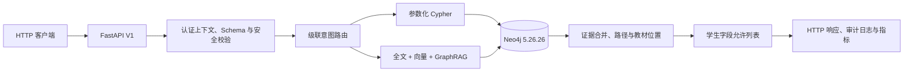

# Neo4j 小学数学图检索严格端到端验证报告

> 验证日期：2026-08-02<br>
> 验证对象：`k12-kgraph-retrieval-e2e` 研究环境<br>
> 规范接口：`POST /v1/retrieval/search`<br>
> 数据边界：全过程只读，未修改 Neo4j 数据、Embedding、索引、约束、容器或数据卷

## 1. 验收结论

当前稳定代码已经连续三轮完成串行和并发 8 的完整图检索 E2E。每次完整
运行包含 240 条图谱派生相关性查询和 110 条契约、安全、边界、无结果及
澄清查询，共 350 条 HTTP 请求用例；三轮共执行 6 次完整运行。Neo4j
不可用语义由单独的 isolated API 运行验证。

最终结果：

| 验收项 | 结果 |
| --- | ---: |
| 连续完整通过轮数 | 3 |
| 每轮串行 / 并发 8 | 均通过 |
| P0 | 0 |
| P1 | 0 |
| 固定 E2E 失败 | 0 |
| Recall@5 | 1.0000 |
| MRR | 0.9139 |
| nDCG@10 | 0.9343 |
| 教材证据覆盖率 | 1.0000 |
| 路径正确率 | 1.0000 |
| 学生泄露率 | 0 |
| 非法请求接受率 | 0 |
| 数据库指纹变化 | 0 |

结论只证明当前图谱快照、测试集、机器和配置下的工程检索链路满足本报告的
硬门槛。240 条相关性查询由图数据自动生成，标记为
`graph_derived_not_sme_reviewed`，不能替代小学数学教研人员的独立人工验收，
也不能直接推导生产 SLA。

## 2. 被验证的完整链路



验证范围包括：

- 知识点详情、教材位置、前置知识、后续知识、对应练习和相似练习；
- 年级、册次、版本、教材、章节、题型和难度过滤；
- 中文别名、公式、全角字符、Unicode 规范化、同名实体消歧和多意图；
- 1～3 跳路径方向、路径端点和原始图关系一致性；
- 学生端递归字段泄露检查；
- Cypher、`CALL`、APOC、GDS、注释、分号和 Unicode 混淆攻击；
- GraphRAG 回退、Embedding 故障、结构化模型故障和 Neo4j 不可用；
- 串行、并发 8、连接池冷启动和本地 FastEmbed 资源争用。

## 3. 不可变数据库证明

初始及每轮前后均用 Neo4j READ 事务读取节点、关系、完整属性、索引、约束
和组件信息，规范化后计算 SHA-256。初始基线为：

| 范围 | 数量 | SHA-256 |
| --- | ---: | --- |
| 节点（含完整属性与 Embedding） | 1,182 | `d8db1d2f3dce48ac2a69e9f7a00d53fa6eaae7b8517b1663aaf360f6ecfaf1bb` |
| 关系（含起止节点与完整属性） | 2,303 | `9fe74092dfa24eaf89f59bf26edb1597a77efa590bed5eaa41e801f948ae1324` |
| 索引 | 20 | `0d04c8292192d4911d6420be4c8e131b13e2a577acb50ac0353daa4baa1d32a9` |
| 约束 | 6 | `0f80250647bfab327ef9aa5719303bf258857e2101e790bdcdd24d5f70574192` |
| Neo4j 组件 | 1 | `926d55f4e27add30423593edc66b4a83db0494d8da430bbce42f459b00a2dfeb` |
| 组合指纹 | — | `9355a8803f63aa0c70145a295d22dbead56a49615c195707446af7505c79af34` |

最终指纹与初始基线逐字节一致。Neo4j 运行身份也始终保持；规范化的容器
身份快照随本次本地结果保存：

- 容器 ID：`c29ab4640f94c19b509d875f73e1b9e451c97e67f01d1ef389f4eed5183691dd`；
- 启动时间：`2026-07-29T08:18:01.684834922Z`；
- 数据卷：`k12-kgraph-retrieval-e2e_neo4j-data`；
- 版本：Neo4j Community 5.26.26。

修复期间只用 `--no-deps --force-recreate retrieval-api` 替换 API；未停止、
重建或重新创建 Neo4j。未运行导入、Schema 初始化、向量生成或索引脚本。

## 4. 用例构成与指标口径

| 集合 | 数量 | 用途 | 证据等级 |
| --- | ---: | --- | --- |
| `primary_math_eval_240.jsonl` | 240 | 六类检索相关性，每类 40 条 | 图谱自动派生，非教研人工标注 |
| `research_e2e_cases.jsonl` | 60 | 多意图、无结果、安全和 HTTP 契约 | 工程合成 |
| 严格边界动态用例 | 50 | Schema、攻击、Unicode、澄清和边界 | 工程合成 |
| 每次完整运行 | 350 | HTTP 全链路 | 自动化工程验收 |

相关性指标只在 240 条黄金查询上计算；安全、错误语义和契约使用全部 350 条。
路径正确率还会把返回路径的端点、方向和每条关系与
`data/retrieval/primary_math_graph.json` 的原始边集合逐项比较。

## 5. 连续三轮结果

每个运行先预热 20 次。串行和并发 8 使用相同 Neo4j 快照、索引、
`BAAI/bge-small-zh-v1.5`、512 维向量、TopK 和过滤条件。

| 轮次 | 模式 | P0/P1 | Recall@5 | nDCG@10 | 查询 p95 | Cypher p95 | Hybrid p95 | 全链路 p95 |
| ---: | --- | --- | ---: | ---: | ---: | ---: | ---: | ---: |
| 1 | 串行 | 0 / 0 | 1.0000 | 0.9343 | 58.1 ms | 13.2 ms | 66.4 ms | 56.9 ms |
| 1 | 并发 8 | 0 / 0 | 1.0000 | 0.9343 | 214.5 ms | 74.1 ms | 244.0 ms | 204.5 ms |
| 2 | 串行 | 0 / 0 | 1.0000 | 0.9343 | 57.7 ms | 12.1 ms | 64.2 ms | 56.4 ms |
| 2 | 并发 8 | 0 / 0 | 1.0000 | 0.9343 | 221.2 ms | 66.4 ms | 237.4 ms | 209.3 ms |
| 3 | 串行 | 0 / 0 | 1.0000 | 0.9343 | 56.3 ms | 12.2 ms | 61.3 ms | 54.0 ms |
| 3 | 并发 8 | 0 / 0 | 1.0000 | 0.9343 | 196.8 ms | 61.2 ms | 221.6 ms | 192.8 ms |

三轮的教材证据覆盖率和路径正确率均为 1.0000，泄露率、非法请求接受率、
失败率和 GraphRAG 回退率均为 0。连续轮次明确对应本地结果目录
`final-v5-cycle-1`、`final-v5-cycle-2` 和 `final-v5-cycle-3`；更早的失败运行
保留用于缺陷追踪，不属于这三轮最终验收。

## 6. 发现并修复的 P1

| 缺陷 | 根因 | 修复与回归证据 |
| --- | --- | --- |
| 在线读取未显式锁定 READ 事务 | Store 使用通用 Session 执行 | 统一改为 `execute_read()`；模拟 Driver 验证 READ/WRITE 模式和事务超时 |
| 含“位置”的实体名被误判为教材位置意图 | 规则路由扫描了引号内实体文本 | 路由前遮蔽 `【】` 和中英文引号内实体；保留引号外多意图 |
| 负温度题全文召回异常 | Lucene 未转义负号 | 完整转义 `-` 等 Lucene 运算符，目标题恢复 Top 1 |
| GraphRAG/Neo4j 故障可被包装成正常无结果 | 后端异常被宽泛回退 | Neo4j 不可用返回 HTTP 503 `GRAPH_BACKEND_UNAVAILABLE`；GraphRAG 本地回退返回 `GRAPHRAG_FALLBACK_LOCAL` |
| 攻击文本可能进入检索层 | V1 只有参数 Schema，没有问题文本安全门 | NFKC 后拒绝写关键词、注释、外部加载和未知 `CALL`，返回 HTTP 403 `UNSAFE_QUERY_REJECTED` |
| 并发 8 Hybrid 尾延迟超过 500 ms | ONNX 过度并行、同问题重复生成向量、教材位置 N+1 查询、Bolt 连接池冷启动 | FastEmbed 单线程且推理串行；GraphRAG 和本地融合复用查询向量；教材位置批量查询；启动时 8 路只读连接预热 |
| 镜像构建不以锁文件为真值源，且构建上下文可能包含私有文件 | Dockerfile 使用 `requirements.txt` 且缺少 `.dockerignore` | 镜像改为 `uv sync --frozen --no-dev`；排除 `.env`、Git、虚拟环境、运行状态和评测结果，并检查镜像内无私有配置 |
| 评测黄金答案跨教材范围 | 同名知识点生成器合并了不同 `book_id` 的练习 | 生成器按稳定范围 ID 区分；源图 JSON 与独立只读 Cypher 双重证明后修正一个黄金用例 |
| 兼容入口可绕过危险问题安全门 | 旧 `/retrieve` 与 `/retrieval/search` 未复用 V1 校验 | 把 NFKC 安全校验集中到兼容入口共同调用的 `_run_v1()`；两个入口均回归验证 403 |
| 教师分析执行异常被包装为 HTTP 200 | `run_read()` 异常被转换成普通 warning | 执行阶段异常统一抛出后端不可用并映射为 HTTP 503；禁用和计划非法仍保留受控 200 原因码 |
| 新镜像 healthy 后首个 Hybrid 请求可能超时 | FastEmbed 模型在首个业务请求中才下载和初始化 | Neo4j READ 连接成功后、应用启动完成前加载并预热本地模型；重建后首个业务请求约 158 ms |

过程中没有实际 P0。曾出现一次 Runner 把服务根 URL 当成检索端点造成全量
404，该运行保留为执行参数错误记录，没有计入后端缺陷或连续通过轮次。

## 7. 错误、安全和可观测性

- Neo4j 无效 Bolt 端口的独立 API 进程返回 HTTP 503 和
  `GRAPH_BACKEND_UNAVAILABLE`，未伪装为 `NO_RESULT`；
- 安全攻击返回 HTTP 403 和 `UNSAFE_QUERY_REJECTED`，不会回退为命中；
- GraphRAG 官方适配器失败但本地全文/向量成功时，响应包含结构化警告
  `GRAPHRAG_FALLBACK_LOCAL`；本地回退也失败时返回 503；
- 学生响应递归检查 `answer`、`analysis`、`solution`、`explanation`、
  `embedding`、`search_text`、`teacher_search_text`、`cypher` 等字段，泄露为 0；
- 审计日志包含请求 ID、角色、路由、原因码、延迟和问题哈希，不包含原始
  问题、Authorization Header、密码或 API Key；
- 启动连接池预热只执行参数固定的 `RETURN 1 AS value` READ 事务。
- 本地 FastEmbed 在应用报告启动完成前执行一次固定文本推理；它不写入 Neo4j，
  也不生成或替换图库中的节点 Embedding。

## 8. 复现方式

```bash
cd /Users/xiexiaodong/mykg0728/K12-KGraph

uv run pytest -q tests/retrieval
uv run ruff check src/retrieval tests/retrieval eval/retrieval docker/scripts
uv run python -m compileall -q src/retrieval tests/retrieval eval/retrieval docker/scripts

uv run python eval/retrieval/run_strict_graph_e2e.py \
  --url http://127.0.0.1:18000/v1/retrieval/search \
  --output-dir eval/retrieval/results/strict-e2e/<run-id> \
  --warmup 20 \
  --concurrency 8

uv run python eval/retrieval/run_failure_semantics_e2e.py \
  --output eval/retrieval/results/strict-e2e/<run-id>-failure-semantics/summary.json
```

数据库指纹脚本使用环境中的现有只读连接信息：

```bash
uv run python eval/retrieval/graph_fingerprint.py \
  --output eval/retrieval/results/strict-e2e/<run-id>-fingerprint.json
```

结果目录被 Git 忽略，不作为黄金答案或代码运行依赖。

## 9. 剩余 P2 与外部条件

- 教学内容和 240 条相关性查询尚未经过独立小学数学教研人工复核；
- `successors` 的 Recall@5 为 1.0，但多相关节点排序使该意图 MRR 为 0.5，
  属于排序优化项，不影响当前命中和路径硬门槛；
- 大部分教材证据只能定位到章，缺少完整节、页码和原文锚点；
- 当前 Community 研究环境依靠应用只读边界；生产仍需 Enterprise/Aura
  只读账户与外部 JWT/JWKS 身份源；
- 本机性能受 Docker Desktop 和宿主进程负载影响，本报告是本地工程基线，
  不是生产容量结论；
- 测试输出存在 Starlette/httpx 迁移提醒和测试用短 HMAC Key 警告，均未影响
  当前检索、安全或部署门槛。

## 10. 最终判定

在本报告约束内，严格图检索 E2E 的 P0=0、P1=0，连续三轮完整测试通过，
数据库和持久化运行身份零变化。后续若修改检索代码、Docker 运行参数、
Embedding 模型、图数据或索引，应重新从第 1 轮开始计数。
