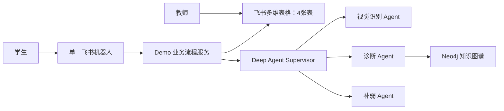
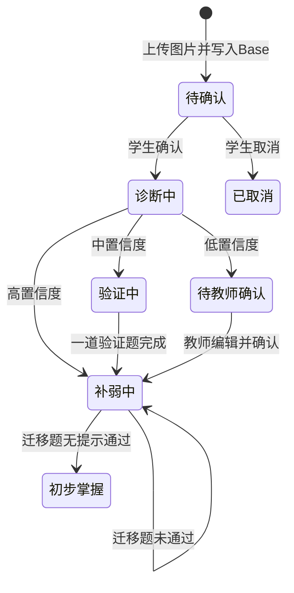

# 学生错题诊断与补弱路径：功能型 Demo 设计

- 日期：2026-08-02
- 状态：已确认
- 范围：小学数学功能型 Demo
- 入口：单一飞书机器人
- Agent 框架：LangChain Deep Agents（harness）
- 未来规划：[学生错题补弱系统：未来规划](./2026-08-02-student-remediation-future-roadmap.md)

## 1. Demo 目标

本 Demo 用于证明以下核心链路能够工作：

> 学生上传错题图片 → 图片写入飞书多维表格 → 学生确认识别结果 → Neo4j 知识定位与错因诊断 → 补弱练习 → 迁移题 → 教师可直接查看和修改结果。

Demo 面向演示，不处理真实敏感学生数据，也不建设生产级权限、可靠性、审计和长期学习运营能力。

核心成功标准：

1. 学生可以只通过飞书机器人完成一次错题诊断与补弱；
2. 原始图片、诊断结果和作答过程能够在多维表格中查看；
3. 系统能够演示高、中、低三种置信度分流；
4. 教师能够直接编辑多维表格，学生再次使用 `/继续` 时读取最新结果；
5. 失败和重复操作不会产生明显错误结果或重复记录。

## 2. 设计原则

1. 一个飞书机器人承载全部学生操作，不创建多个场景机器人。
2. 学生不直接打开多维表格，只通过机器人间接读写。
3. 教师作为 Demo 协作者，可以直接查看和编辑全部 Demo 数据。
4. 机器人使用发送者 `open_id` 查找学生，并用 `student_id` 过滤本人记录。这是业务查询正确性，不是生产级权限系统。
5. 图片上传后立即创建错题案例并写入原始附件，学生确认前不进入诊断。
6. Deep Agents 负责理解、推理和内容生成；业务服务负责流程顺序、状态、幂等和数据写入。
7. 保留 Neo4j 知识定位能力，不让 Agent 自动修改知识图谱。
8. 优先保证演示主链清晰，暂缓跨天运营、精细数据建模和生产化能力。

## 3. 方案选择

| 方案 | 能力范围 | 优点 | 缺点 |
| --- | --- | --- | --- |
| 功能型 Demo（采用） | 完整主链、三档分流、教师直接编辑 Base | 能展示产品差异，开发量适中 | 不具备生产安全和长期运营能力 |
| 最小演示 | 固定学生、只演示高置信度路径 | 开发最快 | 容易退化为普通搜题机器人 |
| 接近正式 MVP | 七表、四专业 Agent、教师卡片、间隔复测 | 功能完整 | 对 Demo 成本过高 |

## 4. 总体架构

### 4.1 组件职责

| 组件 | 负责 | 不负责 |
| --- | --- | --- |
| 飞书机器人 | 接收指令和图片、发送确认与练习卡片、接收按钮回调 | 长期数据存储、复杂推理 |
| Demo 业务流程服务 | 查询学生、创建案例、控制步骤、调用 Agent、写 Base、去重 | 开放式诊断推理 |
| Deep Agent Supervisor | 在当前受控步骤中调用三个专业 Agent | 任意跳过流程、直接修改长期状态 |
| Neo4j | Concept、Skill、Exercise 检索和前置关系 | 学生记录和 Agent 运行状态 |
| 飞书多维表格 | Demo 业务事实、图片附件、教师直接查看和编辑 | 图谱遍历和生产级访问控制 |

## 5. Agent 与模型配置

Demo 保留一个 Supervisor 和三个专业 Agent。

| Agent | 职责 | 模型能力 |
| --- | --- | --- |
| 视觉识别 Agent | 从错题图片提取题目、条件、学生答案和手写过程 | 视觉理解 |
| 诊断 Agent | 计算标准答案、调用 Neo4j 检索、对比解法、输出错因和置信度 | 强文本推理与工具调用 |
| 补弱 Agent | 生成基础题、变式题、迁移题及分层提示 | 常规文本推理 |

Supervisor 使用稳定的文本工具调用模型。不是所有 Agent 都配置视觉模型。

所有专业 Agent 使用结构化输出；格式不合法时重试一次，仍失败则停止当前案例处理。

## 6. 飞书机器人交互

### 6.1 指令

| 指令 | 用途 |
| --- | --- |
| `/诊断` | 创建新错题案例 |
| `/继续` | 继续最近的未完成案例，或读取教师最新修改 |
| `/进度` | 查看本人当前案例和掌握概要 |
| `/求助` | 把当前案例状态改为 `待教师确认` |

学生提交图片后，机器人也会按当前会话状态继续，不要求反复输入命令。

### 6.2 图片与卡片

图片作为飞书聊天消息附件上传。机器人下载图片后，通过飞书附件接口写入 `MistakeCase` 的附件字段。

Demo 使用 Card 2.0 展示：

- 识别确认卡；
- 诊断结果卡；
- 单题练习卡；
- 当前进度卡；
- 失败提示卡。

按钮 action 携带 `case_id` 和操作类型。服务端使用飞书 `event_id` 去重。

## 7. 四张多维表格

### 7.1 `StudentProfile` 学生档案

| 字段 | 用途 |
| --- | --- |
| `student_id` | Demo 内部学生稳定 ID |
| `open_id` | 飞书消息发送者 ID，用于自动查找学生 |
| `student_name` | 展示名称 |
| `grade` | Demo 默认年级，可由教师修改 |
| `textbook_version` | Demo 默认教材版本，可由教师修改 |
| `mastery_summary` | 供 `/进度` 使用的简短概要 |

首次使用时根据 `open_id` 自动创建档案，不要求学生填写完整资料。

### 7.2 `MistakeCase` 错题案例

这是 Demo 的核心表。原设计中的诊断结果、补弱计划和教师复核信息合并到该表。

| 字段组 | 字段 |
| --- | --- |
| 标识 | `case_id`、关联学生、飞书原始消息 ID、创建时间 |
| 原始材料 | 错题图片附件、学生补充文本 |
| 识别结果 | 题目、条件、学生答案、手写过程 |
| 诊断结果 | 标准答案、Neo4j 知识点 ID、错因、置信度 |
| 补弱信息 | 补弱计划 JSON 或长文本、当前题序号 |
| 教师处理 | 教师备注、教师修改后的诊断 |
| 流程 | 当前状态、最近错误信息、更新时间 |

学生上传图片后，系统立即创建该记录：

1. 生成 `case_id`；
2. 写入学生关联、原始消息 ID 和图片附件；
3. 将状态设为 `待确认`；
4. 视觉识别完成后更新同一条记录；
5. 学生确认后才允许进入诊断。

### 7.3 `LearningAttempt` 学习作答

每道验证题、补弱题或迁移题对应一条记录。

核心字段：`attempt_id`、`case_id`、学生、题目类型、题目内容、学生答案、是否正确、提示层级、作答时间。

### 7.4 `MasteryRecord` 掌握状态

每个学生、每个 Neo4j 知识点保留一条当前状态。

核心字段：`student_id`、`concept_id/skill_id`、状态、简化证据分数、最近更新时间。

状态只保留：

- `待诊断`；
- `补弱中`；
- `初步掌握`。

## 8. Demo 数据访问边界

### 8.1 学生

- 学生不能直接打开多维表格；
- 机器人根据消息发送者 `open_id` 找到 `StudentProfile`；
- `/诊断`、`/继续`、`/进度` 的查询都附带当前 `student_id`；
- 学生只看到机器人返回的业务结果。

### 8.2 教师

- 教师是多维表格的 Demo 协作者；
- 教师可以直接查看和编辑全部四张表；
- Demo 不区分只读教师、可编辑教师和管理员；
- Demo 不实现教师绑定范围、修改审批、字段锁定和完整变更审计。

### 8.3 Demo 安全约束

- 不启用 Base 高级权限、记录级权限或字段级权限；
- 不放入真实敏感学生数据，只使用虚构或脱敏演示数据；
- 保留 `case_id` 和 `event_id` 去重，因为它们属于业务正确性，而不是访问控制。

生产级权限与数据治理要求见独立的[未来规划](./2026-08-02-student-remediation-future-roadmap.md)。

## 9. Demo 业务流程

### 9.1 上传与识别

1. 学生发送 `/诊断` 并上传图片；
2. 系统查找或自动创建学生档案；
3. 系统立即创建 `MistakeCase` 并写入原图，状态为 `待确认`；
4. 视觉识别 Agent 提取题目、学生答案和过程；
5. 机器人发送识别确认卡；
6. 学生选择确认、修改或取消。

未经确认的案例不能进入诊断。

### 9.2 诊断

诊断 Agent 在一次受控任务中完成：

1. 计算标准答案；
2. 检索 Neo4j 知识点和前置关系；
3. 对比学生过程与标准解法；
4. 输出错因、简短证据和置信度。

Demo 不做双模型答案校验、多个错因 Top-1/Top-3 排序或置信度数据校准。

### 9.3 置信度分流

Demo 使用固定阈值：

- 高置信度：`confidence >= 0.80`，直接进入补弱；
- 中置信度：`0.55 <= confidence < 0.80`，只发送一道验证题；
- 低置信度：`confidence < 0.55`，状态改为 `待教师确认`。

低置信度案例出现在 Base 的“待教师处理”视图中。Demo 不发送教师机器人卡片，也不自动提醒教师。

教师可直接修改标准答案、知识点、错因、备注和状态。教师将状态改为 `教师已确认` 后，学生再次执行 `/继续`，机器人读取最新记录并进入补弱。

### 9.4 补弱与迁移

补弱 Agent 最多生成：

1. 一道基础补弱题；
2. 一道变式题；
3. 一道迁移题。

提示层级保留：概念提示、关键步骤、完整解析。

每次作答写入 `LearningAttempt`。迁移题无提示通过后，相关 `MasteryRecord` 更新为 `初步掌握`；否则保持 `补弱中`。

Demo 不做跨天自动复测、自动提醒或按年级配置每日学习预算。

## 10. 简化状态流

图片识别或 Agent 失败时，案例进入相应失败状态，不继续推进。

## 11. 必要异常处理

| 场景 | Demo 处理 |
| --- | --- |
| 图片无法识别 | 保留原图，状态改为 `识别失败`，提示重新上传或改用文本 |
| Agent 调用失败 | 自动重试一次，仍失败则状态改为 `处理失败` 并展示友好提示 |
| Base 写入失败 | 当前操作重试一次，仍失败则告知无法保存，不展示完成结果 |
| 重复消息或按钮 | 使用 `event_id` 去重，使用 `case_id` 校验当前案例 |

Demo 不建设备用模型、持久化任务队列、写入重放或完整断点恢复。

## 12. Demo 范围

### 12.1 包含

- 小学数学；
- 单一飞书机器人；
- 图片上传并立即写入 Base；
- 学生识别确认；
- Neo4j 知识定位；
- 高、中、低置信度分流；
- 最多一道中置信度验证题；
- 最多三道补弱与迁移题；
- 四张多维表格；
- 教师直接查看和编辑 Base；
- 三种掌握状态；
- 一次重试和基础去重。

### 12.2 不包含

- Base 高级权限和细粒度角色；
- 教师机器人复核卡和自动通知；
- 双模型答案复核和备用模型；
- 七张规范化业务表；
- 五级掌握状态；
- 动态每日学习预算；
- 1–3 天间隔复测和自动提醒；
- 持久化任务队列和生产级恢复；
- 完整审计、数据保存期限和附件治理；
- 正式准确率指标、压力测试和真实班级试点；
- 其他学科和外部教务系统。

以上内容不是取消，而是进入独立的[未来规划](./2026-08-02-student-remediation-future-roadmap.md)。

## 13. Demo 验收

只验收以下五条链路：

1. **正常链路**：图片 → 确认 → 高置信度诊断 → 补弱 → 迁移题 → 初步掌握；
2. **中置信度链路**：诊断 → 一道验证题 → 确定错因 → 补弱；
3. **教师链路**：低置信度 → Base 待处理视图 → 教师修改 → 学生 `/继续`；
4. **失败链路**：图片或 Agent 失败后停止推进并显示友好提示；
5. **去重链路**：重复消息或重复点击不创建重复案例和作答。

使用少量预先准备的演示题完成验收，不要求正式准确率基线、压力测试或真实班级数据。

## 14. 关键决策记录

| 决策 | 结论 |
| --- | --- |
| Demo 类型 | 功能型 Demo |
| 机器人数量 | 一个 |
| 图片存储时机 | 上传后立即写入 `MistakeCase` 附件字段 |
| Agent 数量 | Supervisor + 三个专业 Agent |
| Base 表数量 | 四张 |
| 学生访问 | 只通过机器人，按 `open_id/student_id` 查询本人数据 |
| 教师访问 | 直接查看和编辑全部 Demo 数据 |
| Base 高级权限 | Demo 不实现 |
| 教师复核 | 直接编辑 Base，学生通过 `/继续` 读取 |
| 中置信度验证 | 最多一道题 |
| 掌握状态 | 待诊断、补弱中、初步掌握 |
| 跨天复测 | Demo 不实现 |
| 演示数据 | 仅虚构或脱敏数据 |

## 15. 实施前置条件

- 飞书应用的消息、图片资源、Card 2.0 回调和 Base 读写权限；
- 预先建立四张多维表格及“待教师处理”视图；
- Neo4j Concept、Skill、Exercise 稳定 ID；
- 一组覆盖高、中、低置信度和失败场景的演示题；
- 一个教师 Demo 协作者账号；
- 三个专业 Agent 的结构化输出 schema。

这些条件只服务于 Demo，不代表已经满足生产上线要求。
