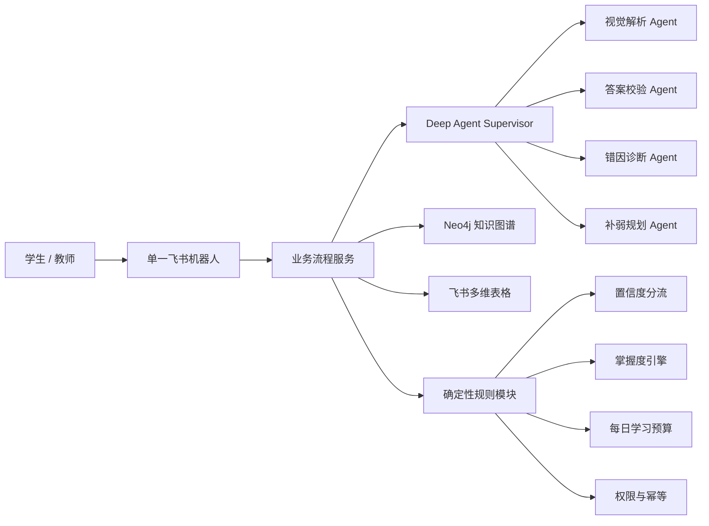
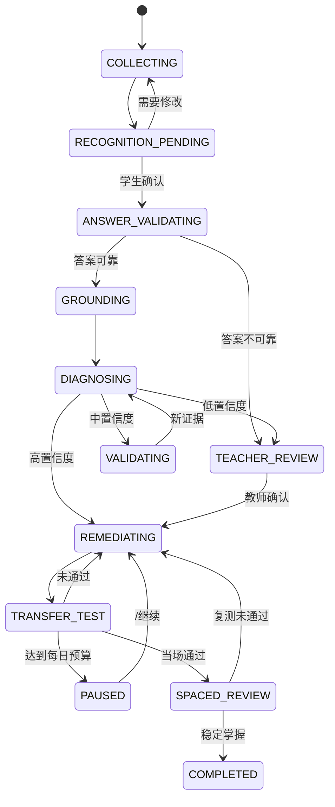

# 学生错题诊断与补弱路径：业务与系统设计

- 日期：2026-08-02
- 状态：已确认
- 范围：小学数学 MVP
- 入口：单一飞书机器人
- Agent 框架：LangChain Deep Agents（harness）

## 1. 目标与成功标准

本系统面向学生自主使用。学生在飞书中提交一道错题，系统识别并确认题目，校验答案，结合知识图谱形成错因假设，再通过置信度分流、验证题、分层提示、迁移题和间隔复测，形成可持续的补弱闭环。

教师不是常规流程的操作员，只在以下情况介入：诊断低置信度、标准答案不可靠、图谱证据冲突、学生长期无改善、学生主动求助或系统无法安全恢复。

北极星指标不是机器人回答题目的数量，而是：

> 学生在未见迁移题上的正确率提升，并且这种提升能够在间隔复测中保持。

支撑指标包括：诊断质量、置信度校准、补弱流程完成率、教师介入比例、教师纠正率、间隔复测通过率、故障恢复成功率和重复事件去重率。

## 2. 已确认的产品原则

1. 一个飞书机器人承载所有业务，不为不同场景创建多个机器人。
2. 学生自主使用；教师只处理需要人工判断的案例。
3. 同时支持单道错题即时闭环和长期学生知识掌握画像。
4. 支持图片与文本输入，图片优先；视觉识别后必须由学生确认原题。
5. 标准答案优先来自题库或图谱关联习题；缺失时由模型求解并独立复核。
6. 高置信度直接进入补弱，中置信度先做 1–3 道验证题，低置信度转绑定教师。
7. 补弱持续到形成稳定掌握证据，但受年级对应的每日时长或题量预算约束，可跨会话继续。
8. LLM 负责理解、生成候选和解释；确定性规则负责权限、状态、分流、预算、幂等与掌握度更新。
9. 首期只做小学数学，不扩展其他学科。
10. 首次使用由学生填写年级、教材版本和班级，暂不接入外部花名册或教务系统。

## 3. 方案选择

### 3.1 候选方案

| 方案 | 说明 | 优点 | 主要风险 |
| --- | --- | --- | --- |
| Agent 全权驱动 | Agent 自行决定流程、状态和数据写入 | 原型快、灵活 | 不可预测、难审计、权限和幂等风险高 |
| 确定性流程 + 专业 Agent | 业务状态机控制关键规则，Agent 只承担理解和推理 | 可控、可测、可审计，适合教育场景 | 需要先定义状态与契约 |
| 传统工作流为主、少量 LLM | 大部分逻辑规则化，LLM 只做辅助抽取 | 稳定、成本可控 | 对开放式手写过程和复杂错因理解不足 |

### 3.2 选择结论

采用“确定性业务流程 + Deep Agents 专业智能体”。Deep Agents 是推理编排层，不是权限系统、业务数据库或掌握状态的最终裁决者。

## 4. 总体架构

### 4.1 组件职责

| 组件 | 负责 | 不负责 |
| --- | --- | --- |
| 飞书机器人 | 接收消息和附件、展示卡片、接收交互回调、发送提醒 | 业务状态裁决、长期数据存储 |
| 业务流程服务 | 案例状态机、权限、幂等、Agent 调用、数据协调、失败恢复 | 自由文本复杂推理 |
| Deep Agent Supervisor | 根据当前受控步骤调用专业 Agent 与工具 | 任意跳过流程、直接改掌握状态 |
| Neo4j | Concept、Skill、Exercise 及前置关系、知识检索与路径 | 学生业务记录、Agent checkpoint |
| 飞书多维表格 | MVP 业务事实、附件、关联记录、视图和权限 | 知识图谱遍历、Agent 运行时 checkpoint |
| 确定性规则模块 | 置信度分流、掌握度、每日预算、升级教师、重试上限 | 开放式语义理解 |

## 5. Agent 与模型配置

并非所有 Agent 都配置视觉模型。按任务能力选择三类模型：视觉理解、强推理、常规文本推理。

| Agent | 主要输入 | 主要输出 | 推荐模型能力 |
| --- | --- | --- | --- |
| Supervisor | 当前案例状态、可用工具、专业 Agent 结果 | 下一项受控任务及汇总结果 | 常规文本、稳定工具调用 |
| Visual Parser | 题目照片、手写过程图、裁剪区域 | 题干、条件、学生答案、步骤、坐标与识别置信度 | 视觉理解 |
| Answer Verifier | 已确认题目、题库答案、候选解法 | 标准答案状态、解法、冲突证据 | 强推理 |
| Diagnostician | 学生过程、标准解、图谱证据、相关历史 | 多个错因假设、证据、置信度、待验证差异 | 强推理 |
| Remediation Planner | 已确认错因、前置关系、掌握历史、每日预算 | 最短补弱路径、题目类型与提示策略 | 常规文本推理 |

所有 Agent 输出都必须通过结构化 schema 校验。未经校验的输出不得写入多维表格，不得作为学生画像事实展示。

## 6. 学生业务流程

### 6.1 首次使用与建档

学生首次发送 `/诊断` 时，机器人展示资料卡，采集：

- 年级；
- 教材版本；
- 班级；
- 绑定教师（由班级配置解析或管理员预置）。

学生后续不需要重复填写。资料变更保留审计记录。

### 6.2 提交与识别确认

1. 学生发送 `/诊断`，随后提交题目图片或文本，并提供自己的答案或思路。
2. 系统立即创建 `MistakeCase`，保存原始消息和附件，生成 `case_id`。
3. 图片输入调用 Visual Parser，提取题干、条件、图形区域、学生答案和过程。
4. 机器人发送识别确认卡，提供“确认无误”“需要修改”“取消”。
5. 未经学生确认，流程不能进入答案校验。

### 6.3 答案校验

答案来源按以下顺序处理：

1. 命中题库或 Neo4j 中关联的 Exercise 标准答案；
2. 未命中时，由 Answer Verifier 求解；
3. 使用独立求解、代入检查或第二模型进行复核；
4. 如果两次校验冲突、题目多解、条件缺失或答案仍不可靠，转绑定教师，不自动判错。

### 6.4 知识定位与错因诊断

系统使用题目、标准解法和学生过程检索 Neo4j，定位：

- 直接相关 Concept / Skill；
- 必要的前置 Concept / Skill；
- 相似 Exercise；
- 可解释的前置路径。

Diagnostician 形成多个错因假设，每个假设至少包含：错因类型、关联知识点、学生过程证据、标准解对照证据、图谱证据、置信度及可区分该假设的验证题特征。

Agent 的诊断不会直接改变掌握状态。

### 6.5 置信度分流

首期默认阈值：

- 高置信度：`confidence >= 0.80`，进入补弱；
- 中置信度：`0.55 <= confidence < 0.80`，发送 1–3 道验证题；
- 低置信度：`confidence < 0.55`，转绑定教师。

阈值属于可配置业务参数，必须使用教师标注集和试点数据持续校准，不能写死在 Prompt 中。

中置信度验证题用于区分候选错因。验证结果回到诊断步骤重新计算证据；如果仍无法收敛，转教师。

### 6.6 补弱与分层提示

Remediation Planner 从薄弱根节点到目标知识点生成最短补弱路径，并按每日预算安排练习。每次只向学生展示一道题。

提示层级固定为：

1. 允许学生再试一次；
2. 给出概念或方法提示；
3. 给出关键步骤；
4. 给出完整解析；
5. 另发一道未见迁移题。

看过完整解析后的答对不计作掌握证据。学生可以随时 `/求助`，不受置信度门槛限制。

### 6.7 迁移检测与跨会话继续

补弱完成后必须使用未见过的新题进行迁移检测。达到每日时长或题量上限时，系统保存当前计划、下一道题和待复测时间；未完成不等于失败。

学生下次使用 `/继续` 从断点恢复。系统在 1–3 天后安排无提示间隔复测。

## 7. 案例状态机

任意运行状态可因可恢复故障进入 `RECOVERY_PENDING`，恢复后回到原步骤。不可安全恢复时进入 `TEACHER_REVIEW` 或系统人工处理队列。

## 8. 掌握度模型

### 8.1 状态

知识点掌握状态为：

1. `UNKNOWN`：证据不足；
2. `SUSPECTED_WEAK`：错题触发，但根因未确认；
3. `LEARNING`：根因已确认，正在补弱；
4. `PROVISIONAL_MASTERY`：当场基础题和迁移题通过；
5. `STABLE_MASTERY`：跨会话间隔复测仍独立通过。

### 8.2 默认证据权重

| 证据 | 默认权重 |
| --- | ---: |
| 迁移题正确且无提示 | +4 |
| 基础题正确且无提示 | +3 |
| 使用提示后答对 | +1 |
| 看过完整解析后答对 | 0 |
| 同类关键错误再次出现 | -3 |
| 无效输入、跳过、识别失败 | 不计分 |

题目难度、提示层级、是否跨会话作为修正因子；重复原题不作为迁移证据。

### 8.3 稳定掌握的必要条件

即使累计分达到阈值，仍必须同时满足：

1. 至少覆盖两种不同题型或表述；
2. 至少一道未见迁移题无提示通过；
3. 至少跨两个学习会话；
4. 1–3 天后间隔复测无提示通过；
5. 最近没有再次出现同一关键错因。

缺少任一条件时最多进入 `PROVISIONAL_MASTERY`。

## 9. 教师介入

### 9.1 触发条件

- 标准答案不可靠；
- 诊断置信度低于 0.55；
- 中置信度验证后仍无法区分错因；
- 图谱无法稳定映射或关系与题目冲突；
- 连续 3 个学习会话没有改善；
- 同一关键错因持续重复；
- 学生主动 `/求助`；
- 视觉、Agent、Base 或其他系统异常无法安全恢复。

### 9.2 教师可见范围

教师只看到：当前案例、题目和学生过程、候选诊断及证据、相关知识点历史和必要的作答记录。教师不能查看与当前案例无关的完整学生画像。

教师可以确认或纠正标准答案、知识定位和错因，并添加简短说明。教师复核写入 `TeacherReview`，触发学生端发送新的结果卡；所有修改保留操作者和时间审计信息。

## 10. 飞书机器人交互

### 10.1 指令

| 指令 | 用途 |
| --- | --- |
| `/诊断` | 创建新错题案例 |
| `/继续` | 继续最近的未完成补弱计划 |
| `/进度` | 查看当前知识掌握与待复测任务 |
| `/求助` | 将当前案例提交绑定教师 |

机器人也要理解当前会话状态。学生提交图片后无需重复输入命令。

### 10.2 卡片设计

使用飞书 Card 2.0，默认在机器人私聊中完成：

- 首次建档卡；
- 识别确认卡；
- 答案校验与诊断进度卡；
- 高、中、低置信度结果卡；
- 一题一卡的补弱练习卡；
- 今日总结与待复测卡；
- 教师低置信度复核卡。

图片通过聊天消息附件提交，而不是在卡片内上传。表单提交以 `card.action.trigger` 处理；表单值来自 `form_value`。按钮 action 中携带 `case_id`、`run_id` 和操作类型，服务端校验操作者身份与当前状态。

飞书卡片延迟更新 token 有效期为 30 分钟且最多使用两次。超时后发送一张反映当前状态的新卡，不能依赖旧 token。更新必须发送完整新卡，而不是局部 patch。

## 11. 飞书多维表格数据设计

多维表格作为 MVP 业务事实的主存储，业务服务通过 Repository 接口访问，为未来迁移到独立数据库保留边界。

### 11.1 七张关联表

| 表 | 核心字段 | 主要关联 |
| --- | --- | --- |
| `StudentProfile` 学生档案 | student_id、open_id、年级、教材版本、班级、绑定教师、状态 | 错题案例、掌握记录 |
| `MistakeCase` 错题案例 | case_id、原始消息、题目文本、学生答案、状态、当前步骤、附件、创建时间 | 学生、诊断、补弱计划、教师复核 |
| `DiagnosisResult` 诊断结果 | diagnosis_id、候选错因、证据、置信度、知识 ID、版本、是否确认 | 错题案例 |
| `RemediationPlan` 补弱计划 | plan_id、根知识点、目标知识点、路径、每日预算、当前节点、下次复测时间 | 案例、作答 |
| `LearningAttempt` 学习作答 | attempt_id、题目引用、答案、过程、提示层级、结果、附件、时间 | 学生、计划、知识点 |
| `MasteryRecord` 掌握状态 | student_id、concept_id/skill_id、状态、分数、必要条件证据、更新时间 | 学生、作答 |
| `TeacherReview` 教师复核 | review_id、教师、结论、纠正项、说明、时间 | 案例、诊断 |

题目照片、手写过程图片、视觉裁剪区域和生成的学习报告使用附件字段保存。附件不是普通文本单元格，必须使用飞书附件上传接口处理。

Neo4j 的 Concept、Skill、Exercise 稳定 ID 以文本引用保存在 Base 中，不复制图谱关系。Deep Agents checkpoint 存储在业务服务的独立运行时存储中，不放入 Base。

### 11.2 写入原则

- 使用 `case_id + operation_type` 或等价幂等键；
- 同一张表的写入串行化，批处理不超过平台限制；
- 对写冲突和限流采用限次重试与指数退避；
- 写入成功后才向学生展示“已保存”或“已完成”；
- 关键记录只做状态变更或版本追加，不静默覆盖审计信息。

## 12. 权限与隐私

采用默认拒绝原则：

- 学生只能访问自己的资料、案例、计划、作答和掌握记录；
- 教师只能访问绑定学生中被分配的案例及相关知识历史；
- 教师默认不能下载与当前复核无关的附件或批量导出数据；
- 系统服务账号只获得完成自动化所需的最小权限；
- 机器人群聊中不展示学生详细画像，诊断和学习过程默认私聊；
- 所有教师纠正、状态变化和系统降级必须可审计；
- 附件设置保存期限、访问控制和哈希去重策略。

## 13. 异常处理与恢复

### 13.1 安全不变量

1. 没有可靠原题，不诊断；
2. 没有足够证据，不修改掌握画像；
3. 写入未确认，不算业务完成；
4. 未通过 schema 校验的 Agent 输出不展示、不入库；
5. 旧卡片或重复事件不能推进已经变化的案例状态。

### 13.2 故障策略

| 故障 | 处理 | 恢复点 |
| --- | --- | --- |
| 图片模糊或识别失败 | 请求补拍缺失区域或补充文字，保留原图和已识别片段 | 识别确认 |
| 答案不可靠 | 停止自动判错，转绑定教师 | 答案校验 |
| 图谱无匹配或关系冲突 | 记录查询和候选节点，转教师并进入图谱治理队列 | 知识定位 |
| Agent 超时或输出越界 | 同模型重试一次，再切同级备用模型；仍失败则安全降级 | 当前 Agent 步骤 |
| Base 写入失败 | 幂等待写队列、限次退避重试 | 当前写操作 |
| 重复消息或回调 | 使用 event_id 去重，校验 operator_id、case_id 和当前状态 | 无需重复执行 |
| 卡片 token 过期 | 发送当前状态的新卡 | 当前业务状态 |

学生只看到当前停留步骤、需要补充的信息、是否已转教师以及稍后能否继续；技术错误详情进入内部审计日志。

## 14. MVP 范围

### 14.1 首期包含

- 一个飞书机器人及四个学生指令；
- 小学数学图片/文本错题提交；
- 识别确认、答案校验、知识定位和错因诊断；
- 高/中/低置信度分流；
- 分层提示、迁移检测、每日预算、跨会话继续与间隔复测；
- 七张多维表格及附件、关联、权限和审计；
- 低置信度教师复核闭环；
- 幂等、恢复和安全降级。

### 14.2 首期不包含

- 语文、英语、物理等其他学科；
- 学籍、教务或外部花名册同步；
- 班级大屏、排行榜和复杂运营分析；
- Agent 自动新增、删除或修改 Neo4j；
- 开放式闲聊、百科搜题和全科答疑；
- 仅凭一次答对或模型主观判断宣布稳定掌握。

## 15. 验收与试点

### 15.1 四层验收

1. **工程可靠性**：重复消息不重复建案；故障可断点恢复；Base、Neo4j、Agent 超时均安全降级。
2. **诊断质量**：基于教师标注黄金案例集评估知识定位、错因 Top-1/Top-3、教师纠正率和置信度校准。
3. **交互完成率**：学生能独立完成提交、确认、补弱与迁移题；教师只处理符合介入规则的案例。
4. **学习有效性**：未见迁移题正确率提高，并在间隔复测中保持。

具体数值门槛不在缺少基线时预设。先用教师标注集建立基线，再依据试点确定正式阈值。

### 15.2 上线前端到端必测场景

1. 清晰图片 → 高置信度诊断 → 补弱 → 迁移题 → 初步掌握；
2. 多个错因假设 → 1–3 道验证题 → 收敛到正确路径；
3. 低置信度 → 绑定教师复核 → 学生收到修正结果；
4. 图片模糊、重复回调、Base 写入失败、Agent 超时 → 不丢数据且可恢复；
5. 达到每日预算 → `/继续` → 间隔复测 → 稳定掌握；
6. 学生越权访问、教师查看无关画像、旧卡片重复点击 → 全部被拒绝并记录。

### 15.3 试点节奏

1. 内测：使用教师黄金案例集校准结构化输出、规则和置信度；
2. 小范围试点：1–2 个班运行 2–4 周，保留完整人工复核通道；
3. 扩大使用：指标稳定后逐步增加班级，再评估学科扩展。

## 16. 关键决策记录

| 决策 | 结论 | 原因 |
| --- | --- | --- |
| 机器人数量 | 一个 | 学生无需记忆多个入口，状态和权限统一 |
| 教师角色 | 低置信度及异常时介入 | 保持学生自主性，控制教师负担 |
| 流程控制 | 确定性业务状态机 | 可审计、可测试、防止 Agent 越权 |
| 视觉模型 | 仅视觉解析 Agent 使用 | 降低成本和延迟，按任务选择能力 |
| MVP 业务主存储 | 飞书多维表格 | 与协作平台一致，支持附件、关联、视图和权限 |
| 知识存储 | Neo4j | 保留图谱遍历与前置路径能力 |
| 掌握度裁决 | 规则引擎 | 避免 LLM 主观更新长期画像 |
| 首期学科 | 小学数学 | 控制知识、题型和验收复杂度 |
| 核心成效 | 未见迁移题 + 间隔保持 | 衡量真实学习，而非原题记忆 |

## 17. 实施前置条件

进入实施计划前需要准备：

- 飞书应用的消息、附件、卡片回调和多维表格权限；
- 一份可用于校准的教师标注黄金案例集；
- Neo4j Concept、Skill、Exercise 稳定 ID 及版本约定；
- 小学年级每日学习预算的初始配置；
- 班级到绑定教师的配置来源；
- Agent 结构化输入输出 schema 和模型降级清单；
- 数据保存期限、附件访问和审计策略的组织确认。

这些前置条件不改变本设计，但会影响实施计划的任务排序和试点启动时间。
